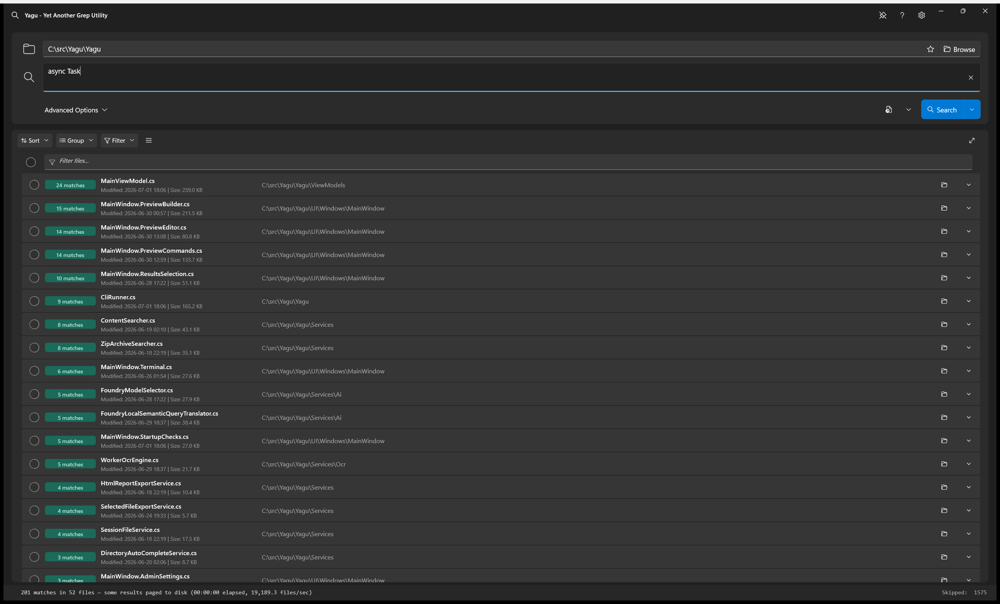
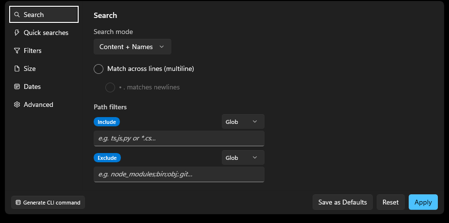

<h1 align="center">Yagu Help Guide</h1>

Yagu is a fast Windows search app for finding text, regex matches, or file names across large folder trees. The name stands for "Yet Another Grep Utility". It is built for repeated code, log, and source-tree investigation where you want command-line search speed with a graphical result browser.

**Yagu runs only on Windows.** There is no macOS or Linux version, by design. Yagu is a *native* Windows app rather than a cross-platform one: its interface is built on WinUI 3 (the Windows App SDK), and it relies on Windows-only features throughout — the Explorer right-click menu, the system tray and taskbar, global hotkeys, Windows Error Reporting crash dumps, the NTFS change journal for indexing, and optional voidtools Everything integration (which is also Windows-only). It ships as a self-contained Native AOT build with a Rust engine DLL compiled for Windows. This keeps Yagu as fast as possible on Windows at the cost of portability. See **Prerequisites** in the README for supported Windows versions (Windows 10 build 17763 / version 1809 or newer).

## Quick Start

1. Open Yagu.
2. Choose a directory to search:
   - Type or paste a path into the directory box (auto-complete suggests folders as you type).
   - Click **Browse** to pick a folder.
   - Drag a folder from Windows Explorer onto the window.
   - Launch from a command line: `Yagu.exe --dir "D:\projects\myapp"`.
   - Use the Windows Explorer context menu: right-click a folder → **Search with Yagu**.
   - Click the **★ pin** to the left of Browse to keep the current folder as the startup default so it is pre-filled the next time Yagu opens. By default the box starts empty (which searches all drives); click the pin again to unpin and clear the saved folder. Pinning snapshots the folder when you click it — changing the box afterward does not change the pin.
   - Click the **index** glyph (to the right of the pin) to add the folder in the box to the content index so future searches over it can skip files that cannot match. The button shows as selected whenever the box holds a folder that is already in the index (whether its build has started, finished, or not yet run); click it again to remove that folder from the index. A whole-drive or very large folder is confirmed first. This is the same as `--index-add-root` on the command line.
3. Enter the search query in the search box.
4. Choose search options: **Case sensitive** (Alt+C), **Regex** (Alt+R), **Multiline** (Alt+M), **Exact match** (Alt+E).
5. Click **Search** or press **Enter** in the search box.
6. Results stream in while the search runs. Click a result or match line to preview it.
7. Use Open, Edit, Copy, or Export actions to work with the results.

On first launch, Yagu predicts which guarded setup prompts apply to the current machine before showing them. When two or more setup steps are expected, each startup modal shows **Step x of y**, a percentage, and a progress bar in its footer. Follow-up dialogs caused by a choice (for example, confirming an indexing folder) remain part of the same setup step, so the total does not jump while you work through onboarding.

The status bar shows progress during a search. When the search finishes or is canceled, it shows elapsed time. Enable **Show resource usage in status bar** in Settings -> Developer Options to add Yagu's current result-temp usage, total content-index storage, and RAM used by Yagu plus its worker processes; these metrics are hidden by default, and each has a detailed hover tooltip. Enable **Stats for nerds** separately to show files processed per second and a real-time throughput sparkline.

## Main Screen

The main screen has seven working areas:

| Area | Purpose |
| --- | --- |
| Title bar | App title, Help button (F1), Settings gear, and window mode pin. |
| Directory bar | The folder to search, with auto-complete, a pin (★) to keep the current folder as the startup default, an index toggle to add/remove the folder from the content index, Browse, and recent history. |
| Search bar | Query entry with history (Down arrow), Search/Cancel (F5), and option toggles. |
| Options row | Quick toggles for Regex, Case, Multiline, Exact match, and the Advanced Options expander. |
| Results pane (left) | Matching files and lines with sorting, grouping, filtering, selection, copy, and export. A yellow information icon beside **Filter files** appears when files are skipped. |
| Preview pane (right) | Match preview, full-file view, built-in editor, match navigation, and export. |
| Status bar | Search progress/completion, result-temp disk usage, total content-index disk usage, Yagu/worker RAM, and index health/coverage. |



- Click the **?** button or press **F1** to open Help. Inside Help, press **Ctrl+F** to search the
  rendered guide. All matches are highlighted; use the up/down buttons to move through them, and turn
  on **Regex** only when the find text should be interpreted as a regular expression.
- Click the **gear** to open Settings.
- Click the **pin** button to cycle window modes (Tray / Stay open / Always on top / Traditional).

---

## Search Modes

Use the search mode dropdown to decide what the query matches:

| Mode | What It Searches | Best For |
| --- | --- | --- |
| Content + Names | File contents and file names. | General investigation when either the path or text may contain the clue. |
| Content only | File contents only. | Code, logs, config files, text dumps. |
| File names only | File names only. | Finding files by name without reading contents. |
| File name, then content | File contents, but only for files whose names match the query first. | Narrowing content search to files with relevant names. |

For literal **Content + Names** and **File names only** searches, Yagu first queries Everything for matching filenames across **every selected drive** before starting content work. Filename hits therefore appear immediately even when the file is on a later drive. In **Content + Names** mode, after all drives' filename rows are visible, Yagu content-scans those name-hit files first; content hits are added to the same file group that already carries the **file name** badge. Only then do the sequential full content sweeps begin. Those sweeps skip the priority files and do not emit duplicates. Filename priority runs before content-index setup, so opening a Yagu content index can never delay a filename result already known to Everything.

> **Tip — open a specific file directly.** If you paste a complete file path (and nothing else) into the Traditional search box and press Enter, Yagu skips the normal scan and shows just that one file. This works no matter what's in the Directory box. Surrounding quotes are allowed (e.g. `"C:\path with spaces\app.log"`).

---

## Query Options

| Option | Shortcut | Effect |
| --- | --- | --- |
| Case sensitive | Alt+C | Requires exact casing. Leave off for case-insensitive search. |
| Regex | Alt+R | Treats the query as a .NET regular expression. Invalid regexes are reported before scanning. |
| Multiline | Alt+M | Match across lines: runs the query over the whole file so a single match can span line breaks (like ripgrep `-U`). Strictly opt-in and off by default. |
| Exact match | Alt+E | Matches whole words only (word boundaries around the query). |
| Context | — | Number of lines before and after each match stored with each result row. |
| Preview context | — | Number of surrounding lines shown in the preview pane. |

Literal searches are faster than regex. Use regex when you need pattern matching, anchors, alternation, groups, or character classes.

### Match across lines (multiline)

By default a match must fit on one physical line. Turn on **Multiline** (the `\n` toggle in the
search box, Alt+M, or the checkbox in Advanced Options → Search) to let a single regex match span
line breaks — for example `foo[\s\S]*?bar` matches a `foo` on one line and a `bar` several lines
later. In Advanced Options a sub-option, **`.` matches newlines**, additionally lets the dot match
newline characters (dot-all).

Multiline reads whole files into memory, runs at a lower concurrency, and is slower than the default
line search — pair it with a narrower scope than a whole drive. Files larger than the multiline size
cap (50 MB by default) are skipped and reported, never silently line-searched. Cross-line matches in
the results show the start line plus a `… (+N lines)` marker; full cross-line highlighting in the
preview is not yet available. The default state of the toggle can be set in Settings.

Multiline runs on the native engine (with the managed engine as a fallback for lookaround patterns).
Two interchangeable native backends are available and give identical results — a hand-rolled scan
(default) and ripgrep's grep-searcher — selectable as a global performance knob in Settings or via
the CLI `--multiline-engine` flag.

### Inline calculator & unit converter

When the Traditional search box contains a math expression or a unit conversion, Yagu shows the
answer in a small banner below the search box (it never blocks a normal search). A **Copy** button
copies just the answer.

- **Math** — `2+2`, `sqrt(9)*4`, `(3+4)^2`, `15% of 340`. Supports `+ - * / ^ %`, parentheses, the
  functions `sqrt`, `abs`, `round`, `floor`, `ceil`, `sin`, `cos`, `tan`, `log`, `ln`, and the
  constants `pi` and `e`.
- **Unit conversion** — `5 km to miles`, `72 f to c`, `2 gb to mb`, `90 min to hours`. Covers length,
  mass, data size, speed, time, and temperature. `to` and `in` are interchangeable separators.

The same capability is available from the CLI via `--calc "<expr>"` (see
[Command-Line Interface](#command-line-interface-cli-mode)).

---

## Semantic Search (Local AI)

The **Search** button has a **chevron** on its right edge (shown when semantic search is enabled in Settings). Click the chevron to open the mode menu and pick **Traditional** or **Semantic**. In **Semantic** mode you describe what you want in plain language and a local on‑device AI model translates it into concrete Yagu search options — directory, include/exclude filters, dates, sizes, search mode, and result **sorting** and **grouping** — then runs the search.

Example query:

> *search the C drive for all png files that were modified in the past year. ignore mov files and any file named "abc"*

Yagu sets the directory to `C:\`, adds an include filter for `*.png`, excludes `*.mov` and `abc`/`abc.*`, sets a "modified after" date one year ago, switches to **File names only** mode, and searches.

You can also ask Yagu to **sort** or **group** the results in the same sentence — e.g. *"find all files on C:\ with invoice2024 in the name, sort by file name and group by directory"* sets the Sort and Group controls accordingly. When you name a sort field without a direction (e.g. *"sort by file name"*), Yagu defaults to **descending**; say *"ascending"* / *"a to z"* for the other direction.

**More things you can ask.** Semantic mode understands file types, content vs. file-name matches, dates, sizes, exclusions, structured patterns, and sorting/grouping. A few examples:

- **By file type:** *"all PDF files in D:\docs larger than 5 MB"* · *"log files changed this week"* · *"images created in the last 30 days"*
- **Find text inside files:** *"search for TODO in all python files in the current folder"* · *"all files on C:\ that have \"1111-1111-1111\" in them"* (the phrase *in them* / *inside* means file **contents**, not names)
- **Office documents** — because `.docx`/`.xlsx`/`.pptx` files are ZIP containers, Yagu turns on **Search archives** automatically: *"word documents with \"Andrew\" in them"* (→ `*.docx`, `*.doc`) · *"excel spreadsheets containing revenue"* (→ `*.xlsx`, `*.xls`)
- **By file name:** *"files named invoice2024 on C:\"* · *"anything with backup in the name"*
- **Structured patterns (Yagu writes the regex for you):** *"find email addresses in C:\dump"* · *"IP addresses in the logs folder"* · *"GUIDs in the source folder"* · *"lines that start with ERROR"* · *"files where the word andrew appears at least twice"*
- **Exclusions:** *"png files on C:, ignore mov files and anything named thumbnail"*
- **Sort & group:** *"search src for TODO, biggest files first, grouped by file type"*

For relative dates just say the phrase (*"in the past year"*, *"last 7 days"*, *"since January"*, *"yesterday"*) and Yagu resolves it against today's date; sizes accept plain units (*"5 MB"*, *"larger than 1 GB"*). Keep each request to a single search — one directory, one thing to find.

Notes:

- **Runs entirely on your machine.** Your query is never sent off the device. The model is downloaded once via Microsoft **Foundry Local** and cached for reuse.
- **Hardware‑aware.** Yagu auto‑picks the best small instruct model your machine can run. Within that model it prefers the less‑quantized **GPU** build for accuracy, falling back to **NPU** then **CPU**, so it still works even without a dedicated GPU/NPU.
- **Smart default mode.** On machines with a supported GPU/NPU, the search bar starts in **Semantic** mode automatically; machines with no supported accelerator start in **Traditional**. You can override the default for accelerated machines under **Settings → Search Defaults → Default to Traditional search mode** (that option is greyed out when no supported GPU/NPU is present). Either way you can switch modes any time from the Search‑button chevron.
- **First run asks before downloading.** The first time you switch to Semantic, a borderless dialog lists the available models with their download sizes. The model best suited to your hardware is pre‑selected and marked **Recommended**; smaller or lower‑ranked models show a ⚠ warning that they *may be less accurate*. Choose **Use this model** to download (a progress bar shows the percentage), or **Not now** to cancel — declining switches you back to **Traditional**. Already‑cached models are tagged **Downloaded** and start instantly. After the first download the prompt is not shown again.
- **The model check avoids incompatible variants by default.** Before the check starts, you can adjust
  the model-load and query time limits in a compact setup screen. Models that require an unavailable
  GPU/NPU, exceed available memory, or have too little context are not probed. For deliberate testing,
  check **Probe models detected as likely incompatible with this machine** to override that safety filter.
  Choose **Skip** to leave the check without selecting a model.
- **Status while translating.** A progress line appears just below the search card (in the status area above the results) while the runtime/model loads and the query is being translated, so it never pushes the search box down.
- **Transparent.** After translating, Yagu fills in the Advanced Options so you can see and tweak exactly what it set before or after searching.
- **Frees GPU memory automatically.** A larger model can hold several GB of GPU VRAM while loaded. By default Yagu **releases the model from memory after each search** — it unloads as soon as each translation finishes and reloads on the next search (a few seconds). You can turn this off under **Settings → AI → GPU Memory** (uncheck **Release model from memory after each search**) to keep the model resident for the fastest back‑to‑back searches at the cost of held VRAM. Either way, translation quality is identical. Yagu also automatically trims an over‑large model's reserved context window down to what a search request needs before loading, reducing the VRAM it reserves without affecting quality.
- **Switching back to Traditional** (via the same Search‑button chevron menu) restores the literal/regex query behavior; the inline Case/Regex/Exact toggles apply in Traditional mode only.
- **Single-token queries run as Traditional searches automatically.** A lone word, number, path, or symbol cannot express a natural-language request, so Yagu searches for it literally without starting or loading the AI model. Add another word when you want Semantic interpretation.
- **Did you mean AI search?** While in **Traditional** mode, if you type something that reads like a natural‑language request — e.g. `files on C: containing the word test` — Yagu offers to run it as a Semantic search instead. Choose **Switch to AI search** to interpret it that way (this turns AI search on for you if you'd disabled it), or **Keep Traditional** to match your text literally. Tick **Don't remind me again** to stop the prompt for good. It only appears once a Semantic model has been downloaded.

Configure availability and the optional preferred model under **Settings → Search Defaults**. The same capability is available from the CLI via `--semantic-pattern` (see [Command-Line Interface](#command-line-interface-cli-mode)).

For a comprehensive, categorized list of example queries and how the options combine, see [Semantic Search Query Examples](#semantic-search-query-examples) (all 300 scenarios from the test suite).

### Advanced: per-model generation parameters

Power users can override the six text-generation (sampling) parameters Yagu sends to the local model
— **Temperature**, **TopP**, **MaxTokens**, **RandomSeed**, **FrequencyPenalty**, **PresencePenalty**
— on a **per-model** basis. Yagu ships tuned defaults for each model class (reasoning models sample at
`Temperature 0.7 / TopP 0.95`; instruct models decode near-greedily with small repetition penalties and
a JSON-object response format), and those defaults are used until you override them.

There is no in-app editor: add a `SemanticModelParameterOverrides` object to
`%APPDATA%\Yagu\settings.json`, keyed by the model **alias** (e.g. `phi-4-mini-reasoning`) or the exact
catalog **variant id** (matched id-first, then alias, case-insensitively). Every field is optional — a
field you omit keeps Yagu's built-in default for that model:

```json
"SemanticModelParameterOverrides": {
  "phi-4-mini-reasoning": { "Temperature": 0.6, "TopP": 0.9 },
  "Phi-4-mini-instruct-cuda-gpu:5": { "MaxTokens": 256, "FrequencyPenalty": 0.4 }
}
```

The overrides apply to **both** the GUI and the `--cli --semantic-pattern` path (they read the same
settings file), and take effect on the next search after the file is saved — no rebuild required.

---

## Advanced Options

Click the **Advanced Options** expander below the search bar to reveal a tabbed panel. The left tabs group controls into **Search**, **Quick searches**, **Filters**, **Size**, **Dates**, and **Advanced**. Advanced Options are per-session and reset to defaults on next launch (defaults can be configured in Settings). Changes apply immediately; **Apply** closes the panel, and **Reset** restores the controls to the current settings defaults.

**Reordering the tabs.** Drag any tab up or down the left column to put the ones you use most at the top. The new order is remembered across restarts (it is stored separately from your search defaults, so **Reset** and **Save as Defaults** leave it alone). The panel always reopens on the **Search** tab wherever you have moved it to.



### Search Tab

| Control | Effect |
| --- | --- |
| Search mode | Chooses what the query matches (see Search Modes above). |
| Include filter | Limits the search to files matching these patterns. Accepts comma- or semicolon-separated extensions, globs, or path segments. Switch the dropdown between **Glob** and **Regex** modes. |
| Exclude filter | Removes files matching these patterns. Same syntax options as Include. |

### Quick searches Tab

One-click searches for things developers routinely hunt for across a codebase. Selecting one loads it into the search box and runs it immediately, in the folder that entry was saved with (or across every drive when no folder was set).

**Find code annotations (TODO / FIXME…)** is a fixed action at the top of the tab — it is the GUI twin of the CLI `--todos` flag.

Everything under **My quick searches** is yours to manage, and every change is saved to disk immediately:

| Action | How |
| --- | --- |
| Add | Choose **Add** to open the definition controls in a panel beneath the button, fill in the name, pattern, icon, mode, folder and options, and choose **Save**. |
| Save current options | Choose **Save current options** to open the same panel pre-filled with the query, folder and *every* Advanced Option currently shown in the drawer, then name it and choose **Save**. |
| Edit | Hover the entry and choose the pencil icon to edit it in place. |
| Reorder | Hover the entry and use the ▲ / ▼ icons to move it up or down the list. |
| Delete | Hover the entry and choose the trash icon. |

The hover icons sit in a fixed lane on the right-hand side of each row, so a long name is shortened with an ellipsis rather than pushing them out of line. The icon is chosen from a picker rather than typed.

Each saved quick search stores its own **Traditional / Semantic** mode plus the four search-box options (**Regex**, **Case**, **Multiline**, **Exact**), so running it restores exactly the search you saved. Deleting every entry is allowed — the list stays empty rather than re-seeding.

#### Choosing where a quick search runs

**Search in folder** sets the directory the entry searches. **Leave it empty and the search starts at the root of every drive** — the same thing an empty directory box does anywhere else in Yagu. Hovering a row tells you which of the two it will do.

Choose the folder icon beside the field to open Yagu's own folder browser: a flyout listing your drives, then their subfolders as you click down into them, with **↑** to go back up and the path box for typing or pasting a location directly (press <kbd>Enter</kbd> to jump there). **Use this folder** takes the folder you are viewing; **Search all drives** clears the field. Folders are listed on a background thread, so a slow network or removable drive never freezes the panel.

#### Capturing the full Advanced Options

**Save current options** captures the *live* drawer — search mode, multiline dot-all, include/exclude filters and their Glob/Regex modes, .gitignore handling, the skip / binary / archive extension lists, hidden, online-only, archive, image-text (OCR) and PDF-text toggles, the content-index toggle, the size range, the created/modified date ranges, and max depth — not just the four options the tab shows inline. Values you changed but never saved as defaults are captured too.

Running a quick search that carries a snapshot restores all of it before the search starts; the drawer reverts to your saved defaults once that search finishes. A gear icon on the row marks the entries that carry one. Inside the editor, **Capture current** / **Recapture** refreshes the snapshot and **Clear** removes it, after which running the entry leaves Advanced Options untouched.

The list is seeded on first run with these built-ins:

| Quick search | What it finds |
| --- | --- |
| Merge conflict markers | Unresolved Git merge-conflict markers (`<<<<<<<`, `=======`, `>>>>>>>`) left in files after a bad merge. |
| Leftover debug output | `console.log`, `print()`, `printf`, `System.out.print`, `Debug.Write`/`Log`, `fmt.Print` — debug logging you may have forgotten to remove. |
| Possible secrets / credentials | A first-pass scan for hardcoded credentials — assignments to `api key`, `secret`, `password`, `token`, `access key`, or `connection string`. |
| URLs / links | Every `http(s)` URL — handy for auditing endpoints and links. |
| Email addresses | Email addresses in the files. |
| Empty catch blocks | `catch` blocks with an empty body that silently swallow exceptions. |
| Deprecated / obsolete markers | `@deprecated`, `[Obsolete]`, `@Deprecated` — APIs marked for removal. |
| GUIDs / UUIDs | GUID/UUID values in the files. |

### Filters Tab

| Control | Effect |
| --- | --- |
| Obey .gitignore | Reads `.gitignore` files in the tree and excludes matching paths. Has a performance cost on very large trees. |
| Skip Extensions | A dropdown list of file extensions to skip entirely. Files with these extensions are never opened or read. Use **All/None** links to quickly toggle the whole list. |
| Search binary | When enabled, files detected as binary (null bytes, magic headers) are included in content search. Off by default. |
| Search archives | Opens ZIP-format containers (ZIP, DOCX, XLSX, JAR, NUPKG, etc.) and searches text entries inside. Has a performance cost. |
| Archive Extensions | Visible when Search archives is on. Controls which extensions are treated as ZIP containers. |
| Search online-only cloud files | When enabled, OneDrive/Google Drive online-only placeholder files are downloaded on demand and searched — but only while the sync provider is running to serve them. Off by default: cloud-only files are skipped so the scan can't hang on a download. Can be slow and use network/disk. |
| Search hidden files | When enabled (default), files and folders carrying the Windows Hidden attribute are searched. When disabled, hidden items are excluded — the managed file walker skips them and the Everything backends filter them with `!attrib:h`. System files (e.g. `pagefile.sys`, `hiberfil.sys`) are always skipped by the file walker regardless of this setting. The default for this per-search toggle comes from **Settings ▸ Path and File Type Filters ▸ Search hidden files**. |
| Search image text (OCR) | When enabled, image files (PNG, JPG, BMP, GIF, TIFF, WEBP) are run through OCR and the recognized text is searched like any other file's contents. Off by default because OCR is slower than reading text files. OCR runs on a background queue that does not block the normal file scan; matches appear as each image is processed. As discovery identifies image/PDF candidates, those documents are included once in the same overall progress denominator. Once extraction is the visible tail, the label combines both views — for example **95% [OCR: 11,113 / 104,000 images]** (then PDF text if needed) — and the tooltip/status show the same queue count, so a large OCR tail never looks frozen. The OCR engine, recognition quality, and this toggle's default come from the **Settings ▸ OCR** tab (see below). The first search that uses OCR checks for the engine's one-time components **before** the search starts: if they are missing, Yagu asks once, then downloads them while showing a progress dialog with elapsed time, and begins the search only when they are ready (confirmed by an **OCR components downloaded** message at the bottom of the window). Declining the download simply runs the search without OCR; if the download fails you can still choose **Search anyway**, which searches everything except text inside images. The OCR-bundled edition of the installer already ships these components, so nothing is downloaded. || Search PDF text | When enabled, PDF files are converted to text (via the bundled Xpdf `pdftotext`) and the extracted text is searched like any other file's contents. Off by default because extraction is slower than reading text files. It runs on a background queue that does not block or slow the normal file scan; matches appear in the results panel as each PDF is processed. Only the embedded text layer is read — scanned/image-only PDFs (pages that are just pictures) yield no text. The toggle's default comes from **Settings ▸ Path and File Type Filters ▸ Search PDF text**. |
| Use content index | When enabled, this search uses the opt-in persistent content index to skip files that cannot contain a match, then verifies the rest live — an accelerator that never changes results. It mirrors **Settings ▸ Indexing ▸ Use the index for searches by default** and requires content indexing to be enabled there; it is independent of the image/PDF/archive toggles. Acceleration applies to raw text and, when **Search binary** is on, bounded printable-ASCII runs in binary files. Case-sensitive or ASCII case-insensitive queries can accelerate; non-ASCII case-insensitive, unsupported-regex, oversized/unsupported binary, and unindexed files transparently live-scan. Equivalent to the CLI `--use-index` / `--no-index` flags. |

Before the first scan of each detected cloud-backed drive in an app session, Yagu warns that the provider may download files or metadata on demand, consuming network bandwidth and local disk. **Search cloud drive** continues; **Cancel** is the safe default. Known online-only placeholders remain skipped unless the corresponding toggle is enabled, but the provider ultimately controls hydration.

### Size Tab

| Control | Effect |
| --- | --- |
| Min MB | Only include files at least this many megabytes. Blank = no lower limit. |
| Max MB | Only include files at most this many megabytes. Blank = no upper limit. |

### Dates Tab

| Control | Effect |
| --- | --- |
| Created Date From/To | Only include files created within this date range. |
| Modified Date From/To | Only include files modified within this date range. |

### Advanced Tab

| Control | Effect |
| --- | --- |
| Max depth | Maximum subdirectory levels to recurse below the search root. Blank or 0 = unlimited. A value of 2 searches the root and up to two levels of child folders. This value is per-search and is not saved to settings. |

### CLI Command

| Control | Effect |
| --- | --- |
| Generate CLI command | Builds a `Yagu.exe --cli` command from the current directory, query, search toggles, and Advanced Options. The command appears in a closable code-styled overlay with Copy, Send to terminal, and Close buttons. The **Options already saved in settings** toggle controls whether the generated command includes options that already match `%APPDATA%\Yagu\settings.json`; it defaults to **Omit** to keep commands short. Sending to the terminal expands the embedded terminal if needed, verifies the shell changed to the running Yagu executable directory, and then places the command at the prompt without pressing Enter. |

The generated command includes supported CLI flags for directory, pattern, regex/case/exact-match state, context, search mode, include/exclude mode and patterns, gitignore behavior, size/date filters, binary/archive search, skip/archive extensions, result caps, max depth, thread count, memory limits, file-listing backend, SDK buffer size, and admin-protected path handling.

### Embedded Terminal

The embedded terminal is a command shell hosted inside Yagu below the main content. Use the chevron in the status area, or the inline chevron beside Advanced Options when the status bar is hidden, to expand or collapse it.

A **Shell** dropdown in the terminal's toolbar lets you switch between **Command Prompt (cmd.exe)** and **PowerShell**. The choice is saved and reused the next time the terminal opens. Switching shells starts a fresh session in the selected shell — pick PowerShell if you want PowerShell cmdlets and aliases such as `cat`, `ls`, and `Get-ChildItem`.

**PowerShell is the default shell.** You can change the default under **Settings → Terminal Emulator → Default Shell**; the terminal-toolbar dropdown switches a running session live.

The PowerShell session is fully interactive: running a cmdlet that needs a mandatory parameter (for example, a bare `Get-Item`) prompts you with **Supply values for the following parameters** instead of hanging, and `Read-Host` prompts work too. Variables and the current directory persist across commands, and errors (such as a missing file or a failed download) appear as readable text.

Right-click inside the terminal pane for **Copy**, **Paste**, **Cut**, **Select all**, **Clear**, and **Reset terminal session**. **Clear** runs `cls` and clears the xterm surface; typing `cls` at the prompt clears the surface and erases the typed command line too. **Reset terminal session** disposes the current shell session and starts a fresh one; use it if the terminal appears disconnected, stuck, or out of sync. The generated CLI command overlay can send commands into this terminal without executing them, which gives you a chance to review or edit before pressing Enter.

---

## Results Pane (Left Panel)

Results are grouped by file. Each group header shows the file name, match count, file size, modified date, and directory path. Expand a file group to see individual matching lines with context.

When an expanded file's header scrolls out of view, a compact sticky strip at the top of the results list shows the current file name and includes an Explorer button for that file. Double-click the strip to collapse that file group.

### Results Toolbar

| Control | Purpose |
| --- | --- |
| Sort | Changes the order of file groups: None (arrival order), Match count ↑↓, Date modified ↑↓, File size ↑↓, File name ↑↓. |
| Group | Groups results into collapsible sections: None, Folder A–Z/Z–A, Date range (Modified/Created/Both), Extension A–Z/Z–A, File size range. |
| Auto-scroll | Scrolls to follow new results during a search. Uncheck or scroll up to freeze. |
| Context lines | Lines before/after each match in the result row. Higher = more context but more memory. |
| Clear results | Removes all results (clear-selection icon, or **Ctrl+Shift+Delete**). |
| Expand/Collapse panel | Toggles between expanded result list and split view with preview. |

### Filtering Results

Below the toolbar is a filter bar:

| Control | Purpose |
| --- | --- |
| Select All checkbox | Checks or unchecks all file groups. |
| Filter files textbox | Instantly filters visible file groups by file name or path substring. Does not re-run the search. |
| Date range filter | Narrows results by modification or creation date: Last day, Last week, Last month, Last year, etc. |

### Selecting Results

- **Checkbox** on each file group header: selects that file for batch operations.
- **Ctrl+A** in the results list: selects all file groups.
- **Select All** checkbox in the filter bar: toggles all at once.

### Right-Click Context Menus

**On a file group header:**

| Option | Action |
| --- | --- |
| Preview | Opens full-file preview of that file in the right panel. |
| Preview all selected | Previews all checked files (shows "Preview selected (N)"). |
| Open in Editor | Opens the file in your configured external editor at the first match line. |
| Open containing folder | Opens the directory in Windows Explorer. |
| Copy Full Path | Copies the file's full path to clipboard. |
| Copy Selected File Paths | Copies paths of all checked files. |
| Copy Selected Files With Content | Copies file paths and their matched content. |
| Save Selected File Paths… | Saves checked file paths to a text file. |
| Save Selected Files With Content… | Saves checked files with matched content to a text file. |
| Open with default application | Opens the right-clicked file with its Windows default application. |

**On a match line:**

| Option | Action |
| --- | --- |
| Copy line | Copies just the right-clicked line. Always shown first. |
| Copy lines | Copies all checked match lines. Shown only when more than one line is checked. |
| Export this to file… | Exports just the right-clicked line. |
| Export selected to file… | Exports all checked match lines. Shown only when more than one line is checked. |

Right-clicking does not change the checked selection. The singular actions always target the row under the pointer; the plural actions operate only on checked rows.

### Previewing Files

- **Click a file group header** — opens a context preview of that file's matches.
- **Double-click a file header** — selects all matches and shows full preview.
- **Click a match line** — previews that match with surrounding context.
- **Right-click → Preview all selected** — multi-file preview of checked files. To keep the WinUI preview responsive for extreme selections, one preview is limited to the first 1,000 checked files and 100,000 prepared match references (both configurable in Settings ▸ Editor ▸ Preview section limits, 0 = default); Yagu reports the limit in the status bar. Preparation and paging show a live loading overlay and continue pumping UI input/rendering.

---

## Preview Pane (Right Panel)

The preview pane displays file content with highlighted matches, line numbers, and an active match overlay band showing the current match position.

### Preview Toolbar

| Button | Purpose |
| --- | --- |
| Full File | Shows the complete file content with all matches highlighted. For a very large file the right-panel preview shows the first portion (up to 20,000 lines / 1,000,000 characters) with a truncation notice — open it in the built-in editor (the Full File button) to view the whole file, since the editor loads huge files in chunks. |
| Copy Path | Copies the previewed file's full path to clipboard. |
| Open | Opens the file with the default Windows application. |
| Open in Explorer | Opens the containing folder in Windows Explorer. |
| Edit | Opens the file in the built-in editor (editable mode with save). |
| Expand All | Expands and renders all collapsed/lazy-loaded sections. |
| Export Report | Exports all current preview content as a styled HTML report. |
| Clear | Removes all files from the preview pane. |

### View Options

| Control | Purpose |
| --- | --- |
| Layout → Concatenated | Multiple files shown as stacked sections. Each file has its own header. |
| Layout → Multi-highlight | Multiple files merged into a unified highlighted view. |
| Word Wrap | Toggles line wrapping. Long lines either wrap or scroll horizontally. |
| Find & Replace | Opens the find/replace bar (**Ctrl+H**). Search within the preview. |
| Preview Context | Adjusts the number of context lines around each match in real time. |

### Match Navigation

When viewing a file with multiple matches, navigation controls appear at the bottom-right:

| Control | Purpose |
| --- | --- |
| "N of M" label | Shows your current position among matches. |
| Previous (◀) | Jump to previous match. Keyboard: **Shift+Enter**. |
| Next (▶) | Jump to next match. Keyboard: **Enter**. |
| Ctrl+Click Next/Prev | Bulk jump — the first Ctrl+Click shows a flyout asking how many matches to skip at a time. After setting the step, subsequent Ctrl+Clicks jump by that amount. |

A red flash at the boundary indicates you've reached the first or last match.

### Per-File Section Headers (Multi-File Preview)

When previewing multiple files, each file section has its own header:

| Control | Purpose |
| --- | --- |
| File path | Full path in the section header. Click to expand/collapse. |
| Open in Explorer | Opens that file's containing folder. |
| Section match nav | Previous/Next match navigation within that file section only. |
| Dismiss (×) | Closes that file section from the preview. |
| Export section | Exports just that file section as an HTML report. |

### Clipboard Copy in Preview

- **Ctrl+C** in the preview copies selected text **without line numbers** (clean content only).

### Double-Click to Edit

**Double-click on a highlighted match** in the preview to open the built-in editor and jump directly to that line and column. This is the fastest way to go from a search result to editing.

---

## Built-in Editor

Click the **Edit** (pencil) button in the preview toolbar to enter editor mode.

| Feature | Description |
| --- | --- |
| Full editing | Edit the file content directly with syntax-aware text display. |
| Syntax coloring | Colors code (keywords, strings, comments, etc.) based on the file's name or extension. Supported types include C#, C/C++, Java, JavaScript/TypeScript, Python, JSON, XML/XAML, HTML, CSS, SQL, Markdown, Lua, PHP, INI/TOML, batch, and more. Toggle in Settings → Editor. |
| Save | Write changes back to disk. Creates a `.yagubak` backup first (configurable). |
| Back | Return to preview mode (prompts if unsaved changes exist). |
| Backup on save | Automatically creates `{filename}.yagubak`. Numbered backups if one already exists. |
| Saved confirmation | Shows a brief Saved confirmation after the editor successfully writes the file. |
| Pop out | Detach the editor into its own independent, resizable window (drag it to a second monitor and keep editing). Also available on each preview drawer's header — pop out a read-only preview, then click **Edit file** to edit it in that same window. Limited to files up to the "Preview editor max pop-out size" setting (default 100 MB). |
| Large file chunking | Files over ~10 MB load in chunks with a "Load More" button. |
| Max file size | Controlled by the "Preview editor max size" setting (default 32 MB). |
| Forced wrap | Lines longer than 50,000 characters are force-wrapped for display. |

---

## Find and Replace

Open with **Ctrl+F** (find only) or **Ctrl+H** (find and replace). The find/replace
panel appears as a floating modal over the top-right of the preview/editor — it
overlays the content instead of pushing it down, positioned below the toolbar so
it does not cover the drawer buttons. Drag it anywhere within the panel using the
**grip handle** on its left edge. The modal is fully opaque while you are using it
and dims to translucent once focus moves elsewhere (its close button stays more
visible so you can always dismiss it).

| Control | Purpose |
| --- | --- |
| Grip handle | Drag to move the floating find/replace modal. |
| Find textbox | Text to search within the preview or editor. |
| Previous / Next | Navigate between matches (with wrap-around). |
| Match case (Aa) | Toggle case-sensitive find. |
| Replace textbox | Replacement text (visible in replace mode). |
| Replace | Replace the current match. |
| Replace All | Replace all matches in the current file. |
| Replace in All Files | Replace across all result files on disk (confirmation dialog first). |

> **Warning:** "Replace in All Files" writes to disk across multiple files. A confirmation dialog shows the count of occurrences and files that will be affected.

---

## Sessions

A **session** is a snapshot of a completed search — the query, the search location, the options, and the full result set — saved to a `.yagu-session` file. Reopening a session restores those results **instantly, without rerunning the scan**. That makes sessions ideal for long searches over large folder trees, for handing an investigation to a colleague, or for picking up exactly where you left off days later.

### Saving a session

After a search finishes, open the results **⋯ (more)** menu at the top of the results pane and choose **Save session**. Pick a location and name; Yagu writes a `.yagu-session` file containing the query, options, and matched results. From the CLI, add `--save-session <path>` to any search.

### Loading a session

Click the **Load session** button — the folder icon in the search card, beside the Search/Cancel button — to open the **Load session** picker. Yagu uses Everything to find every `.yagu-session` file on your PC and lists them in a sortable table:

| Column | Description |
| --- | --- |
| Name | The session file name. |
| Directory | The folder the session file is stored in. |
| Size | The session file size. |
| Created | When the session was saved — the default sort, newest first. |

Click any column header to sort by it (click again to reverse the order). Select a session with a click, double‑click, or **Enter** to load it, or choose **Browse…** to pick a file manually with the standard Windows dialog. If Everything is not available, Yagu skips the picker and opens the Browse dialog directly.

Loading a session repopulates the results list and preview from the saved data — no files are re‑read and no scan runs, so even a session from a search that originally took minutes reopens at once. From the CLI, use `--load-session <path>` to re‑emit a saved session's results.

---

## Settings

Open Settings from the **gear** button in the title bar. Settings are saved to `%APPDATA%\Yagu\settings.json`. Reset and Use default buttons are disabled when the current value already matches the default. If you close Settings with unsaved changes, Yagu asks whether to save, discard, or keep editing.

Use the search box at the top of Settings to filter settings by tab name, setting label, helper text, current value, or available option text. Hover over a setting label to open its detailed description in a flyout. Close it with the flyout's **X**, **Esc**, or a click outside it; descriptions are resolved and cached only as they are shown.

### Search Defaults Tab

| Setting | What It Controls |
| --- | --- |
| Context lines | Default match context lines stored in result rows. |
| Preview context lines | Default match context lines shown in preview. |
| Default include pattern mode | Whether default include patterns are interpreted as Glob or Regex. |
| Default include patterns | Include filter applied by default on app start. Leave blank to include every eligible file. |
| Default exclude pattern mode | Whether default exclude patterns are interpreted as Glob or Regex. |
| Default exclude patterns | Exclude filter applied by default before content scanning. |
| .gitignore vs Include filter precedence | Which side wins when a file is both matched by your Include filter and excluded by .gitignore (only relevant when Obey .gitignore is on). Choose **Ask me each time** (default), **.gitignore wins**, or **Include filter wins**. The precedence prompt's **Don't ask again** option also updates this setting. |
| Default to Traditional search mode | Overrides the hardware-based startup mode. When your machine has a GPU/NPU that can run Semantic search, the search bar defaults to **Semantic**; check this to default to **Traditional** instead. Greyed out and unset on machines with no supported GPU/NPU (those always default to Traditional). You can still switch modes any time from the Search-button chevron. |

### Search Limits Tab

| Setting | What It Controls |
| --- | --- |
| Max results | Stops after this many matches. 0 = unlimited, subject to the hard ceiling and memory safeguards. |
| Max results ceiling | Hard cap applied to Max results. Values below 1,000 are not allowed. |
| Absolute results safety limit | Optional hard backstop on total matches that applies even when Max results is 0 (unlimited). Default 0 (disabled — no truncation). Set a positive value to cap an unbounded match-everything search; memory-pressure eviction and the per-line cap always apply. |
| Default file size filter | Minimum and maximum MB applied by default. Both 0 = any size. |
| Default created date filter | Created-after and created-before defaults for Advanced Options. Blank = any date. |
| Default modified date filter | Modified-after and modified-before defaults for Advanced Options. Blank = any date. |
| Clear date defaults | Clears all saved created/modified date defaults. |
| Search binary files | Includes files detected as binary by null bytes or magic bytes. Off by default. |
| Search hidden files | Default for the Advanced Options ▸ Content options "Search hidden files" toggle. On by default — items with the Windows Hidden attribute are included. System files are always skipped by the file walker. |
| Skip admin-protected paths | Excludes system directories that deny access when not elevated. |
| Admin-protected path segments | Custom path segments to skip (semicolon-separated). |
| Skip extensions | Extensions skipped before contents are read. Use semicolon-separated names without dots. |
| Binary extensions | The set of file types treated as binary/build artifacts. When binary search is on, the Advanced Options ▸ Binary ext dropdown lets you pick which of these to include in the search (checked = searched; unchecked types are skipped). |
| Reset binary extensions | Restores the default binary extension list. |
| Archive extensions | Extensions treated as ZIP-like containers when archive search is on. Detection still checks file-header magic bytes. |
| Max archive nesting depth | How deep to recurse into nested archives. 0 = default 5. |
| Max archive entry size (MB) | Largest individual entry to extract from an archive. 0 = default 64 MB. |

### Notifications Tab

The master switch is on by default. Each category can be enabled or disabled independently:

| Setting | What It Controls |
| --- | --- |
| Enable Windows notifications and in-app alerts | Master switch for all categories below. Windows Focus Assist and notification permissions still apply. |
| Completed searches | Native Windows 11 notification with match, file, skipped-file, and elapsed-time totals after a successful search. |
| Canceled searches | Native Windows 11 notification with partial totals after you cancel a search. Low-disk termination keeps its actionable in-app warning. |
| Application updates | Allows the automatic updater to show its non-modal notice for a newer verified Yagu release. Manual update checks are unaffected. |
| New AI models | Allows the daily Foundry Local catalog check to show a one-time alert for new or updated on-device models after AI search has been used. |

### OCR Tab

Controls image text recognition (OCR). When OCR is on, image files (PNG, JPG, BMP, GIF, TIFF, WEBP) are recognized on a background queue and their text is searched like any other file's contents.

> **Two installer editions.** Yagu ships in two flavors: a **lite** installer that downloads the OCR engine runtime and language models the first time you actually use image-text search, and an **Offline** installer (the `x64-offline` download) that bundles those components so OCR works fully offline with no download. The Offline edition ships **both** engines' runtimes and data — the PaddleOCR runtime and models **and** the Tesseract engine with its English data — and it **defaults to PaddleSharp** (faster and more accurate on the CPU), so image-text search works out of the box with nothing to fetch and you can still switch to Tesseract offline. With the lite edition, Yagu **warns you before any external download** and only proceeds once you approve; consent is then remembered. The Offline edition also bundles the voidtools **Everything** installer, so Yagu can install Everything for fast file discovery with no download (the lite editions fetch it on demand). Installing Everything **always** requires your explicit consent — Yagu never installs it silently.

| Setting | What It Controls |
| --- | --- |
| Search image text (OCR) | Default for the Advanced Options ▸ Filters "Search image text (OCR)" toggle. Off by default. When on, image files are OCR'd on a background queue and the recognized text is searched. |
| OCR engine | PaddleSharp or Tesseract. PaddleSharp is generally more accurate and runs on the CPU (MKL-accelerated) — no GPU or NPU is required or used; Tesseract is a lighter alternative with a fixed pipeline that runs entirely from bundled data. The default is **PaddleSharp on x64 and Arm64** (faster and more accurate than Tesseract on the CPU); on **x86 the default is Tesseract**, because PaddleOCR's native runtime is x64-only and cannot run in a 32-bit process. With the lite installer, the selected engine's runtime and models download on first use (after you approve the warning); the Offline installer ships both engines' runtimes and data so no download is needed. |
| Quality preset | Quick presets that set the recognition model and detection resolution together: **Fast** (English v3, 640 px), **Balanced** (Chinese+English v5, 960 px), **Accurate** (Chinese+English v5, 1536 px). Switches to **Custom** when the model/resolution below don't match a preset. Applies to PaddleSharp. |
| Recognition model | PaddleSharp recognition model: English v3 (fastest), English v4, Chinese+English v4, or Chinese+English v5 (default, recommended, most accurate). Models download on first use. Ignored by Tesseract. |
| Detection resolution | Longest image side (in pixels) the image is downscaled to before detection: 640, 960, 1280, 1536, 2048, or Unlimited (native resolution). Larger finds smaller text but is slower. Ignored by Tesseract. |
| OCR worker processes | Number of independent `Yagu.OcrWorker` processes: 0 (default) is automatic; 1–4 is explicit. Automatic uses one Paddle process because oneDNN already parallelizes internally and each model process can use hundreds of MB; Tesseract uses up to two on larger CPUs. The Performance-tab HDD safeguard overrides this to one process for an HDD search root. |

### Indexing Tab

The **Indexing** tab is the authoritative home for the on-device content index (a search accelerator). **Manage Indexes** appears immediately below **Content Index** so registered folders, health, and direct actions are visible before advanced tuning. Indexing is on by default but **builds nothing on its own** — no folder is indexed until you choose one (the first-run prompt, the status-bar indicator, or **Build now** here), so searches keep live-scanning until then. The first-run prompt (and the status-bar "add a folder" prompt) can register **several folders in one pass**: check the folder you picked and/or any of its parent folders, and use **Add another folder…** to pick an unrelated folder as well — your existing selections are kept. It keeps everything on the machine, and always falls back to a full live scan when the index is missing, stale, disabled, corrupt, or unsafe — results never change. Every setting here also has a matching CLI `--index-config <key>=<value>` key.

#### Should you use indexing?

Indexing is most useful when you repeatedly search file **contents** across the same large source tree, log archive, document collection, or drive. The first build costs time and disk space; later eligible searches can avoid opening most files.

| Good Fit | Usually Not Worth Building an Index |
| --- | --- |
| Repeated content searches over tens of thousands or millions of mostly unchanged files. | A one-time search or a small folder that already scans in a moment. |
| Large repositories, log trees, local document archives, or stable data drives. | Filename-only searches. Everything already accelerates those when available. |
| Slow storage where avoiding nonmatching reads matters. | Mostly cloud-only files, archives, or live OCR work; those specialized sources are not suppressed by the raw-file index. |
| A maintained folder whose changes can be followed through the Windows change journal. | A frequently detached or rewritten source where Yagu cannot continuously prove freshness. It remains safe, but may live-scan more often. |

You can index a parent folder and still search only one descendant. Yagu uses the covering parent index but keeps discovery restricted to the directory you requested. Avoid adding overlapping parent and child roots; Yagu consolidates them so only one maintained scope is authoritative.

#### Yagu content index vs. Everything

These are separate, complementary accelerators:

| Accelerator | What It Speeds Up | What It Stores |
| --- | --- | --- |
| **voidtools Everything** (optional) | Discovering paths and matching file names. | The filesystem's names and metadata in Everything's own database. |
| **Yagu content index** (optional) | Eliminating files that cannot contain a content query before the scanner reads them. | Compact content signatures plus Yagu's path, identity, freshness, and optional extended-source metadata. |

A search can use both: Everything supplies the scoped file list quickly, then Yagu's content index prunes impossible content candidates, and the normal scanner verifies every retained file live.

#### Where indexing controls live

| Location | Use It For |
| --- | --- |
| **Directory bar index glyph** | Add or remove the folder currently in the directory box. A selected glyph means the folder is covered by a registered index root; it does not by itself mean a completed build exists. |
| **Settings ▸ Indexing ▸ Manage Indexes** | Add maintained folders, build/update/rebuild/validate/repair/delete indexes, set per-folder filters, inspect health and storage, and configure automatic maintenance. |
| **Advanced Options ▸ Filters ▸ Use content index** | Enable or bypass index use for this search. It does not build an index. |
| **Status-bar Index indicator** | See overall health, active build progress, current-search acceleration, recent changes, and direct recovery actions. Click or hover for details; right-click for pause/disable options. |
| **Result `indexed` badge** | See candidate provenance when enabled. It means the index selected that file for live verification, not that the displayed match came from cached content. |
| **CLI** | Automate the same search, build, root, filter, configuration, status, and deletion workflows. See **Content Index (CLI)** below. |

#### What the content index does

**Removable-drive safety.** Indexes are bound to the actual mounted volume (volume GUID, serial
number, and filesystem), not only to a drive letter. Disconnecting media cancels work using that
volume, marks the source unavailable, refreshes watcher registrations, and leaves the previously
committed index unchanged. A different device reusing the same drive letter cannot inherit trusted
postings. A full build commits only after the root was completely enumerated and the same volume and
change journal are still mounted at the final commit barrier; otherwise its staged replacement is
discarded.

**Per-file I/O deadline.** Settings ▸ Performance ▸ Search Engine ▸ **Per-file I/O timeout** controls
how long Yagu waits for one file open/read or low-level index-volume I/O operation (default 30
seconds, range 1–600). Timed-out search files appear separately in the skipped-files breakdown. Index
mutations fail closed or keep the file eligible for live scanning; they never advance a checkpoint
past unrepresented work. Native scans use owned source reads instead of memory mapping on removable
and optical media, so a disconnect cannot fault a mapped source page in the main process.

The index records compact content signatures and file identity/path metadata so Yagu can prove that many files **cannot** contain a query. It removes only those impossible candidates; every file that remains is opened and searched live by the normal scanner. The index is therefore an accelerator, not a cached copy of search results. Index data, extracted PDF text (when enabled), and diagnostics remain local to the computer.

Acceleration is deliberately conservative. Literal, whole-word/exact, and a safe subset of regex and multiline searches can use it. Non-ASCII case-insensitive queries, unsupported or very complex regex shapes, unsupported binary cases, stale/untrusted layers, an excessive candidate ratio, a query memory/size limit, or an index that is not ready within the startup budget transparently use the live scanner instead. A completion summary of **Content index: accelerated**, **partially accelerated**, or **not used** explains what happened. OCR, archive traversal, and live PDF extraction remain separate pipelines and are never suppressed by raw-file pruning.

#### Quick indexing workflow

1. Open **Settings ▸ Indexing**, or use the index glyph beside the directory box/status-bar index indicator.
2. Add the folder you want Yagu to maintain. A registered parent can accelerate searches in any descendant, so prefer one useful common root instead of overlapping parent/child entries.
3. Optionally set **Filters…** before building. Global and per-folder build filters control what is stored; excluded or oversized files still live-scan.
4. Choose **Build now**. Whole drives and very large/system folders require confirmation. The build runs in the background and uses an isolated worker by default.
5. Leave **Use the index for searches by default** on, or use Advanced Options ▸ **Use content index** per search. The CLI equivalents are `--use-index` and `--no-index`.
6. Watch the status-bar indicator or **Manage Indexes** for health. After a search, the coverage summary and optional per-result **indexed** badge show whether acceleration was actually used.

During the first build, Yagu crawls the selected folder, reads eligible files, writes private staged index data, validates it, and then publishes the complete generation atomically. You can continue using Yagu; builds pause during searches by default. A first build has no resumable percentage checkpoint: cancelling or exiting discards that private partial build and the next full build starts over. Once a complete generation exists, it remains usable until a newer complete generation commits.

For ongoing maintenance, **Automatic incremental** is the recommended update mode. Yagu replays the Windows change journal from the last committed checkpoint and publishes a small immutable delta. A file changed after the last update is never trusted as unchanged: it is scanned live until represented by a committed update. Watcher events can request maintenance sooner, but the journal remains authoritative and catches changes made while Yagu was closed.

#### What search and status messages mean

| Message | User Meaning | Best Next Step |
| --- | --- | --- |
| **Index: accelerating** | The index safely removed impossible candidates for the active search. | None. Results still come from live verification. |
| **Index: fully accelerated** | The finished search was accelerated for every root it requested. (This label used to read **Index: full**, which was easily misread as the unrelated **Index: disk full** warning.) | None. |
| **Index: partially accelerating** | Some searched roots/files were accelerated and the rest were scanned live. | Hover the status for the per-root reason if you expected full coverage. |
| **Index: partially accelerated** | The finished search accelerated some requested roots and scanned the rest live. | Hover the status for the per-root reason if you expected full coverage. |
| **Index: available · not accelerated** | A usable index exists, but the query shape was unsupported or too broad, or a query budget/size limit chose live scan. | Read the completion reason. Rebuilding does not fix query-shape or selectivity bypasses. |
| **Index: none for this folder** | No registered index covers the requested folder. | Click the indicator to add this folder or a useful parent, or keep searching live. |
| **healthy · recent changes pending** | The committed generation is valid, but newer changed paths are known. Those paths scan live. | Let the next automatic incremental pass run, or choose **Update index**. |
| **Indexing: preparing...** | Yagu is warming a legacy in-process index before it can be queried. | Wait, raise the startup budget, or search live now. Mapped worker sessions avoid loading the full index into Yagu. |
| **Content index needs attention** | One or more searched locations cannot use the index, so Yagu will scan their files directly. Results remain complete; only speed may change. | Choose the single recommended maintenance action for a location, or **Search live** immediately. |
| **leftover index — not maintained** | Index files remain for a folder that is no longer registered for automatic maintenance. | Choose **Maintain** to re-register it or **Delete index** to reclaim storage. |
| **not indexed — not maintained** | A ready local fixed drive is eligible for indexing but has no index and is not registered. | Choose **Add to index** on that row to register it, pick when it is kept up to date, and start the build. |
| **build required** | The folder is registered for maintenance but its index has never been built. | Choose **Build now** on that row to build it behind the blocking progress overlay. |

The completed-search summary is the authoritative answer for that run. A green overall health label means maintained indexes are healthy; it does not claim that every possible query used them.

**Green check on the status indicator.** A green check appears beside the status glyph only when the label reports unqualified success: **Indexes: all healthy**, **Index: accelerating**, **Index: fully accelerated**, or **Index: ready**. Any qualified variant — **Index: accelerating (1 of 4 needs attention)**, **Index: 3/4 drives healthy**, **Index: partially accelerating**, or anything needing attention — shows no check, so the check never implies that an outstanding problem is resolved.

**Uninstall and reinstall.** When interactive Setup detects an existing 32-bit or 64-bit Yagu installation, settings file, or content index, it shows an **Existing Yagu installation or data found** page before installation. **Keep existing settings** and **Keep existing content indexes** are independent and selected by default. Kept settings are loaded by the new version on first launch: newly added settings receive their defaults, obsolete settings disappear on the next save, and Yagu's compatibility migrations handle known renamed or changed settings. Interactive uninstall asks the same preservation questions; **Keep** remains the default. Silent install/uninstall never deletes settings or indexes. Index deletion removes the dedicated default index root; for a custom storage location, Yagu removes only recognized Yagu index scopes and leaves unrelated files in that folder untouched. If settings were removed but reusable indexes remain, Yagu retains the minimum custom-location locator when needed, and the next GUI or interactive CLI launch offers to adopt the indexes without rebuilding.

| Group | What It Controls |
| --- | --- |
| Content Index | The **master switch** (on by default; it never builds or deletes anything on its own — a folder is only indexed when you choose one) and whether searches **use the index by default**. The per-search Advanced Options ▸ Use content index toggle and the CLI `--use-index` / `--no-index` flags override the default only while the master is on. |
| Query Acceleration | Per-family gates (literals, whole-word/exact, regex, multiline) can only narrow the safety gate. **Isolate index maintenance and candidate evaluation** (on by default) sends builds, refreshes, compaction, validation, PDF population, and legacy candidate-set evaluation to worker processes, but that legacy search path still opens/classifies the index inside Yagu and remains subject to the **in-process size limit** (default 2048 MB). **Use memory-mapped worker query sessions (format-v3)** is also on by default: it moves candidate/path classification and pruning into the long-lived worker, avoids opening the index in Yagu's process, and uses the **mapped worker query size limit** instead (default 30720 MB / 30 GB). It requires the complete set of format-v3 query files in every active layer; new builds create those additional files alongside each layer by default. If any required file is missing, or the worker/freshness check fails, Yagu safely reads files live. **Query worker parallelism** controls mapped candidate/path-classification lanes: 0 (default) selects a conservative logical-core-based degree, while 1–32 sets an explicit cap; the HDD safeguard overrides it to one lane for rotational roots. This group also includes query startup, candidate-percentage, and query-memory budgets. When the legacy path has a usable index within its in-process limit, Yagu warms it and shows **Indexing: preparing...**; starting a search can pause that warm-up. Case-insensitive searches accelerate when the query is ASCII; non-ASCII case-insensitive queries live-scan. |
| Scope & Ingestion | What a build ingests: hidden files, reparse points, removable-drive policy, maximum file size, and build-time excluded globs/extensions. These are not per-search filters — an unindexed file simply live-scans. Case-sensitive directories and cloud-only files are fixed live-only policies. **Build a PDF-text index** can safely skip non-matching PDFs when extraction is repeatable and the PDF is unchanged. **Build an image-text index to prioritize likely OCR matches** runs the selected OCR engine during a full build and stores only positive trigram postings—not recognized text. Because OCR is non-deterministic, the image-text index never skips OCR for a nonmember, unknown, changed, or fingerprint-mismatched image; it only identifies prior positive candidates and can make large builds substantially longer. **Produce format-v3 query structures** writes additional memory-map-friendly query files for postings, paths/identities, and deletion markers alongside every raw-index layer. The optional **Use memory-mapped worker query sessions (format-v3)** mode reads those files in the isolated worker; the separate **Use format-v3 reader for in-process queries** switch controls only the in-process candidate reader. Benefits are bounded host memory, fewer large deserialization allocations, worker fault isolation, and efficient layered candidate/path classification. Costs are extra build time/I/O and disk space, cold mapped-page faults/IPC overhead, and an all-layers requirement: an older or missing-v3 layer causes safe fallback/live scan until rebuilt. Search results remain identical. |
| Storage | The **Index data location** — where the indexes Yagu builds are saved on disk (this is not a folder whose contents get indexed; empty = `%LOCALAPPDATA%\Yagu\content-index`; custom folders must be a fixed local NTFS volume), disk quota, reserved free-space floor, **stop-when-full limit** (an index build in progress stops when the index drive reaches this used-space percentage — default 90%; staged full builds leave the previous complete index unchanged), retained generation count, and stale/quarantine cleanup ages. The bottom status bar's **Index:** value totals every file under this storage location, including all indexed folders, retained generations, PDF/v3 data, and temporary/recovery data. It refreshes off the UI thread at most once per minute and never remeasures during a search. Measurement honors the selected file-listing backend: **Everything SDK** uses one in-process size query, **es.exe** launches it with `-get-total-size`, **Managed** scans file metadata, and **Auto** tries SDK → es.exe → Managed. An unavailable/incomplete Everything result safely falls back to the managed scan. |
| Build Scheduling | The build trigger(s), the **update mode**, and separate cadence controls. The trigger is a set of checkboxes — **When enabled**, **At startup**, **When the machine is idle**, **Continuously while Yagu is open**, and **On a schedule** — and you can turn on more than one at once. With none checked the trigger is **Manual**. **Idle delay** appears only when **When the machine is idle** is selected and controls how long Windows must report no keyboard or mouse input before maintenance runs. **Continuous interval** appears only when **Continuously while Yagu is open** is selected and controls the minimum time between maintenance passes; continuous maintenance evaluates immediately when Yagu opens. If both triggers are selected, both controls appear and whichever cadence becomes due first may start the next shared pass. Both paths still honor searches, battery policy, low disk space, and a user pause. Existing settings written before these controls were split keep their prior combined value for both controls. To keep existing indexes continuously current, select **Automatic incremental** (recommended) or **Automatic full rebuild when changed**; the default **Manual full rebuild** update mode only builds missing indexes, regardless of trigger. On a fresh first-launch drive opt-in, Yagu preselects **Continuously while Yagu is open**, a **one-minute continuous interval**, and **Automatic incremental**, while keeping the separate idle delay at its five-minute default and keeping pause-during-search and pause-on-battery enabled; the dialog still lets you override its trigger and update mode. The approved first-run profile also uses an 8,000,000-record foreground journal catch-up cap. This tab shows an inline warning if an automatic trigger is ever left on **Manual full rebuild**. **On a schedule** supports an interval (5–10080 minutes) or selected weekdays/time. Automatic incremental applies small append-only deltas and never silently escalates to an expensive full rebuild when journal continuity cannot be proven. The only compatibility exception is a one-time automatic rebuild of an older ReFS index whose stored file identities cannot match ReFS journal records; the old index remains active until the replacement commits, and searches safely live-scan changed content meanwhile. |
| Build Resources | Build memory budget, **build worker parallelism**, serialized folder publication (fixed at one writer), pause-during-search, pause-on-battery, auto-repair, journal catch-up limits, and the incremental-maintenance controls. Build parallelism 0 (default) selects a conservative physical-core-based degree bounded by the memory budget; 1–32 sets an explicit cap. File reads/classification run concurrently, but outcomes are committed in crawl order so content IDs, spill boundaries, and transactional publication remain deterministic. The existing **Limit parallelism on HDDs** safeguard overrides it to one lane for rotational roots. The **post-build catch-up threshold** (default 30,000 journal changes; 0 = any non-empty interval) controls whether a full build immediately applies changes that arrived while its crawl was running. The remaining controls include **use file-system watcher hints** (off by default; a latency hint only — the change journal stays authoritative), the **maximum delta segments** (default 8), and the **compaction size threshold** (default 256 MB). (The opt-in **share aggregate content-index metrics** telemetry toggle lives on the **Privacy** tab.) |
| Index Size Management | How each index reclaims storage. An index only ever grows on its own: every incremental update appends a delta segment, and storage comes back only through **coalescing** (merging a run of neighbouring small segments — cheap, never loads the base) or **compaction** (folding every layer into a fresh base — far more effective, but it briefly loads the index into memory). The **default size-management strategy** picks which an index may use: *Coalesce, then compact* (default), *Coalesce only* (lowest memory), *Compact only*, or *Off*. The **auto-compaction size cap** (default 512 MB, 0 = no cap) bounds how large an index may be before automatic compaction stops folding it — above the cap only coalescing or an explicit rebuild reclaims space. The four **coalescing** controls set the largest segment eligible to merge (default 256 MB), the largest merge batch (default 1024 MB, the main memory bound; keep it at or above the run minimum multiplied by the segment cap so a full-length run can fit), the fewest neighbouring segments worth merging (default 4), and how many merges one maintenance pass may perform (default 8). If the largest-segment value is set below your typical segment size, coalescing can never find work and a large index will have no way to reclaim storage. Every folder can override the strategy, the size budget, and the compaction cap under **Manage Indexes ▸ Size…**. If an index does reach its budget and automatic clean-up cannot bring it back under, Yagu says so directly: the index-health row reports **updates paused — reached its N MB size limit**, and a dialog explains in plain language that searches remain complete (uncovered files are read live) but the index is no longer being kept up to date. The dialog fixes it for you — **Rebuild this index** (recommended; frees almost all the space and resumes updates, with the current index still working until the new one is ready), **Raise the limit**, **Compact it instead**, or **Delete this index** — and applies your choice immediately rather than sending you elsewhere. None of these settings can change search results — an index that stays segmented, or one paused at its budget, simply prunes less, and anything it cannot prove safe to skip is read live. |
| Status & Provenance | Whether the main window shows index coverage status, build notifications, and a per-result **indexed** badge on files the content index selected as candidates (files scanned live show no badge). At launch, the bottom status bar checks every ready local fixed drive plus every maintained index root, even when another folder is selected. Hovering opens an interactive status panel with one persistent row per drive/root. When automatic indexing is off, its status hover panel offers an inline schedule dropdown; choosing continuous, idle, startup, or the configured schedule saves immediately. If the update mode was still manual-only, Yagu also selects safe automatic incremental updates so existing indexes stay current. The compact label summarizes mixed health as an affected count (for example, **Index: 1 of 4 needs attention**) instead of making one unavailable drive sound like every index is unavailable; hover shows the exact root and reason. The lifecycle lines distinguish **Created**, **Active generation built**, and **Last incremental update**; paged full-build batches are never mislabeled as incremental updates. Journal-proven file changes that arrived after a recent update are shown as **healthy · recent changes pending** (with the exact count); those files safely scan live until the next incremental update and do not raise a health warning. Unprovable freshness, required rebuilds/builds, and storage problems do raise a warning. During a search, query planning also reports **Index: accelerating**, **partially accelerating**, or **available · not accelerated**. If another root needs attention while the active search is accelerated, both facts remain visible — for example, **Index: accelerating (1 of 4 needs attention)**. Each affected row has its own recovery buttons. A valid **leftover index** offers **Maintain** (register it without rebuilding, then let the next maintenance pass check or update it) and **Delete index**. A ready local fixed drive that is eligible but has no index offers **Add to index**, which opens the same add-folder dialog used by onboarding so you can choose the build trigger (manual, continuous, when idle, at startup, or on the configured schedule) and the update mode before the build starts; the trigger and update mode apply to every indexed folder, not only the one being added, and the row updates immediately once the drive is registered. A registered root whose index has never been built offers **Build now**. Irrecoverable freshness failures such as a change-journal gap/reset show **Rebuild** beside that root. A catch-up-limit stop shows the recommended **Increase limit & update** action plus **Rebuild** as an explicit fallback; the incremental action replays from the last committed checkpoint and does not imply that a full rebuild is required. **Indexing settings** is always available. Query-shape bypasses do not offer rebuild because rebuilding cannot make an ineligible or non-selective query acceleratable. The badge is candidacy provenance only — match content is always read live. |
| Manage Indexes | There is **one list** of the **folders you index**. Add a folder, select it, and the **Build now** / **Rebuild** / **Validate** / **Repair index** / **Delete this index** buttons act on the selection — there is no second folder picker to confuse it with. Adding a folder also enrolls it in the automatic build schedule (Build Scheduling), so you don't manage a separate list. Select a folder and click **Filters…** to give it **per-folder build-time globs**: exclude globs add to the global excludes for that folder only, and include globs re-admit paths a broader exclude would drop (so you can, e.g., exclude `node_modules` globally but still index it under one specific folder). A folder with custom filters is marked in the list. Select a folder and click **Size…** to override how that one index manages its storage — its strategy (coalesce / compact / both / off), its size budget, and its auto-compaction cap — leaving any box at `-1` to inherit the global setting. This is how a whole-drive index can be limited to cheap coalescing while a small project folder still gets full compaction. A folder that has an index on disk but is **not** in your list — e.g. one you built, then removed with **Remove selected folder** (which unregisters it without deleting the index files) — still appears, marked **leftover index**: the index stays on disk and searches can still use it, but it won't be kept up to date automatically. An old-version, corrupt, or incomplete index shows its recovered folder and exact reason instead of the vague “unreadable or partial” label. The **Index storage** area is grouped into **Needs attention** and **Healthy indexes** cards: a green check means valid, a red X means broken/incompatible, and an orange warning identifies valid-but-unmaintained or redundant data. Counts are labeled **stored content records** because the cheap manifest-only total counts records in the base plus every active layer; replacements may temporarily exist in more than one layer until compaction, so this is not presented as a unique live-file count. Every card has direct action links beside its explanation — **Repair now**, **Delete stored index**, **Validate**, **Rebuild**, or **Add to maintained folders** as appropriate — so no distant-button hunt is required. Scope residue whose root cannot be recovered appears as **Unidentified index data** and can be deleted individually rather than requiring **Clear all indexes**. Also here: **Clear all indexes**, **Open storage folder**, **Remove selected folder** (unregister it), **Refresh stats**, and **Restore indexing defaults**. The health cards read manifests only, so they stay cheap even for a large index. Building runs in the background and can be cancelled; the previous index stays intact until a replacement is validated. |

#### Folder coverage, freshness, and maintenance

**Removed folders and status health.** Removing a folder from the maintained list immediately removes its freshness warning from the overall status. The ready-drive row remains visible for context, but it is excluded from overall health totals and warnings: it says **not indexed — not maintained** when no index data remains, or **leftover index — not maintained** when files remain on disk. Therefore, three healthy maintained indexes plus an unindexed F: report **Indexes: all healthy**, not **Index: 3/4 drives healthy**. Add a folder back to resume maintenance, or use **Delete this index** to remove leftover data. Deleting an index or clearing all indexes also refreshes the status panel immediately.

**New files and incremental updates.** For a whole-drive index, the change-journal check treats every new file identity as pending maintenance even though that identity was not present in the prior index. A live file-system watcher can request the update sooner, but it is only a hint; if Yagu was closed or restarted while a file was copied, the next scheduled/continuous journal pass still discovers it. A watcher-triggered pass bypasses the old-identity preflight for the same reason. The HDD safeguard does not disable incremental indexing — it only limits that drive's index worker to one lane, so an update may take longer but is still performed.

**Changes during a full build.** A full build records its starting change-journal checkpoint before crawling. After raw, PDF, and image-text staging finishes, Yagu counts the journal records that arrived during the build. If that count is greater than **Post-build catch-up threshold** (default 30,000), it applies an incremental delta to the private staged index and only then performs the single atomic publication. Cancellation during catch-up never exposes the replacement; the previous committed generation stays active. A complete interval at or below the threshold is left for normal scheduled maintenance, and affected paths continue to live-scan safely. The threshold counts journal records, not estimated KB, because the journal API does not expose a reliable byte total. The separate **Foreground journal catch-up limit (records)** remains the hard safety cap; if the build interval exceeds that cap or journal continuity cannot be proven, Yagu publishes the completed base with its original checkpoint, reports that post-build catch-up needs attention, and live-scans safely rather than trusting a partial delta or starting another expensive full rebuild automatically.

#### When settings require a rebuild

**Rebuild advice after settings changes.** When saved settings change what a build stores, Yagu identifies the minimal maintained-folder set and offers an explicit staged rebuild. This applies to the index data location, maximum indexed file size, hidden-file and reparse-point policies, global build-time excluded globs/extensions, per-folder filters, newly added/broadened roots, and enabling PDF-text, image-text, or format-v3 build output. Enabling additive output recommends a rebuild; disabling it applies immediately and does not require one. Query-family switches, query budgets/parallelism, scheduling, build resources, journal limits, compaction thresholds, retention/cleanup, telemetry, and status/provenance settings do **not** trigger rebuild advice because they change how existing indexes are used or maintained, not their stored meaning. The prompt is advisory—search correctness is preserved by live-scan/fallback before rebuilding—and rebuilding several roots is always an explicit, cancellable choice.

#### Diagnostics and overlapping roots

**Local fragmentation and query-open diagnostics.** Every successful mapped index query writes one structured `Index query open diagnostics` entry to the local Yagu log. It reports base-plus-segment layer count, path and tombstone records, distinct newest-owner routes, superseded records, route-record amplification, and separate mapping, candidate-evaluation, routing-table, worker-open, and host-round-trip times. Layer count alone is not treated as degradation because a memory-bounded full build can create several disjoint layers; amplification above 1.0 identifies replacement/tombstone history, while measured open times show whether that structure actually affects searches. These diagnostics stay on the machine and are not sent through telemetry.

**Overlapping index roots are consolidated.** Registered roots form a non-overlapping coverage set. If `C:\` is registered, adding `C:\src` does not create or maintain a second index: descendant searches use the single `C:\` index, but discovery remains restricted to `C:\src`, so files outside the requested folder are never searched. Adding a broader root replaces narrower registrations it contains. Existing child index data from an older Yagu version is retained safely as a **redundant index — covered by …** row; it is not maintained or opened alongside the parent and can be deleted individually to reclaim space. Yagu never combines parent and child postings in one search, so overlap cannot duplicate results.

#### Readiness prompts and quick actions

**Pre-search index readiness warning.** Before an index-enabled query starts, Yagu checks only the lightweight query plan, index metadata/file identities, and bounded change-journal freshness state. If a searched root has no usable index, or its checkpoint is too old to prove freshness (for example, a journal gap/reset or the configured catch-up-record limit), a titleless **Content index needs attention** prompt explains which root will be scanned live and makes clear that results remain complete. Each location offers at most one recommended maintenance action: **Index in background** or **Build in background** for a missing index, **Update index** (or **Increase limit and update**) for recoverable journal catch-up, and **Rebuild index** for an irrecoverable gap/reset. While a build or maintenance pass is already running, no action is offered at all — index mutation is serialized by a single writer, so the card just says indexing is already under way and the search reads files directly until it finishes. **Search live** is the single primary action and starts immediately; closing the prompt cancels the pending search. For an unregistered location with no index, **Always search this location live without warning** permanently dismisses only that location's missing-index warning. Registered, stale, broken, and incompatible indexes still warn. Use Settings ▸ Indexing ▸ Status & Provenance ▸ **Restore live-scan warnings** to re-enable dismissed warnings. Query-shape/selectivity bypasses do not show this warning because rebuilding cannot make those queries acceleratable.

**Quick add from the main window.** When a search covers a folder that has no index yet, the status-bar index indicator reads **Index: none for this folder** — click it to open an **Add folder to the content index** dialog. The dialog lets you index that exact folder or any of its parent folders ("subpart of the path"), shows which folders are already indexed, and — if you pick a whole drive or a very large system folder — warns before it starts. Confirming turns the feature on, registers the folder, and builds it in the background. (When an index already exists, clicking the indicator opens this Indexing tab instead.) The first time you run Yagu it also offers, once, to pick a folder to index; the same large-folder warning applies.

#### Pausing, disabling, interruption, and recovery

**Turn the index off from the status bar.** **Right-click any index label** (for example **Index: fully accelerated** or **Index: accelerating**) for an **Options** menu that expands to three choices: **Pause indexing** (temporarily stops the current background build; resume from the same menu), **Disable index (this run)** (stops using the index for searches for the rest of this session without changing your saved setting — it's used again next launch), and **Disable indexing (persistent)** (turns the whole feature off and saves it; your registered folders and their built indexes are kept, so re-enabling restores them). Each command is **reversible from the same menu**: after "this run" the submenu shows **Use index (this run)**, and after a persistent disable the indicator stays visible as a muted **Index: off** whose right-click **Options** menu offers **Enable indexing (persistent)** (the inverse of **Disable indexing (persistent)**). If a registered folder has no index yet, the menu also offers **Rebuild now**. Every command is keyboard-accessible via the Menu / Shift+F10 key on the focused indicator.

**Crash- and corruption-safe.** The index is only ever an accelerator, so a damaged, incompatible, partial, or missing index never changes your results — the affected search simply live-scans everything. Every index file carries a checksum; a new index generation is written to a temporary folder, validated, and only then swapped in atomically behind redundant pointers, with the previous generation retained. A crash, kill, cancellation, disk-full stop, or power loss while indexing therefore leaves the previous complete index unchanged (and a failed first build publishes nothing).

**Interrupted work does not resume from its displayed percentage.** An interrupted **full build/rebuild** discards its private partial workspace; the next full build starts again from the beginning. An interrupted **incremental update** leaves its journal checkpoint unchanged, so the next update safely replays changes from the last completed checkpoint rather than trusting a half-finished delta. In both cases, searches continue using the previous complete index when safe, and live-scan anything whose freshness cannot be proven.

**Yagu warns before an active index operation is terminated.** Closing the window to the system tray is safe because Yagu and indexing keep running. A real application exit — including **Exit** from the tray, an update that needs to close Yagu, or a Windows restart/shutdown/sign-out request — is blocked while indexing is active and opens a titleless warning. Keep Yagu open to let indexing finish, or explicitly exit anyway. For a full build, partial work is discarded and a complete build must start again later. For an incremental update, the next pass replays from the last committed journal checkpoint; a complete rebuild is required only if continuity can no longer be proven. When Yagu blocks a Windows session-ending request, retry that Windows operation after indexing finishes or after choosing to exit Yagu.

#### Index management actions

| Action | What It Does |
| --- | --- |
| Add folder | Registers a maintained root. The quick-add dialog also starts a background build; Settings scheduling controls later maintenance. |
| Build now | Runs a complete staged build for the selected maintained folder. If an index already exists, it remains active until the new generation validates and commits. |
| Update index | Applies journal-proven changes incrementally when continuity can be established. |
| Increase limit & update | Raises the bounded journal catch-up limit and retries the incremental update; it is not resuming a partial full build. |
| Rebuild | Explicitly forces a complete staged replacement, normally after build-output settings change or when existing data needs replacement. The current complete index stays active until the replacement validates and commits. |
| Validate | Re-checks the stored manifests, checksums, layers, and pointers. It reports health but does not rebuild content. |
| Repair index | Builds a safe replacement for recoverable corrupt, incomplete, or incompatible data. |
| Remove selected folder | Stops maintaining that root but leaves its stored index as a **leftover index** until you delete it. |
| Delete this index | Removes stored index data for one scope. It does not delete source files. |
| Clear all indexes | Removes all Yagu content-index data. Registered folders/settings remain unless separately changed. |
| Pause indexing | Stops background indexing until resumed. It does not disable use of an already healthy index. |
| Disable index (this run) | Live-scans for the remainder of this Yagu session without changing saved settings or deleting data. |
| Disable indexing (persistent) | Saves the master switch as off; registered folders and stored data remain available if re-enabled. |

#### Indexing troubleshooting

| Symptom | What To Check |
| --- | --- |
| A search says **available · not accelerated** | Check the completion reason: the query may be ineligible, too broad, over the candidate/memory/startup budget, or the index may exceed the in-process size limit. Rebuilding does not help a query-shape/selectivity bypass. |
| **Indexing: preparing...** stays visible | Yagu is warming a usable index. Wait, increase the query startup budget, or choose to search live; warm-up pauses during that search and resumes afterward. |
| **healthy · recent changes pending** | The committed index is valid, but the journal proves newer files/changes exist. Those paths live-scan until the next incremental update. |
| **Content index needs attention** | Read the per-location explanation. Use its single recommended **Update**, **Increase limit and update**, **Rebuild**, or background-build action, or choose **Search live** immediately. Results remain complete. |
| A build was cancelled, Yagu closed, or the worker stopped | A full build restarts next time; an incremental update replays from its last committed checkpoint. The previous complete index is preserved. |
| Builds are slow | Whole drives, PDF-text output, large files, and broad ingestion increase work. Review build-time excludes/max file size, build memory/parallelism, and whether the HDD safeguard has correctly forced one lane. |
| Index storage is growing | Review quota/free-space limits, retained generations, cleanup/quarantine ages, redundant child indexes, leftover indexes, and optional PDF/v3 output. **Open storage folder** shows the configured location. |
| Source folder is missing | Restore the source, remove it from maintenance, or delete its stored index. Searches cannot use an unavailable source and safely live-scan reachable paths. |
| A worker build failed | The previous generation remains active. Review the local log/status reason, then retry, **Validate**, **Repair**, or **Rebuild** as appropriate. A worker that fails after accepting work is not automatically repeated inside the main app. |

The CLI exposes the same lifecycle through `--build-index`, `--rebuild-index`, `--index-status`, `--delete-index`, `--clear-indexes`, root/filter commands, and `--index-config`; see **Content Index (CLI)** below.

### Performance Tab

| Setting | What It Controls |
| --- | --- |
| File-listing backend | Auto, Everything SDK, `es.exe`, or .NET enumeration. |
| Content-search parallelism | Concurrent file scan workers: Safe cap, 1 thread, Half cores, 2x cores, or All cores. |
| Limit disk-intensive parallelism on HDDs | Authoritative per-root HDD safeguard. Forces content-scan CPU parallelism, OCR worker processes, content-index query lanes, and content-index build lanes to one. The native scanner's separate I/O oversubscription can still overlap sequential reads. |
| SDK channel buffer size | Number of file paths buffered between Everything SDK discovery and search workers. |
| Search result temp-file drive | Drive used for disk-backed result temp files during memory-saving mode. Only writable drives with enough free space are listed, ordered by storage tier (NVMe, SSD, SATA, HDD, then unknown). Within a tier, drives with an OS-advertised spindle speed are ordered fastest first. |
| Temp-drive full warning threshold (%) | Active searches are terminated when the search result temp-file drive is more than this full. Default 90%; valid range 1-99. Checked every 30 seconds. |
| System memory pressure limit (%) | System RAM usage threshold for memory-saving mode. 0 = disabled. |
| Process memory hard cap (MB) | Working-set limit before memory-saving activates. |
| Max matches per file | Cap on stored matches per file (0 = unlimited). |
| Max matches per line | Cap on matches emitted from a single line before the scanner moves on (0 = unlimited, default 0). Set a positive value to tame a match-everything pattern (e.g. the regex `.`) on very long minified lines. |
| Content-search file size ceiling (MB) | Max individual file size for content search when no explicit max-size filter is set. 0 = no ceiling. |
| MMF concurrency limit | Max concurrent memory-mapped file views. 0 = default 16. |
| Native scanner concurrency limit | Max concurrent Rust native scanner operations. 0 = default `min(64, CPU cores x 2)`. |

### Display Tab

| Setting | What It Controls |
| --- | --- |
| Theme | Auto follows Windows app theme; Dark and Light pin Yagu to that theme. |
| Line truncation length | Result-list line cap for UI responsiveness with very long lines. 0 = disabled. |
| Results list match text font family | Typeface used by match lines in the left results pane. |
| Results list match text font size | Base size used by match lines in the left results pane. |
| Highlighted match text | Color of the matched substring inside each result-list match line. |
| Preview layout | Default layout: Concatenated or Multi-highlight. |
| Word wrap | Default word-wrap state in preview. |
| Preview text font family | Typeface used by preview pane line text and line-number gutters. |
| Preview text font size | Base size used by preview pane line text and line-number gutters. |
| Selected preview content background | Background for the active preview section body. |
| Unselected preview content background | Background for inactive preview section bodies. |
| Preview gutter text | Color of preview line numbers and separator pipes. |
| Matched preview gutter text | Color of preview gutter line numbers for matched lines. |
| Match highlight text | Color of highlighted match text in the preview pane. |
| Active match overlay | Color of the overlay border/underline on the current navigated match. |
| Matched line text | Color of non-highlighted text on matched lines. |
| Auto-load matches on scroll | Number of matches to auto-load when scrolling (default: 50). |
| Max matches per section | Matches shown per file section before an overflow "show more" button (default: 500). |
| Preview section page size | Initial file sections loaded per page, more loaded on scroll (default: 50). |
| Full-file preview limit (MB) | Largest file size for full-file preview mode (default: 1024 MB). |
| Full-file preview render lines | Lines the full-file preview renders before a truncation notice; the editor still opens the whole file (default: 20,000). |
| Full-file preview render characters | Character budget for the full-file preview render, also caps a single very long line (default: 1,000,000). |
| Max rendered matches per section | Ceiling on matches a single section renders across all "Load more" expansions before directing you to the editor (default: 4,000). |
| Max files per multi-file preview | Cap on how many checked files one "Preview all selected" prepares, keeping the preview responsive (default: 1,000). |
| Max match references per multi-file preview | Cap on total match references prepared across a multi-file preview (default: 100,000). |
| Built-in editor font family | Typeface used by the built-in full-file editor. |
| Built-in editor font size | Base size used by the built-in full-file editor; zoom scales from this value. |
| Editor gutter text | Color of line numbers in the built-in editor gutter. |

### Editor Tab

| Setting | What It Controls |
| --- | --- |
| Editor command | External editor command. Supports `{file}` and `{line}` placeholders. Examples: `code -g {file}:{line}`, `notepad++ {file} -n{line}`. |
| Backup before save | Create `.yagubak` file before overwriting (on by default). |
| Show saved confirmation after saving | Show a brief confirmation overlay after the built-in editor successfully writes the file. |
| Syntax coloring based on file type | Color code in the built-in editor based on the file's name or extension (on by default). Applies to files opened after the change. |
| Long-line warning | What to do when opening a file with a very long line in the built-in editor: **Ask every time** (default, shows the warning dialog), **Always open without word wrap**, or **Always open with word wrap**. The dialog's "Don't remind me again" checkbox sets this automatically. |
| Preview editor max size (MB) | Maximum file size the built-in editor loads (default: 32 MB). |
| Preview editor max text length | Character limit for the built-in editor (default: 20 million). |
| Preview editor max line length | Single-line character limit (default: 1 million). |
| Preview editor max pop-out size (MB) | Largest file that can be popped out into its own editor/preview window. Popping out loads the whole file (not chunked), so very large values can be slow to open (default: 100 MB). |

### Window Tab

| Setting | What It Controls |
| --- | --- |
| Start in compact launcher mode | Launches as a small search bar when enabled, or as a traditional window when disabled. On the very first launch, Yagu initially shows the traditional window so it matches the default selection in the window-style prompt. |
| Launcher focus-loss behavior | Minimize to tray, Stay open, or Always on top when the window loses focus. Applies in both the compact launcher and the traditional window. |
| Close to tray | Closing the window minimizes to tray instead of exiting (on by default). |
| Maximize window on startup | Starts the main window maximized instead of at the default size. |
| Traditional window launch position | Where the traditional window appears on screen at launch: Centered (default), or any of the eight edge/corner anchors (Top Left, Top Middle, Top Right, Middle Left, Middle Right, Bottom Left, Bottom Middle, Bottom Right). Ignored when Maximize window on startup is on or while in the compact launcher. |
| Compact launcher launch position | Where the compact launcher (Spotlight-style search bar) appears on screen at launch. Same nine anchors as above, defaulting to Top Middle. |

### Interaction Tab

| Setting | What It Controls |
| --- | --- |
| Checking a file header adds it to the preview pane | Selecting a file-group checkbox immediately previews that file's matches. |
| Checking a match line adds it to the preview pane | Selecting an individual match-line checkbox immediately previews that match. |

### Terminal Emulator Tab

| Setting | What It Controls |
| --- | --- |
| Default working directory | Starting directory for the embedded terminal shell. Leave blank to use the directory Yagu was launched from. |
| Browse | Picks a terminal working directory. |
| Use default | Clears the saved terminal working directory so launch directory is used again. |

### Updates Tab

| Setting | What It Controls |
| --- | --- |
| Check GitHub for Yagu updates | Chooses how Yagu looks for a newer version on the official GitHub Releases page (it never sends any of your data). Pick **Automatically** (a quiet background check about once a week — you're notified only when a genuinely newer version exists, via a dismissible banner, never a pop-up on every launch), **Only when I ask** (Yagu never checks on its own; use **Check for updates now**), or **Off**. A fresh install asks you once which mode to use; you can change it here any time. The **Check for updates now** button runs an on-demand check and reports whether you're up to date. When a newer release is found, Yagu shows its release notes before asking to download; the download runs in a dedicated MultiTerm terminal, and Yagu verifies the GitHub size/SHA-256 and requires the installer and running app to have trusted Authenticode signatures from the same publisher before offering installation; a failed installer is deleted and never executed. |

### Developer Options Tab

| Setting | What It Controls |
| --- | --- |
| Show memory pressure warning | Display the orange toolbar warning when memory-saving mode activates. Hidden by default. |
| Stats for nerds | Shows files/sec, MB/s, disk throughput sparkline, and utilization percentage in the bottom status bar. |
| Show resource usage in status bar | Shows result-temp disk usage, total content-index storage, and RAM used by Yagu plus its worker processes. Hidden by default. |
| Show build number in title bar | Adds the current Yagu version to the main title bar for diagnostics and screenshots. Hidden by default. |
| Show Auto-scroll checkbox | Shows the results-toolbar Auto-scroll checkbox for testing continuously appended result rows. Hidden by default. |
| Simulate system idle | Session-only index-maintenance test switch. While enabled, the **When idle** scheduler treats the machine as idle. Enabling it requests an immediate real maintenance check; the configured trigger and update mode plus normal pause, search, power, disk-space, and eligibility safeguards still apply. Click **Stop simulating system idle** to restore real keyboard/mouse idle detection. The switch resets when Yagu exits. |
| Reset font contrast reminders | Allows theme/font contrast warnings to appear again after Remind me later or Don't remind me again. |
| Reset .gitignore vs include filter warning | Re-enables the precedence prompt after you chose Don't ask again or set a fixed preference in Search Defaults. |
| Reset index warm-up search warning | Re-enables the prompt shown when a search would pause startup index warming and run without index acceleration. |
| Reset first-time introductory tooltips | Allows the file drawer, line-number, and preview-match introductory tooltips to appear again. |
| Reset window style prompt (re-prompt on startup) | Shows the one-time "Choose your window style" prompt (Traditional / Compact launcher / Launcher on top) again on the next launch. |
| Re-enable admin privilege warning | Re-enables the non-administrator warning after it was dismissed. Visible only after the warning has been suppressed. |
| File log level | Controls file logging: None, Critical, Warning, Info, or Verbose. Verbose can degrade performance. |
| Console log level | Controls console logging with the same levels as file logging. |
| Log file | Shows the path to the active Yagu log file as a clickable link — click it to open the log in Notepad. |
| Clear log file | Erases the contents of the current log file. New activity is logged normally afterward. |

### Privacy Tab

Controls Yagu's two **optional, off-by-default** diagnostics features. Both are independent — you can enable either, both, or neither. The very first time Yagu starts it shows a one-time consent prompt offering both; if you decline, the prompt never appears again and you can still turn either feature on later from this tab.

> **Your searches never leave your machine.** Yagu never sends file paths, file contents, directory names, search queries, or machine identifiers through the silent telemetry channel — those are scrubbed out before anything is sent (any filesystem path in an error message is redacted to `<path>`). The only data tied to your install is a random GUID generated once, used only to count distinct installs. The bug-report channel can include more (your settings file and a log tail), but **only after you review the exact contents in a dialog and click Submit**.

> **Nothing is sent unless an endpoint is configured.** Telemetry travels to a self-hosted Azure Function proxy, not to any third party. If the build you are running has no endpoint configured, both features are completely inert and Yagu makes no network calls regardless of these toggles. Headless/CLI runs never send anything.

| Setting | What It Controls |
| --- | --- |
| Send anonymized error & performance telemetry | When on, Yagu sends a small batch of anonymized, path-scrubbed error summaries and performance measurements (e.g. startup time) to the configured proxy. No file paths, queries, contents, or personal data. Off until you opt in. |
| Share aggregate content-index metrics | When on — **and only if you also enabled the anonymous telemetry above** — Yagu may include aggregate content-index metrics (build/refresh time, segment and compaction counts, index-used vs bypassed). Never includes folders, paths, queries, or file contents. Off by default. Also settable from the CLI via `--index-config ShareAggregateIndexTelemetry=true`. |
| Offer to send a bug report on errors | When on, if Yagu hits a critical/unhandled error it opens a **bug-report dialog** that shows you exactly what would be submitted — the error and stack trace, GPU/NPU details, a copy of your `settings.json`, and a tail of your log file — plus an optional comment box. Nothing is sent unless you click **Submit report**. The same error is offered at most once per session. Off until you opt in. |
| Contact email (optional) | An email address attached to bug reports you submit, so the developer can follow up. Leave blank to stay anonymous. Only sent with reports you explicitly submit. |

The **What's Sent & Where** group on this tab summarizes the destination and shows whether a telemetry endpoint is configured for the current build.

---

## Privacy Policy

Yagu's full privacy policy ships as **PRIVACY.md** in the install folder and is shown during setup. Its plain-language summary:

> **Everything runs on-device.** Your files, file contents, directory names, and search queries never leave your PC. Yagu has no accounts, no sign-in, and does not sell or share personal data.

**What stays on your machine (all core work is local and never transmitted):**

- Search queries and results, file names, paths, directory names, and file contents.
- **Semantic (natural-language) AI search** — a small model running locally through Microsoft Foundry Local translates your query into concrete search options; the query is never sent over the network (only the model file is downloaded once from Microsoft).
- Image-text (OCR) and PDF-text extraction, performed on-device.
- The optional content index and the local Yagu log file (the log is only sent if you explicitly submit a bug report).

**Optional network features — all off or opt-in by default:**

| Feature | Default | What it does |
| --- | --- | --- |
| Anonymized diagnostics (telemetry) | Off | Sends path-scrubbed, anonymized error/performance summaries to a self-hosted proxy. Never includes paths, queries, or contents; only a random install GUID. Inert if the build has no endpoint configured; CLI/headless never sends. |
| Bug reports | Off | On a critical error, shows you exactly what would be submitted (error, stack, GPU/NPU info, your `settings.json`, a log tail) — nothing is sent until you review it and click **Submit**. |
| Application update checks | Asks once | Contacts GitHub's public release metadata only, after a one-time prompt. No personal data. |
| Model downloads & new-model notices | Semantic-only | The local model is downloaded once from Microsoft Foundry Local on first semantic search; an optional daily catalog check can notify you of new on-device models. No queries or personal data are sent. |

All of these can be reviewed and changed at any time under **Settings ▸ Privacy** (and the update behavior under app updates). Read the complete policy any time — [open the full Privacy Policy (PRIVACY.md)](PRIVACY.md), which ships in the install folder beside this help file.

---

## CLI Command Generation

Click **Generate CLI command** in Advanced Options to turn the current UI state into a reproducible `Yagu.exe --cli` command. The overlay is selectable text and includes three icon buttons:

| Button | Action |
| --- | --- |
| Copy command | Copies the generated command to the clipboard and closes the overlay. |
| Send command to terminal | Opens the embedded terminal if needed, collapses Advanced Options, verifies the shell changed to the running Yagu executable directory, inserts the generated command at the prompt, and leaves it unexecuted for review. |
| Close | Closes the overlay without copying or sending. |

The **Options already saved in settings** toggle defaults to **Omit**. With Omit, Yagu compares the UI state to `%APPDATA%\Yagu\settings.json` and leaves out flags that already match saved defaults. Switch it to **Include** when you want a fully explicit command that does not rely on the current settings file.

Generated commands cover supported CLI equivalents for search behavior, filters, size/date limits, binary/archive handling, result limits, max depth, threading, memory settings, file-listing backend, and admin-protected path handling. Display-only settings, window behavior, and editor appearance are not included because they do not affect CLI search results.

---

## Embedded Terminal

Yagu includes an embedded command shell rendered with xterm.js in a WebView2 panel. Use the terminal chevron to expand or collapse it. The terminal starts on first use and uses the **Terminal Emulator -> Default working directory** setting, or the directory Yagu was launched from when that setting is blank.

Use the **Shell** dropdown in the terminal toolbar to choose between **Command Prompt (cmd.exe)** and **PowerShell**. Your selection is persisted and reused on the next launch. Changing the shell restarts the terminal session in the chosen shell — for example, select **PowerShell** to use PowerShell cmdlets and aliases (`cat`, `ls`, `Get-ChildItem`, `Select-String`, and so on). Tab completion offers the built-in commands for whichever shell is active. The PowerShell session is interactive: cmdlets that require a mandatory parameter prompt for it (rather than hanging), `Read-Host` works, and variables and the working directory persist between commands.

The terminal supports normal typing, command history navigation, paste, and Ctrl+C cancellation. Right-click inside the terminal for:

| Menu item | Action |
| --- | --- |
| Copy | Copies the current terminal selection. |
| Paste | Pastes clipboard text at the prompt. |
| Cut | Copies the current selection and clears the terminal selection. |
| Select all | Selects the terminal buffer. |
| Clear | Sends `cls` and clears the visible terminal surface. Typing `cls` also erases the command line before the blank prompt returns. |
| Reset terminal session | Starts a fresh shell session and clears terminal state. |

When using generated CLI commands, **Send command to terminal** first verifies that the embedded shell changed to the running Yagu executable directory, then inserts the command text into the prompt without pressing Enter. This is useful for reviewing, editing, or adding shell redirection before running the command.

---

## Keyboard Shortcuts

| Shortcut | Action |
| --- | --- |
| **Enter** (search box) | Start search. |
| **Escape** (search box) | Cancel running search. |
| **Down arrow** (search box) | Open search history dropdown. |
| **F1** | Open Help window. |
| **F5** | Start search (from anywhere). |
| **Ctrl+F** | Open Find bar in preview (find only). |
| **Ctrl+H** | Open Find & Replace bar in preview. |
| **Ctrl+C** (preview) | Copy selected text without line numbers. |
| **Ctrl+A** (results) | Select all file groups. |
| **Ctrl+Shift+Delete** | Clear all results. |
| **Enter** (preview) | Jump to next match. |
| **Shift+Enter** (preview) | Jump to previous match. |
| **Ctrl+Click** Next/Prev | Bulk match jump (configurable step size). |
| **Alt+C** | Toggle case sensitive. |
| **Alt+R** | Toggle regex. |
| **Alt+M** | Toggle match across lines (multiline). |
| **Alt+E** | Toggle exact match. |
| **Alt** (hold) | Reveal access-key tips on the main commands, then press the letter to activate: **P** pin folder, **I** index folder, **B** Browse, **A** Advanced Options, **S** Sort, **G** Group, **F** Filter. |
| **Double-click** (preview match) | Open built-in editor at that line. |

---

## Window Modes

The pin button in the title bar cycles through four modes:

| Mode | Behavior |
| --- | --- |
| Minimize to tray | Minimizes to system tray when window loses focus. Click tray icon to restore. |
| Stay open | Normal window behavior. |
| Always on top | Window stays above other windows. |
| Traditional window | Standard title bar and close button (default). |

---

## Drag and Drop

Drag a folder from Windows Explorer onto the Yagu window to set it as the search directory.

---

## Explorer Context Menu

When registered, the **"Search with Yagu"** entry appears in the right-click menu of any folder in Windows Explorer (and on the folder background). Clicking it launches Yagu with that folder already set as the search directory.

### How to use it

- **Right-click a folder** → **Search with Yagu** — opens Yagu targeting that folder.
- **Right-click the background** of an open folder → **Search with Yagu** — opens Yagu targeting the current folder.

If Yagu is already running, the folder is forwarded to the existing window (single-instance mode): the directory box is populated with that folder — **overriding any pinned startup directory** — and the window is brought to the foreground.

### Registering the context menu

The installer registers it automatically. If you're running a portable (non-installed) copy, register it manually from an elevated PowerShell prompt:

```powershell
.\scripts\register-context-menu.ps1 -ExePath "C:\path\to\Yagu.exe"
```

To remove it:

```powershell
.\scripts\register-context-menu.ps1 -Uninstall
```

No restart is required — the menu appears immediately in new Explorer windows.

---

## System Tray

When tray mode or close-to-tray is active, the system tray icon provides:

- **Left-click** — Restores the window.
- **Right-click menu:**
  - **Quick search…** — Expands an inline panel **inside the tray menu** (the menu stays open) where you can set the **directory**, the **search pattern**, the **Traditional / Semantic** mode, and the four search-box options (**Regex**, **Case**, **Multiline**, **Exact**). Choose **Search** or press Enter to run it in the already-running Yagu window without switching to it first. Leave the directory blank to search all drives. Press **Esc** to collapse the panel, and again to close the menu.
  - **Open (reset)** — Restores the window and clears the directory.
  - **Open (existing)** — Restores keeping the current directory.
  - **Close** — Exits the application.
- **Tooltip** — Shows search progress when a search is running.

---

## Taskbar Integration

During a search, Yagu shows progress in the Windows taskbar icon (progress bar overlay). This lets you monitor search completion even when the window is minimized.

---

## Single Instance

Yagu enforces single-instance mode. If you launch Yagu when it's already running, the existing window is brought to the foreground. Command-line arguments (`--dir`, `--query`) are forwarded to the running instance.

---

## Skipped Files

When at least one file is skipped, a yellow information icon appears immediately to the left of
**Filter files**. Its top-right badge shows the running skipped-file total and updates as new skips
arrive. Hover over the icon to open the categorized breakdown, or click it to keep the breakdown
open. The breakdown opens centered directly beneath the icon; close it with its **×** button or by
pressing **Esc**. The rows **partition the badge number exactly** — every counted category is
listed, and any skip a category doesn't claim shows up under **Unclassified** rather than quietly
disappearing, so the breakdown always adds up to the total.

### Counted toward "Skipped: N"

| Category | Meaning |
| --- | --- |
| Excluded by glob | Matched an Advanced Options ▸ Exclude pattern. |
| Yagu OCR cache | Yagu's own cache of recognized image text, always excluded from results. |
| Binary files | Detected as binary while binary search was off. |
| Extension skips | Extension matched the scanner's skip list. |
| Too large | Exceeded the maximum file size. |
| Below minimum size | Smaller than the minimum file size. |
| Outside date range | Outside the modified-date filter. |
| Access denied | Permission denied (see **Admin Elevation** below). |
| Inaccessible folders | A directory could not be enumerated. |
| I/O errors | The read failed. |
| I/O timeouts | The read exceeded the per-file I/O deadline (`--file-io-timeout`). |
| Not found | Deleted or renamed between discovery and read. |
| Encoding errors | Undecodable text encoding. |
| Cloud-only placeholders | Online-only file that wasn't hydrated during the scan. |
| Multiline size/timeout | Multiline/regex matching exceeded its size or time budget. |
| Other | Any remaining scanner-reported reason. |
| Unclassified | Remainder — the total minus everything above. Normally zero. |
| **Total skipped** | Always shown; equals the information-icon badge number. |

### Filtered during discovery (not counted above)

These files never entered the scan set, so they are reported separately and are **not** part of
"Skipped: N": `.gitignore` rules, excluded extensions (**Settings ▸ Skip extensions**), and
cloud-only placeholders excluded before scanning. This section only appears when one of them is
non-zero.

Zero-count rows are hidden to keep the panel short; the total row is always shown. Archive entries
that are too large or too deeply nested are reported through the scanner categories above.

### Files Yagu cannot count

Some files are removed before Yagu can attribute them to a category, so they appear in neither list:
include-extension filters, search depth limits, the walker's hidden/system-file rules, and — when the
Everything backend serves discovery — exclude patterns and size/date filters that Yagu pushes into
the Everything query itself. In that last case Everything simply never returns the file, so a search
that filtered files can still legitimately report `Skipped: 0`. Force `--file-lister-backend 3`
(.NET enumeration) if you need those filters attributed to a category. The overlay states this in a
footnote.

The `--cli` completion summary prints the same categories, in the same order, whenever any file was
skipped or filtered during discovery.

---

## Admin Elevation

If Yagu detects access-denied errors, a banner appears:

- **Learn more…** — Explains the limitation.
- **Restart as Admin** — Relaunches with administrator privileges.
- **Don't show again** — Suppresses the banner permanently.

---

## HDD Detection

When Yagu detects that a search or index root is on a rotational (HDD) drive, the **Limit disk-intensive parallelism on HDDs** setting can force content-scan CPU parallelism, OCR worker processes, and content-index query/build lanes to one. The pre-search dialog's one-run override changes only content-scan parallelism; specialized OCR/index workers remain at one while the global safeguard is enabled.

---

## Throughput Sparkline

When **Stats for nerds** is enabled in Settings -> Developer Options, a real-time sparkline graph appears in the status area showing I/O throughput over time. It brightens during active scanning and dims during idle periods. This helps identify bottlenecks (e.g., if throughput drops to zero, the disk may be saturated or a large file is being processed).

---

## Export and Reports

### Export Report Dialog (GUI)

Access via the Preview toolbar's **Export Report** button, or right-click a file section header → **Export**. The dialog offers:

**Format:**

| Format | Output |
| --- | --- |
| HTML report | Styled HTML with matches highlighted, line numbers, and context. |
| JSON | Structured JSON with files, matches, optional context and metadata. |
| CSV | One row per match, with optional multi-line context embedding. |

**Options:**

| Option | Effect |
| --- | --- |
| Include file sizes | Adds file size to each file entry (JSON/CSV). |
| Include file modified dates | Adds last-modified timestamp (JSON/CSV). |
| Include context lines | Exports N lines before/after each match. Adjustable count (0–50). |
| Include `<match></match>` markers | Wraps matched text in markers (JSON/CSV only). |

**CSV-specific options** (visible when CSV + context is selected):

| Option | Effect |
| --- | --- |
| Embed context with RFC 4180 newlines | Context lines embedded as quoted multi-line fields using RFC 4180 standard. Maximum compatibility with Excel and database import tools. |
| Separate lines with pipe ( \| ) | Context lines joined with pipe characters instead of embedded newlines. Better for tools that don't handle multi-line CSV fields. |

### Other Export Actions

| Feature | How to Access | Output |
| --- | --- | --- |
| Copy selected file paths | Right-click file group → Copy Selected File Paths | Clipboard: one path per line |
| Copy files with content | Right-click → Copy Selected Files With Content | Clipboard: paths + matched lines |
| Save file paths to file | Right-click → Save Selected File Paths… | Text file |
| Save files with content | Right-click → Save Selected Files With Content… | Text file |
---

## Performance Overview

Yagu is designed around a streaming search pipeline:

1. **File discovery** finds candidate paths (Everything SDK or .NET enumeration).
2. **Filters** remove files that don't need to be opened (extension, size, date, binary, gitignore, admin-protected).
3. **Content workers** scan files concurrently using the native Rust scanner or managed C# fallback.
4. **Results stream** to the UI in batches for responsive display.
5. **Memory-pressure mode** pages result payloads to disk when memory thresholds are exceeded.

### Fastest Configuration

- voidtools Everything running → Everything SDK backend for near-instant file discovery.
- Native Rust scanner (`yagu_core.dll`) for content search.
- Release build of Yagu.
- Literal (non-regex) query.
- Tight include/exclude filters.
- Search binary: off.
- Practical max file size limit.

### What Makes Searches Slow

Broad scans that open/inspect huge numbers of files. On large drives, discovery can produce millions of candidates. Avoiding unnecessary file opens (via filters, extensions, and size limits) is the biggest win.

---

## Files Per Second

After a search completes or is canceled, the status bar shows a rate like `12,345.6 files/sec`. Use it to compare settings on the same machine and dataset:

1. Run the same query against the same directory.
2. Change one setting at a time.
3. Compare the final files/sec value.
4. Also compare match count, skipped count, and whether the search was truncated.

Do not compare rates across unrelated directories — a tree of tiny source files behaves differently from large logs or archives.

---

## Performance Tuning Recipes

### Fast Code Search

- Search mode: Content only (or File name, then content).
- Literal query (not regex).
- Include: `cs;ts;js;py;rs;go;java;cpp;h`.
- Exclude: `bin;obj;node_modules;.git;target;dist;__pycache__`.
- Search binary: off.
- Parallelism: All cores (try 2× cores on fast NVMe SSDs).

### Large Log Search

- Include: `log;txt;json;csv`.
- Raise max file size if your logs exceed the default.
- Set max results to a bounded number if you only need examples.
- Regex only for patterns literal search can't express.

### Whole Drive / Very Large Tree

- Install and run voidtools Everything.
- File-listing backend: Auto or Everything SDK only.
- Use include filters aggressively.
- Skip extensions for archives, databases, media, build outputs, dumps.
- Set a practical max file size.
- Watch skipped count and click for breakdown.

### HDD / Network Share

- Parallelism: 1 thread or Half cores.
- Strict include/exclude filters.
- Avoid broad regex.
- Expect lower files/sec (storage latency dominates).

---

## File Discovery Backends

| Backend | Description | When To Use |
| --- | --- | --- |
| Auto | Tries Everything SDK → `es.exe` → .NET enumeration. | Best default for all users. |
| Everything SDK only | In-process Everything API. Fastest discovery. | When Everything is installed and running. |
| `es.exe` only | voidtools command-line client. | When SDK DLL is unavailable. |
| .NET enumeration only | Built-in recursive directory scan. | No Everything dependency; slower on large trees. |

If Everything is not available, Yagu falls back automatically and shows the reason in the status area.

Before a GUI search that may use Everything, Yagu reads Everything's active `Everything.ini` and checks whether each searched root is covered by an enabled NTFS/ReFS/FAT/remote volume index or recursive folder index. For a nested directory such as `D:\a\b\c`, the warning recommends adding the **root drive (`D:`)**, not only that nested folder. An all-drives search lists every confirmed-uncovered eligible drive in one dialog. Everything keeps current settings in memory and saves them on exit; therefore, while Everything is running, a root absent from the saved INI is treated as **unknown**, not “not indexed” (it may have just been added or still be scanning). This prevents stale-INI false warnings. The warning is also skipped when Everything is not installed, when **.NET enumeration only** is selected, or when the all-drives full-scan option forces .NET enumeration. Choose **Don't warn me again** to suppress it; re-enable it under **Settings ▸ Developer Options ▸ Reminders and Warnings**.

The dialog includes an explicit **Add drive(s) to Everything now** action. With consent, Yagu uses Everything's documented `-add-volumes` and `-rescan` commands, which are forwarded safely to the running instance; Yagu never edits the live INI or proprietary `Everything.db` directly. You can alternatively add the drive manually under **Everything ▸ Tools ▸ Options ▸ Indexes**. Interactive CLI searches provide equivalent choices: add automatically, confirm you already added it, ignore for now, or never warn again. Piped/non-interactive CLI runs never prompt.

---

## Native Scanner and Managed Fallback

Yagu has two content search engines:

| Engine | Speed | Requirements |
| --- | --- | --- |
| Native Rust (`yagu_core.dll`) | Fastest | DLL present, correct architecture, ABI check passes. |
| Managed C# | Slower but always available | No additional requirements. |

If the native DLL is missing or incompatible, Yagu logs the reason and uses the managed scanner transparently.

---

## Memory Behavior

| Safeguard | Purpose |
| --- | --- |
| Bounded channels | Back-pressure between discovery, scanning, and UI. |
| Max results | Stops runaway result streams. |
| Max file size | Prevents accidental reads of enormous files. |
| Skip binary / extensions | Reduces unnecessary reads. |
| Memory-pressure mode | Pages result payloads to the configured search result temp-file drive. |
| Temp-drive low-space monitor | Checks the search result temp-file drive every 30 seconds during search and terminates the search if that drive is more than the configured Performance threshold full. Default 90%. |
| Process memory cap | Hard limit on working set before eviction kicks in. |
| System memory pressure | Activates when system-wide RAM usage exceeds threshold. |

If memory-saving mode appears often, reduce result volume with narrower queries, fewer context lines, or stricter filters. If a search is terminated due to low disk space, free space on the configured temp-file drive, choose a different drive in Settings -> Performance -> Search result temp-file drive, or adjust Settings -> Performance -> Temp-drive full warning threshold (%) before searching again.

---

## Logs and Diagnostics

| Data | Location |
| --- | --- |
| Settings | `%APPDATA%\Yagu\settings.json` |
| Current log | `%APPDATA%\Yagu\yagu.log` |
| Rotated log | `%APPDATA%\Yagu\yagu.log.old` |
| Crash log | `yagu-crash.log` (next to the executable) |
| Memory-pressure temp files | Configured temp-file drive under `Temp\Yagu\yagu-results-*.tmp` |
| Editor backups | `{filename}.yagubak` (same directory as original) |

Log levels: None → Critical → Warning → Info → Verbose. Use Info for normal troubleshooting. Verbose adds overhead during large searches.

**Force verbose logging from the very first launch.** The default file log level is Warning, and it is normally changed in Settings. When you need verbose logs of something that happens during Yagu's *first* launch — before the Settings window is reachable — run the installer with the `/VERBOSELOG` switch. This records `Verbose` to `HKCU\Software\Yagu\LogLevelOverride`, which Yagu reads at startup and applies as a minimum file log level on every run:

```
YaguSetup-<version>-<arch>.exe /VERBOSELOG
```

It works with silent installs too (`YaguSetup-<version>-<arch>.exe /VERYSILENT /VERBOSELOG`). Interactive setup displays Yagu's GPLv3 license on Inno Setup's standard agreement page, then shows the consolidated third-party notices on the page immediately after it, followed by the privacy policy before you pick components and tasks — so every notice is in front of you before anything is installed. The optional **desktop icon** and **Add Yagu to the system PATH** tasks are selected by default on that task page; clear them there if you don't want them. The override stays in effect until you reinstall normally (without `/VERBOSELOG`, which clears it) or uninstall Yagu.

---

## Troubleshooting

### No results appear

- Confirm the directory exists and is readable.
- Check the search mode (Content only vs. File names only, etc.).
- Clear all filters: Include, Exclude, Filter files textbox, date range.
- Turn off Regex if the query should be literal text.
- Check the status area for error messages (invalid regex, access denied, etc.).
- Ensure the query isn't too short for Exact match mode.

### Search is slower than expected

- Install and run voidtools Everything for fast discovery.
- File-listing backend: Auto.
- Use include filters and skip extensions to reduce file opens.
- Search binary: off.
- Avoid broad regex when a literal query works.
- Log verbosity: Warning or Info (not Verbose).
- Compare files/sec after changing one setting at a time.

### Access denied or missing files

- Some directories require admin rights.
- Click "Restart as Admin" in the banner.
- Cloud-synced, offline, locked, or protected files may still be skipped.
- Click the skipped count for a categorized breakdown.

### Search gets truncated

Max results reached. Set a higher value or use 0 (unlimited). Memory-pressure protections still apply.

### Memory-saving mode appears

High process or system memory pressure detected. Results paged to disk. Narrow the query, reduce context lines, or lower max results for better responsiveness.

### Everything is not used

- Verify voidtools Everything is installed and running.
- Backend: Auto or Everything SDK only.
- Check if `es.exe` is on PATH as a fallback.
- Status area shows the reason when Everything is unavailable.

### Preview shows "Load More" button

The file exceeds the preview section page size. Click "Load More" to render additional sections, or click "Expand All" in the toolbar to render everything at once.

### Editor won't open a large file

The file exceeds the "Preview editor max size" setting (default 32 MB). Increase it in Settings → Editor, or use the external editor command instead.

---

## Command-Line Interface (CLI Mode)

Yagu includes a full CLI mode for scripting and pipeline integration:

```
Yagu.exe --cli --directory <path> PATTERN [OPTIONS]
```

### First-run prompts (CLI)

The first time you run an interactive CLI search, Yagu shows the same one-time setup prompts as the GUI, each gated by the **same** saved setting — so answering on either surface never re-asks on the other:

- **Help improve Yagu?** — opt in to anonymized telemetry and bug reports (off by default).
- **Temporary search-result files** — pick the drive Yagu pages large result sets to.
- **Explorer context menu** — add a "Search with Yagu" right-click entry (skipped if already registered).
- **Content index onboarding** — optionally index one or more folders you search often. A fresh first-launch opt-in starts from the approved indexing profile: **Continuously while Yagu is open**, a **one-minute continuous interval** (separate from the five-minute idle delay), **Automatic incremental**, an 8,000,000-record journal catch-up cap, and the same query, worker, safety, storage-budget, and status options shipped in the recommended profile. You can still override the trigger and update mode in the dialog; choosing **Not now** changes none of these settings.
- **AI search on CPU** — a warning when no GPU/NPU is present (only when AI search is enabled).
- **New AI models** — a once-a-day notice when new on-device models appear (only after you've used AI search).

These are skipped automatically when input is redirected (piped/automated runs), so scripts are never blocked. The Everything install offer and the first-run AI model check run separately. Window-style and font-contrast prompts are GUI-only and do not apply to the CLI.

### Required

| Argument | Description |
| --- | --- |
| `--directory <path>` | Directory to search recursively. |
| `PATTERN` (positional) or `--pattern <pat>` | Search pattern (literal by default). |
| `--todos` | Shorthand for a whole-word regex over `TODO`, `FIXME`, `HACK`, `BUG`, `XXX`, `NOTE`, `OPTIMIZE`, `REVIEW` (implies `--regex`, case-sensitive). Supplies the pattern, so no positional `PATTERN` is needed. |
| `--calc "<expr>"` | Evaluate a math expression (`"2+2"`, `"sqrt(9)*4"`, `"15% of 340"`) or a unit conversion (`"5 km to miles"`, `"72 f to c"`), print the answer, and exit — no search is run. |

### Matching Options

| Flag | Description |
| --- | --- |
| `-e`, `--regex` | Treat pattern as regex. |
| `--no-regex` | Literal string (default). |
| `-s`, `--case-sensitive` | Case-sensitive match. |
| `-i`, `--ignore-case` | Case-insensitive (default). |
| `-C`, `--context <n>` | Context lines around matches (default: 3). |
| `--search-mode <mode>` | `both`, `content`, `filenames`, `filename-then-content`. |
| `--exact-match` | Match whole words only (default). |
| `--no-exact-match` | Allow substring matches. |
| `-U`, `--multiline` | Match across lines: run the pattern over the whole file so a match can span line breaks (ripgrep `-U`). Reads whole files; slower/heavier — pair with a narrow scope. |
| `--no-multiline` | Match within single lines (default). |
| `--multiline-dotall` | With `--multiline`, the dot (`.`) also matches newlines (`(?s)`). |
| `--max-multiline-bytes <size>` | Skip files larger than this in multiline mode (default: 50MB; accepts e.g. `20MB`, `1GB`). |
| `--multiline-engine <e>` | Native multiline backend: `regex` (default) or `grep`. Both give identical results — a performance knob (implies `--multiline`). |

### Semantic Search (local AI)

A single-token `--semantic-pattern` is treated as a literal Traditional pattern immediately. This avoids loading the local model for a lone word, number, path, or symbol; Semantic translation begins only when the request contains multiple whitespace-separated tokens.

Describe the search in plain language and let a local on-device model fill in the
flags. The query never leaves the machine; the model is downloaded once via Microsoft
Foundry Local and auto-selected for your hardware (prefers the less-quantized GPU build
for accuracy, falling back to NPU then CPU).

| Flag | Description |
| --- | --- |
| `-SP`, `--semantic-pattern <text>` | Natural-language request translated into the search flags (directory, globs, dates, sizes, search mode) and then executed. Replaces the positional `PATTERN`; `--directory` becomes optional (defaults to the current directory). |
| `--semantic-model <alias>` | Force a specific Foundry Local model, by family alias (e.g. `phi-4-mini`) or by exact variant id (e.g. `Phi-4-mini-instruct-cuda-gpu:5`). Default: auto-pick the best small model for this machine's hardware, preferring the less-quantized GPU build for accuracy. Skips the first-run model check. |
| `--accept-model-download` | Run the one-time AI model check and adopt the best model without prompting — for scripts and non-interactive consoles. Without it, a redirected console falls back to Traditional search instead of running the check. |
| `--explain` | With `--semantic-pattern`, print the interpreted search parameters and exit **without** searching (a dry-run). Also reports the selected model and the model's raw JSON output (to stderr) to help diagnose interpretation. |
| `--semantic-batch <file>` | Translate a file of natural-language queries (one per line; blank lines and `#` comments ignored) through a **single loaded model**, printing one delimited `--explain` block per query. The model loads once and is reused for every query, so a whole query set — or a sweep across many models — can be evaluated without paying the cold-load cost per call. Always a dry-run (no search executed). |

**First-run model check.** The first time you run a semantic query (and the one-time check has not
run yet), Yagu performs the same on-device **model check** as the app: it tests the models that
fit your hardware with a few sample searches, times and scores each, prints a per-candidate report
(accuracy + latency) to stderr, and adopts the fastest model that answers accurately (or the
best-effort fallback). On an interactive console it first asks to run the check (**y**/**N**), then
after the report lets you press **Enter** to accept the recommended model, type a **number** to
choose another probed model, or **n** to decline. Declining — or a non-interactive console without
`--accept-model-download` — falls back to a literal **Traditional** search of your text. The result
is saved to the same settings the app uses (so neither surface re-runs the check), and the check
can download one or more models and take a few minutes. Pass `--semantic-model <alias>` to choose
up front and bypass the check entirely.

Explicit flags always win over the model's choices, so you can override any part of the
interpretation (e.g. add `--directory` or `--search-mode`). Progress, the model prompt, and the
interpreted plan are written to stderr so stdout stays clean for piping.

```
Yagu.exe --cli --semantic-pattern "find png files on the C drive modified in the past year, ignore mov files"
Yagu.exe --cli --semantic-pattern "large pdf reports created since January" --explain
Yagu.exe --cli --semantic-pattern "config files under the repo" --semantic-model "qwen2.5-1.5b-instruct-generic-cpu"
Yagu.exe --cli --semantic-pattern "log files changed this week" --accept-model-download
Yagu.exe --cli --semantic-pattern "find all files on C:\ with invoice2024 in the name, sort by file name and group by directory"
```

Semantic requests can also set **sorting** and **grouping** (e.g. *"sort by file name"*, *"group by directory"*). As with traditional `--sort`/`--group`, the results are collected and rendered after the scan completes rather than streamed. See [Sort (CLI)](#sort-cli) and [Group (CLI)](#group-cli) for the underlying flags.

The CLI honors the same **per-model generation-parameter overrides** as the app (Temperature, TopP,
MaxTokens, RandomSeed, FrequencyPenalty, PresencePenalty), read from `SemanticModelParameterOverrides`
in `settings.json`. See [Advanced: per-model generation parameters](#advanced-per-model-generation-parameters).

### File Filtering

| Flag | Description |
| --- | --- |
| `-g`, `--glob <glob>` | Include files matching GLOB (repeatable). |
| `--exclude-glob <glob>` | Exclude files matching GLOB (repeatable). |
| `--include-regex` / `--include-glob` | Interpret include patterns as regex or glob. |
| `--exclude-regex` / `--exclude-glob-mode` | Interpret exclude patterns as regex or glob. |
| `--min-filesize <size>` | Skip files smaller than SIZE (e.g. `1M`, `10K`). |
| `--max-filesize <size>` | Skip files larger than SIZE. |
| `--binary` / `--no-binary` | Include or skip binary files. |
| `--skip-extensions <ext>` | Semicolon-separated extensions to skip. |
| `--created-after/before <date>` | Filter by creation date (ISO 8601). |
| `--modified-after/before <date>` | Filter by modification date. |

### Gitignore

| Flag | Description |
| --- | --- |
| `--obey-gitignore` | Respect `.gitignore` exclusions. |
| `--no-obey-gitignore` | Ignore `.gitignore` files (default). |
| `--gitignore-precedence` | Gitignore wins over include filters. |

### Performance

| Flag | Description |
| --- | --- |
| `--threads <n>` | Worker threads (0 = service-selected safe cap). |
| `--memory-limit <MB>` | Process memory cap. |
| `--memory-pressure <n>` | System memory threshold 0–100. |
| `--file-lister-backend <n>` | 0=Auto, 1=SDK, 2=es.exe, 3=Managed. |
| `--max-matches-per-file <n>` | Cap matches per file (0 = unlimited). |
| `--max-matches-per-line <n>` | Cap matches emitted per line (0 = unlimited, default 0). |
| `--absolute-max-results <n>` | Hard total-match backstop even when `--max-results` is 0 (default 0 = unlimited). |
| `--max-depth <n>` | Max recursion depth (0 = unlimited). |

### Archive Search

| Flag | Description |
| --- | --- |
| `--search-archives` | Search inside ZIP-like archives. |
| `--archive-extensions <ext>` | Semicolon-separated archive extensions. |

### Content Options

| Flag | Description |
| --- | --- |
| `--hidden` (aliases `--search-hidden`) | Include files/folders carrying the Windows Hidden attribute (default; falls back to the **Search hidden files** setting). |
| `--no-hidden` (aliases `--no-search-hidden`) | Exclude hidden files/folders. System files are always skipped by the file walker regardless of this flag. |
| `--image-text` (aliases `--search-image-text`, `--ocr`) | OCR image files and search the recognized text. Off by default; falls back to the **Search image text (OCR)** setting. Images are processed on a background queue so the normal file scan is not blocked. |
| `--no-image-text` (aliases `--no-search-image-text`, `--no-ocr`) | Do not OCR images (default). |
| `--ocr-engine <name>` | OCR engine for `--image-text`: `paddle` (PaddleSharp) or `tesseract`. Default `paddle` on x64/Arm64, `tesseract` on x86 (PaddleOCR's runtime is x64-only). |
| `--ocr-model <name>` | PaddleSharp recognition model for `--image-text`: `EnglishV3`, `EnglishV4`, `ChineseV4`, or `ChineseV5` (default). Falls back to the **OCR ▸ Recognition model** setting. Ignored by the `tesseract` engine. |
| `--ocr-max-side <px>` | PaddleSharp detection resolution (longest side in pixels) for `--image-text`: default 960; `0` = unlimited (native resolution). Falls back to the **OCR ▸ Detection resolution** setting. Ignored by the `tesseract` engine. |
| `--ocr-workers <0-4>` | Independent OCR worker processes. `0` = automatic (Paddle: one; Tesseract: up to two), while 1–4 is explicit. Falls back to **OCR ▸ OCR worker processes**. The saved HDD safeguard forces one for HDD roots. |
| `--allow-ocr-download` | Consent, in advance, to the one-time download of the OCR engine runtime and/or language models that `--image-text` needs on first use (the lite installer ships without them; the OCR-bundled installer ships them so nothing downloads). Without this flag, a non-interactive run that needs the download is refused and an interactive run prompts before downloading. Consent is remembered for future runs. |
| `--pdf-text` (aliases `--search-pdf-text`, `--pdf`) | Convert PDF files to text (via the bundled Xpdf `pdftotext`) and search the extracted text. Off by default; falls back to the **Search PDF text** setting. PDFs are processed on a background queue so the normal file scan is not blocked. Only the embedded text layer is read — scanned/image-only PDFs yield no text. |
| `--no-pdf-text` (aliases `--no-search-pdf-text`, `--no-pdf`) | Do not convert PDFs to text (default). |

### Output

| Flag | Description |
| --- | --- |
| `--max-results <n>` | Stop after N matches (default: 50000). |
| `--line-truncation <n>` | Truncate lines to N characters (0 = no limit). |

### Content Index (CLI)

The content index is an **opt-in, offline accelerator** that prunes the candidate file set before the normal scanner runs. It never changes results — every retained file is still read live — and it is orthogonal to `--image-text` / `--pdf-text` / `--search-archives` (raw-file pruning never suppresses extracted content). Acceleration applies to raw text and, with `--binary`, bounded printable-ASCII runs in binary files. **Case-sensitive or ASCII case-insensitive** queries can accelerate; non-ASCII case-insensitive, regex-with-classes, oversized/unsupported binary, and unindexed files transparently live-scan. A registered ancestor index serves descendant searches (`C:\` can accelerate a `C:\src` search); exactly one physical index is selected and the normal file discovery remains scoped to the requested directory, so no duplicate files or results are introduced. When a search opts into the index, the completion summary prints a `Content index:` line (accelerated / partial / not used, with the number of files skipped) — the CLI mirror of the GUI's post-search coverage indicator. The management commands below manage the persistent index and exit without searching.

| Flag | Description |
| --- | --- |
| `--use-index` | Use the content index for this search (default from settings). Does **not** bypass a disabled master feature; if indexing is off it reports so and live-scans. |
| `--file-io-timeout <seconds>` | Override the per-file and low-level volume I/O deadline for this run (1–600 seconds; default 30). Timed-out files are skipped and reported; index work fails closed. |
| `--no-index` | Force a full live scan for this search (never use the index). |
| `--build-index [<path>]` | Build/update the index for a scope (default: current directory), count journal changes since the crawl began, apply a staged incremental catch-up above `IndexPostBuildCatchUpThresholdChanges`, print a summary, and exit. Refuses a duplicate child build when a different registered ancestor already covers the path. |
| `--rebuild-index [<path>]` | Force a full rebuild of the index for a scope, including the same pre-publication freshness check and optional catch-up. Refuses a redundant child rebuild beneath a registered ancestor. |
| `--index-status [<path>]` | Print the index manifest, stored content-record/layer counts, creation time, active-generation build time, true last incremental-update time (when one exists), and last-build skip/fail summary for a scope. |
| `--delete-index <path>` | Delete the index for one scope. |
| `--clear-indexes` | Delete all local content-index data. |
| `--index-config` | Print every persisted Indexing setting and its value. |
| `--index-config <key>=<value>` | Set an Indexing setting (repeatable; validated exactly like the Settings tab — unknown keys or invalid values fail without saving any change). Build-output changes print the affected roots and exact `--rebuild-index` commands. Examples: `--index-config IndexPostBuildCatchUpThresholdChanges=30000` and `--index-config IndexContinuousIntervalMinutes=1`. |
| `--index-config reset` | Restore all Indexing settings to their defaults. If reset changes build output, prints rebuild recommendations without starting work automatically. |
| `--index-list-roots` | List the folders registered for content indexing (your **Folders you index** list). |
| `--index-add-root <path>` | Register a folder for content indexing. A covered child is not added; a broader new root consolidates narrower registrations. A newly maintained root prints its build/rebuild command. |
| `--index-remove-root <path>` | Unregister a folder from content indexing. |
| `--index-set-root-filter <path> [--root-include <globs>] [--root-exclude <globs>]` | Set **per-folder** build-time globs for one root. Exclude globs add to the global excludes; include globs re-admit paths a broader exclude drops (e.g. index `node_modules` under just this folder while excluding it globally). Omit both globs to clear. A semantic change prints the affected root's rebuild command. |
| `--index-set-root-size <path> [--root-size-mode <mode>] [--root-size-budget-mb <n>] [--root-auto-compaction-cap-mb <n>]` | Set **per-folder** size management for one index. `<mode>` is `Off`, `Coalesce`, `Compact`, or `CoalesceThenCompact`. Use `-1` for either numeric value to inherit the global setting, `0` for "no limit"/"no cap". At its size budget Yagu reclaims what it safely can and then pauses that index's updates instead of letting it grow; searches still return every match, because files the index no longer covers are read live. |
| `--index-clear-root-size <path>` | Remove one index's size override so it follows the global settings again. |
| `--index-clear-root-filter <path>` | Remove a folder's per-folder glob overrides and print its rebuild command when maintained. |

Management commands use stable exit codes: `0` success, `2` invalid arguments, `3` unsupported scope (e.g. a missing root), `4` cancelled, `5` build failure/corruption.

### Export (CLI)

| Flag | Description |
| --- | --- |
| `--export <path>` | Export results to a file (triggers export mode). |
| `--export-format <fmt>` | Export format: `html`, `json`, `csv` (default: inferred from file extension). |
| `--export-context <n>` | Context lines in exported report (default: 3, 0 = none). |
| `--export-file-sizes` | Include file sizes in export. |
| `--export-modified-dates` | Include file modified dates in export. |
| `--export-no-markers` | Omit `<match></match>` markers in JSON/CSV exports. |
| `--export-csv-embed-context` | Embed context as multi-line CSV fields (RFC 4180). |
| `--export-csv-pipe-separator` | Use pipe ( \| ) to separate context lines instead of embedded newlines. Implies embed context. |

### Replace (CLI)

Search and replace text across all matched files directly from the command line. Mirrors the GUI's **Ctrl+H → Replace in All Files** feature.

| Flag | Description |
| --- | --- |
| `-r`, `--replace <text>` | Replace all occurrences of the search pattern with `<text>` in matched files. |
| `--replace-dry-run`, `--dry-run` | Show what would be replaced without modifying any files. |
| `--replace-no-backup` | Do not create `.yagubak` backup files before replacing. |

By default, each file is backed up to `{filename}.yagubak` before writing (numbered backups if one already exists). The replacement respects the `--case-sensitive` / `--ignore-case` flag for matching.

**Example — dry run:**

```
Yagu.exe --cli --directory src "oldFunction" --replace "newFunction" --dry-run
```

**Example — replace with backup:**

```
Yagu.exe --cli --directory src "oldFunction" --replace "newFunction"
```

**Example — replace without backup:**

```
Yagu.exe --cli --directory src "oldFunction" --replace "newFunction" --replace-no-backup
```

> **Warning:** `--replace` writes to disk. Always use `--dry-run` first to preview changes. Use include/exclude filters to limit the scope.

### Sort (CLI)

Sort CLI output by file attributes. Useful for reviewing results in a specific order or combining with `--export`.

| Flag | Description |
| --- | --- |
| `--sort <key>` | Sort results by: `matches`, `date`, `size`, `name`, `directory`, `path`. Default: unsorted (arrival order). |
| `--sort-desc` | Sort in descending order. |
| `--sort-asc` | Sort in ascending order (default). |

When `--sort` is specified, results are collected, sorted by file group, and then output in ripgrep format. This buffers all results before printing (unlike the default streaming mode).

**Example — most matches first:**

```
Yagu.exe --cli --directory src "TODO" --sort matches --sort-desc
```

**Example — newest files first:**

```
Yagu.exe --cli --directory logs "error" --sort date --sort-desc
```

### Group (CLI)

Group CLI output into buckets by a file attribute. Like `--sort`, grouping collects the whole result set and renders it **after** the scan completes — grouped output is never streamed live. Each group is printed under a header showing the bucket label and its file/match counts. Combine with `--sort` to order the files **within** each group.

| Flag | Description |
| --- | --- |
| `--group <key>` | Group results by: `directory`, `extension`, `size`, `modified`, `created`, `date`, `none`. Default: ungrouped. |
| `--group-desc` | Reverse the natural group order (Z–A / oldest / largest first). |
| `--group-asc` | Natural group order: A–Z / recent / smallest first (default). |

Natural group ordering depends on the key: directory/extension buckets sort A–Z, size buckets smallest-first, and date buckets most-recent-first. `--group-desc` reverses whichever orientation applies.

**Example — group matches by folder:**

```
Yagu.exe --cli --directory src "TODO" --group directory
```

**Example — group by file type, biggest files first within each group:**

```
Yagu.exe --cli --directory src "TODO" --group extension --sort size --sort-desc
```

**Example — group by modified date, oldest groups first:**

```
Yagu.exe --cli --directory logs "ERROR" --group modified --group-desc
```

### Help

| Flag | Description |
| --- | --- |
| `--help`, `-h`, `-?` | Print usage information and exit. |

### Exit Codes

| Code | Meaning |
| --- | --- |
| 0 | One or more matches found. |
| 1 | No matches found. |
| 2 | Usage error. |
| 130 | Cancelled (Ctrl+C). |

### Local Settings File

If `.yagu.json` exists in the current working directory, it is used as the base configuration. If not, Yagu checks the running process launch directory next, then falls back to global AppData settings. CLI flags always override file settings.

---

## GUI Command-Line Arguments

When launching Yagu in GUI mode (without `--cli`):

| Argument | Description |
| --- | --- |
| `<path>` (positional) | A bare folder path sets the initial search directory (**overrides any pinned startup directory**). This is what the Explorer **Search with Yagu** context menu uses — it launches `Yagu.exe "C:\that\folder"`. Only an existing directory is matched. |
| `--dir <path>` | Set initial search directory (takes precedence over a bare positional path). |
| `--query <text>` | Set initial query (auto-starts search if `--dir` is also provided). |
| `--window-mode <mode>` | Window behavior: `0`/`minimize`/`tray`, `1`/`stay-open`, `2`/`always-on-top`, `3`/`traditional`/`desktop`. |

When Yagu is already running, these are forwarded to the existing instance instead of opening a second window: the directory is applied (overriding a pinned startup directory), and a `--query` runs the search in that window.

---

## Practical Defaults

For most users:

| Setting | Recommended |
| --- | --- |
| File-listing backend | Auto |
| Parallelism | Auto |
| Search binary | Off |
| Skip extensions | Keep the default broad list |
| Max file size | Keep a practical limit |
| Max results | 0 (unlimited) |
| Log verbosity | Warning or Info |
| Archive search | Off unless needed |
| Search hidden files | On (matches Everything's default; turn off to skip dotfiles/hidden trees) |
| Close to tray | On (keeps Yagu available) |

Then tune filters and query until the result set is manageable.
---

## Semantic Search Query Examples

These are **natural-language** queries — the kind you type into the search box with **Semantic
Search** turned on (or pass to `--cli --semantic-pattern "…"`). The on-device model reads your
sentence and translates it into concrete Advanced Options: file-type include globs, file-name vs
content mode, size and date ranges, sort and grouping, a target directory/drive, and the
hidden / archive / image-text (OCR) toggles. Everything happens **locally** — the query never
leaves your machine (see [Semantic Search (Local AI)](#semantic-search-local-ai) and the
[Privacy Policy](#privacy-policy)).

This library is exercised end-to-end by the `SemanticEvalGoldenTests` golden test, which runs the
committed set of natural-language queries
(`tests/Yagu.Tests/TestData/SemanticEval/queries.txt`, **300+ queries**) through the real
`Yagu.exe --cli --semantic-pattern` pipeline and pins each one's resolved search parameters against
a snapshot (`expected-plans.json`). The examples below are drawn from that same library, grouped by
the capability they exercise. Add `--explain` to any CLI query to see exactly how it was interpreted
without running the search.

> The model interprets intent, so phrasing is flexible — "modified", "changed", "updated" and
> "edited" all mean the same thing to it, as do "folder"/"directory" and "on C:"/"C drive". Vague
> asks ("recent code", "big logs") resolve to sensible defaults; the more specific you are, the more
> precisely the options are filled in.

### File types → include globs

| Natural-language query | What Yagu resolves it to |
| --- | --- |
| `all png files` | Include filter `*.png`, searching file names. |
| `word documents` | Include the Word extensions (`*.doc;*.docx`). |
| `excel spreadsheets` | Include the Excel extensions (`*.xls;*.xlsx`). |
| `python files` | Include `*.py`. |
| `c# files` | Include `*.cs`. |
| `powershell scripts` | Include `*.ps1`. |
| `zip archives` | Include archive types (`*.zip`, …). |
| `image files` | Include the common image extensions. |
| `source code files` | Include a broad set of programming-language extensions. |
| `config files` | Include config-style extensions (`*.json;*.yml;*.ini;*.conf;…`). |

### Content search → find text inside files

| Natural-language query | What Yagu resolves it to |
| --- | --- |
| `files that contain the word error` | Content mode, pattern `error`. |
| `c# files containing 'async'` | Include `*.cs`, content pattern `async`. |
| `documents mentioning budget` | Document types, content pattern `budget`. |
| `logs that contain the word timeout` | Include `*.log`, content pattern `timeout`. |
| `search for the phrase connection refused` | Content mode, multi-word phrase `connection refused`. |
| `json files containing apiKey` | Include `*.json`, content pattern `apiKey`. |

### Content with exclusions → "X but not Y"

| Natural-language query | What Yagu resolves it to |
| --- | --- |
| `c# files that contain 'async' but not 'Legacy'` | `*.cs`, content `async`, filtering out matches containing `Legacy`. |
| `python files containing import but not test` | `*.py`, content `import`, excluding `test`. |
| `config files containing password but not example` | Config types, content `password`, excluding `example`. |
| `log files with error but without warning` | `*.log`, content `error`, excluding `warning`. |

### Dates & recency

| Natural-language query | What Yagu resolves it to |
| --- | --- |
| `files modified today` | Modified-after set to the start of today. |
| `files changed in the last 30 days` | Modified-after set to 30 days ago. |
| `files modified after 2024-01-01` | Modified-after `2024-01-01`. |
| `files created before March 2023` | Created-before `2023-03-01`. |
| `documents from 2022` | Modified within the 2022 calendar year. |
| `c# files modified this year` | `*.cs`, modified since Jan 1 of this year. |

### Sizes

| Natural-language query | What Yagu resolves it to |
| --- | --- |
| `files larger than 10 MB` | Min-size `10 MB`. |
| `files smaller than 1 KB` | Max-size `1 KB`. |
| `files between 1 and 5 MB` | Min-size `1 MB`, max-size `5 MB`. |
| `empty files` | Max-size `0` (zero-byte files). |
| `png files under 50kb` | `*.png`, max-size `50 KB`. |
| `huge log files` | `*.log`, a large min-size threshold. |

### Sorting & grouping

| Natural-language query | What Yagu resolves it to |
| --- | --- |
| `png files ordered by date` | `*.png`, sort by date modified. |
| `log files sorted by size` | `*.log`, sort by size. |
| `c# files newest first` | `*.cs`, sort by date modified, descending. |
| `documents sorted by name` | Document types, sort alphabetically by name. |
| `all files grouped by folder` | Group results by directory. |
| `images grouped by extension` | Image types, grouped by file extension. |

### Directory & drive targeting

| Natural-language query | What Yagu resolves it to |
| --- | --- |
| `png files in the images folder` | `*.png`, directory `images`. |
| `c# files in the src directory` | `*.cs`, directory `src`. |
| `files on C drive` | Directory `C:\`. |
| `documents on D:` | Document types, directory `D:\`. |
| `files on my desktop` | Directory set to the Desktop. |
| `python files in src/api` | `*.py`, directory `src\api`. |

### Hidden files & dotfiles

| Natural-language query | What Yagu resolves it to |
| --- | --- |
| `including hidden files show me config files` | Config types with **search hidden files** on. |
| `hidden files containing password` | Hidden files on, content pattern `password`. |
| `the .env file` | Targets the `.env` dotfile (hidden included). |
| `png files but no hidden files` | `*.png` with **search hidden files** off. |
| `text files that are not hidden` | `*.txt`, hidden excluded. |

### Office documents, archives & OCR (text in images)

| Natural-language query | What Yagu resolves it to |
| --- | --- |
| `word documents containing invoice` | Word types, content pattern `invoice`. |
| `search inside zip archives for readme` | **Search archives** on, content pattern `readme`. |
| `xlsx files larger than 1MB` | `*.xlsx`, min-size `1 MB`. |
| `screenshots containing invoice` | Image types with **image-text (OCR)** on, text `invoice`. |
| `png files with the word CUDA in them` | `*.png`, OCR on, text `CUDA`. |
| `photos with text that says budget` | Image types, OCR on, text `budget`. |

### Patterns, regex, case & whole-word

| Natural-language query | What Yagu resolves it to |
| --- | --- |
| `regex search for \bTODO\b` | Regex mode with the given expression. |
| `case-sensitive search for 'Error'` | Content `Error`, case-sensitive on. |
| `whole word 'id'` | Whole-word match of `id`. |
| `the exact phrase connection refused` | Exact-match of the phrase. |
| `find START on one line and END on a later line` | Regex + multiline, matching across lines. |
| `files with email addresses` | Regex matching an email pattern. |

### Vague & fuzzy phrasing

| Natural-language query | What Yagu resolves it to |
| --- | --- |
| `recent code` | Source-code types, recently modified. |
| `big log files` | `*.log` with a large min-size. |
| `anything with passwords` | Content pattern `password` across all files. |
| `stuff from last week` | Modified within the last week. |
| `my python scripts` | Include `*.py`. |
| `the largest images` | Image types sorted by size, largest first. |

### Search flags & scope

| Natural-language query | What Yagu resolves it to |
| --- | --- |
| `search ignoring .gitignore` | Turns **obey .gitignore** off. |
| `search including archives for password` | **Search archives** on, content `password`. |
| `shallow search only the current folder for config` | Depth limited to the top level. |
| `search binary files too for MZ` | **Search binary files** on, content `MZ`. |
| `respect gitignore and find TODO` | **Obey .gitignore** on, content `TODO`. |

### Compound, multi-facet queries

The model combines every dimension above in a single sentence:

| Natural-language query | What Yagu resolves it to |
| --- | --- |
| `c# files on C:/ that contain 'async' but don't contain 'Legacy', ordered by date` | `*.cs`, directory `C:\`, content `async` excluding `Legacy`, sorted by date. |
| `python files in src containing import modified this month sorted by size` | `*.py`, directory `src`, content `import`, modified this month, sorted by size. |
| `large log files from last week grouped by folder` | `*.log`, large min-size, modified last week, grouped by directory. |
| `markdown files containing TODO created this year sorted by date descending` | `*.md`, content `TODO`, created this year, sorted by date descending. |
| `word documents modified last month containing invoice grouped by folder` | Word types, modified last month, content `invoice`, grouped by directory. |
| `images larger than 500kb modified this month grouped by extension` | Image types, min-size `500 KB`, modified this month, grouped by extension. |
| `config files containing password not in hidden folders sorted by name` | Config types, content `password`, hidden excluded, sorted by name. |

---

## Search Options Reference

Yagu's **traditional** (non-AI) search engine is verified by a catalog of **300 scenarios** in the
test project (`SemanticSearchQueryCatalog`), each pairing a literal query with specific search
options and asserting an exact result. They double as a comprehensive reference of *what* you can
search for and *how* the options combine — literal / substring / whole‑word / regex matching, case
sensitivity, search modes, include and exclude filters, size and date ranges, result and depth
limits, binary / hidden / archive handling, and multi‑term queries. Every row below is a real,
passing test case; the **Query** column is the raw pattern you would type (no AI translation), and
the **Scenario** column is its name in the test catalog. For the natural-language equivalents, see
[Semantic Search Query Examples](#semantic-search-query-examples) above.

### Literal, substring, whole-word & case sensitivity (59)

| # | Query | Search settings | Scenario |
| ---: | --- | --- | --- |
| 1 | `hello` | substring | `literal-substring-finds-two-files` |
| 2 | `brown` | substring | `literal-substring-single-file` |
| 3 | `token` | substring | `literal-substring-all-three` |
| 4 | `ell` | substring | `literal-substring-partial-word` |
| 5 | `config` | substring | `literal-substring-prefix` |
| 6 | `ing` | substring | `literal-substring-suffix` |
| 7 | `gamma` | substring | `literal-substring-none-present` |
| 8 | `NEEDLE` | substring | `literal-substring-embedded` |
| 9 | `hello` | substring | `literal-case-insensitive-three` |
| 10 | `hello` | substring, case-sensitive | `literal-case-sensitive-lower` |
| 11 | `HELLO` | substring, case-sensitive | `literal-case-sensitive-upper` |
| 12 | `Error` | substring, case-sensitive | `literal-case-sensitive-titlecase` |
| 13 | `MyClassName` | substring, case-sensitive | `literal-case-sensitive-mixed-token` |
| 14 | `myclassname` | substring | `literal-case-insensitive-mixed-token` |
| 15 | `async` | whole word | `wholeword-excludes-partial` |
| 16 | `cat` | whole word | `wholeword-matches-boundaries` |
| 17 | `cat` | substring | `substring-matches-inside-words` |
| 18 | `value` | whole word | `wholeword-punctuation-adjacent` |
| 19 | `max_count` | whole word | `wholeword-token-with-underscore` |
| 20 | `8080` | whole word | `wholeword-digits-boundary` |
| 21 | `foo bar` | substring | `multiterm-or-two` |
| 22 | `red green blue` | substring | `multiterm-or-three` |
| 23 | `cat dog` | substring | `multiterm-or-overlap-counts` |
| 24 | `Cat Dog` | substring, case-sensitive | `multiterm-or-case-sensitive` |
| 25 | `test 123` | whole word | `phrase-wholeword-exact` |
| 26 | `hello world` | whole word | `phrase-wholeword-not-split` |
| 27 | `+=` | substring | `symbol-plus-equals` |
| 28 | `=>` | substring | `symbol-arrow` |
| 29 | `::` | substring | `symbol-namespace-colons` |
| 30 | `$100` | substring | `symbol-currency` |
| 31 | `#TODO` | substring | `symbol-hashtag` |
| 32 | `needle` | substring | `count-three-matching-lines` |
| 33 | `needle` | substring | `count-one-of-many-lines` |
| 34 | `needle` | substring | `count-two-files-total` |
| 35 | `omega` | substring | `count-zero-when-absent` |
| 36 | `2024` | substring | `numeric-token-substring` |
| 37 | `42` | whole word | `numeric-token-whole-word` |
| 38 | `3.14` | substring | `numeric-decimal` |
| 39 | `café` | substring | `unicode-accented` |
| 40 | `検索` | substring | `unicode-cjk` |
| 41 | `привет` | substring | `unicode-cyrillic` |
| 42 | `value` | substring | `tab-separated-token` |
| 43 | `  term  ` | whole word | `leading-trailing-query-trimmed-wholeword` |
| 44 | `needle` | substring | `nested-dirs-found` |
| 45 | `compile` | substring | `nested-dirs-distinct-tokens` |
| 46 | *(filter only)* | substring | `empty-query-no-results` |
| 47 | `   ` | substring | `whitespace-only-query-no-results` |
| 48 | `MIDDLE` | substring | `matched-text-substring-token` |
| 49 | `wholeword` | whole word | `matched-text-wholeword-token` |
| 50 | `function` | substring | `matched-text-case-preserved` |
| 51 | `log` | substring | `repeated-token-distinct-lines` |
| 52 | `edge` | substring | `token-at-line-edges` |
| 53 | `international nation` | substring | `longer-of-two-overlapping-terms` |
| 54 | `treasure` | substring | `token-only-in-deep-file` |
| 55 | `marker` | substring | `mixed-extensions-content-token` |
| 56 | `file.name` | substring | `literal-dot-is-literal-not-regex` |
| 57 | `a*b` | substring | `literal-star-is-literal-not-regex` |
| 58 | `func()` | substring | `literal-parens-are-literal` |
| 59 | `arr[0]` | substring | `literal-bracket-is-literal` |

### Regular expressions (60)

| # | Query | Search settings | Scenario |
| ---: | --- | --- | --- |
| 60 | `foo\d+` | regex | `regex-digits-quantifier` |
| 61 | `ab*c` | regex | `regex-star-zero-or-more` |
| 62 | `colou?r` | regex | `regex-optional` |
| 63 | `\d{3}` | regex | `regex-exact-repeat` |
| 64 | `\d{2,4}` | regex | `regex-range-repeat` |
| 65 | `[a-z]+` | regex, case-sensitive | `regex-plus-letters-cs` |
| 66 | `^start` | regex | `regex-line-anchor-start` |
| 67 | `END$` | regex | `regex-line-anchor-end` |
| 68 | `^exact$` | regex | `regex-anchored-full-line` |
| 69 | `^\d` | regex | `regex-start-digit` |
| 70 | `\.$` | regex | `regex-line-ends-with-period` |
| 71 | `^\d+$` | regex | `regex-whole-line-digits` |
| 72 | `\d$` | regex | `regex-anchor-end-digit` |
| 73 | `#[0-9a-f]{6}` | regex | `regex-char-class-hex` |
| 74 | `[^0-9]+` | regex | `regex-negated-digit-class` |
| 75 | `\d` | regex | `regex-digit-class` |
| 76 | `\w+` | regex | `regex-word-class` |
| 77 | `\s` | regex | `regex-whitespace-class` |
| 78 | `\W` | regex | `regex-non-word` |
| 79 | `\D` | regex | `regex-non-digit` |
| 80 | `a.c` | regex | `regex-dot-any` |
| 81 | `[A-Z]{2,}` | regex, case-sensitive | `regex-case-sensitive-uppercase-class` |
| 82 | `[aeiou]+` | regex | `regex-class-vowels` |
| 83 | `[a-z0-9]+` | regex, case-sensitive | `regex-class-alnum-cs` |
| 84 | `cat\|dog` | regex | `regex-alternation` |
| 85 | `x\|y\|z` | regex | `regex-alternation-three` |
| 86 | `(ab)+` | regex | `regex-group-quantifier` |
| 87 | `^(foo\|bar)` | regex | `regex-alternation-anchored` |
| 88 | `gr(a\|e)y` | regex | `regex-group-alternation` |
| 89 | `(un)?lock` | regex | `regex-optional-group` |
| 90 | `(cat\|dog)s?` | regex | `regex-nested-group-optional-s` |
| 91 | `(ab\|cd)+` | regex | `regex-alternation-with-quantifier` |
| 92 | `(foo)?bar` | regex | `regex-grouped-optional-prefix` |
| 93 | `\bcat\b` | regex | `regex-word-boundary` |
| 94 | `\bpre` | regex | `regex-word-boundary-prefix` |
| 95 | `foo\.bar` | regex | `regex-escaped-dot` |
| 96 | `\(\)` | regex | `regex-escaped-paren` |
| 97 | `a\+b` | regex | `regex-escaped-plus` |
| 98 | `\[x\]` | regex | `regex-escaped-bracket` |
| 99 | `error` | regex | `regex-case-insensitive-default` |
| 100 | `error` | regex, case-sensitive | `regex-case-sensitive-flag` |
| 101 | `^The` | regex | `regex-anchored-start-word` |
| 102 | `\w+@\w+` | regex | `regex-email-like` |
| 103 | `\d{1,3}\.\d{1,3}\.\d{1,3}\.\d{1,3}` | regex | `regex-ip-like` |
| 104 | `\d{3}-\d{4}` | regex | `regex-phone` |
| 105 | `\d{2}:\d{2}` | regex | `regex-time` |
| 106 | `v\d+\.\d+` | regex | `regex-version` |
| 107 | `[0-9a-f]{8}` | regex | `regex-hex8` |
| 108 | `\$\d+` | regex | `regex-currency` |
| 109 | `\d+%` | regex | `regex-percentage` |
| 110 | `#\w+` | regex | `regex-hashtag` |
| 111 | `@\w+` | regex | `regex-mention` |
| 112 | `https?://\w+` | regex | `regex-url-like` |
| 113 | `\w+\d` | regex | `regex-word-then-digit` |
| 114 | `aa+` | regex | `regex-double-letter` |
| 115 | `a+?` | regex | `regex-lazy-quantifier` |
| 116 | `^item` | regex | `regex-multiline-anchor-count` |
| 117 | `\d+` | regex | `regex-count-digit-lines` |
| 118 | `foo.*bar` | regex | `regex-dotstar-between` |
| 119 | `xyz\d{5}` | regex | `regex-no-match` |

### Include / exclude path & type filters (50)

| # | Query | Search settings | Scenario |
| ---: | --- | --- | --- |
| 120 | `needle` | substring, include *.cs | `include-ext-star-cs` |
| 121 | `needle` | substring, include cs | `include-ext-bare-cs` |
| 122 | `needle` | substring, include txt | `include-ext-txt-bare` |
| 123 | `needle` | substring, include *.cs,*.js | `include-ext-comma-two` |
| 124 | `needle` | substring, include *.cs *.js | `include-ext-two-args` |
| 125 | `needle` | substring, include *.CS | `include-ext-uppercase` |
| 126 | `needle` | substring, include json | `include-ext-json` |
| 127 | `needle` | substring, include *.md | `include-ext-no-match` |
| 128 | `needle` | substring, include *.a,*.b,*.c | `include-ext-three` |
| 129 | `needle` | substring, include *.tsx | `include-ext-tsx-not-ts` |
| 130 | `needle` | substring, include md | `include-ext-bare-md` |
| 131 | `needle` | substring, include *.env | `include-ext-env` |
| 132 | `needle` | substring, include *.cs js | `include-ext-and-bare-mixed` |
| 133 | `needle` | substring, include src/**/*.cs | `include-glob-src-cs` |
| 134 | `needle` | substring, include **/*.cs | `include-glob-double-star-cs` |
| 135 | `needle` | substring, include file?.txt | `include-glob-question` |
| 136 | `needle` | substring, include logs/*.txt | `include-glob-folder-file` |
| 137 | `needle` | substring, include app* | `include-glob-prefix-star` |
| 138 | `needle` | substring, include data?.json | `include-glob-data-question-json` |
| 139 | `needle` | substring, include regex \.ts$ | `include-regex-ts` |
| 140 | `needle` | substring, include regex \.(cs\|js)$ | `include-regex-ext-alternation` |
| 141 | `needle` | substring, include regex \d+\.txt$ | `include-regex-digit-name` |
| 142 | `needle` | substring, include regex /src/ | `include-regex-folder` |
| 143 | `needle` | substring, include regex /SRC/ | `include-regex-folder-case-insensitive` |
| 144 | `needle` | substring, include regex /main\.[a-z]+$ | `include-regex-anchored-leaf` |
| 145 | `needle` | substring, exclude log | `exclude-ext-bare-log` |
| 146 | `needle` | substring, exclude *.tmp | `exclude-ext-glob-tmp` |
| 147 | `needle` | substring, exclude *.log,*.tmp | `exclude-ext-comma-two` |
| 148 | `needle` | substring, exclude bak | `exclude-ext-keeps-multiple` |
| 149 | `needle` | substring, exclude *.min.txt | `exclude-ext-min-txt` |
| 150 | `needle` | substring, exclude node_modules | `exclude-segment-node-modules` |
| 151 | `needle` | substring, exclude vendor | `exclude-segment-vendor` |
| 152 | `needle` | substring, exclude coverage | `exclude-segment-coverage` |
| 153 | `needle` | substring, exclude node_modules,coverage | `exclude-two-segments` |
| 154 | `needle` | substring, exclude packages | `exclude-segment-packages` |
| 155 | `needle` | substring, exclude build_out | `exclude-segment-build-out` |
| 156 | `needle` | substring, exclude **/bin/** | `exclude-glob-bin-double-star` |
| 157 | `needle` | substring, exclude regex [\\/]tmp[\\/] | `exclude-regex-tmp-folder` |
| 158 | `needle` | substring, exclude regex \.bak$ | `exclude-regex-bak` |
| 159 | `needle` | substring, exclude regex \.test\.txt$ | `exclude-regex-test-files` |
| 160 | `needle` | substring, exclude regex \.(log\|tmp)$ | `exclude-regex-ext-alternation` |
| 161 | `needle` | substring, exclude regex /v\d+/ | `exclude-regex-numeric-dir` |
| 162 | `needle` | substring, exclude regex /dist/ | `exclude-regex-dist-dir` |
| 163 | `needle` | substring, include *.cs, exclude node_modules | `include-ext-exclude-segment` |
| 164 | `needle` | substring, include txt, exclude *.min.txt | `include-ext-exclude-ext` |
| 165 | `needle` | substring, include src/**/*.txt, exclude *.skip.txt | `include-glob-exclude-ext` |
| 166 | `needle` | substring, include *.cs, exclude *.cs | `exclude-wins-over-include` |
| 167 | `needle` | substring, include *.cs | `include-filters-before-content` |
| 168 | `needle` | substring, exclude *.log | `exclude-filters-before-content` |
| 169 | `needle` | substring, include *.cs *.js | `include-multiple-content-subset` |

### Search modes (file names vs contents) (35)

| # | Query | Search settings | Scenario |
| ---: | --- | --- | --- |
| 170 | `needle` | substring | `mode-content-only-ignores-filename` |
| 171 | `report` | substring | `mode-content-default-ignores-filename` |
| 172 | `hit` | substring | `mode-content-multiple-files` |
| 173 | `hit` | substring | `mode-content-counts-lines` |
| 174 | `needle` | substring, file names only | `mode-filenames-only` |
| 175 | `config` | substring, file names only | `mode-filenames-substring-leaf` |
| 176 | `data` | substring, file names only | `mode-filenames-token-in-name` |
| 177 | `match` | substring, file names only | `mode-filenames-empty-content-name-match` |
| 178 | `readme` | substring, file names only | `mode-filenames-case-insensitive` |
| 179 | `readme` | substring, case-sensitive, file names only | `mode-filenames-case-sensitive` |
| 180 | `log` | whole word, file names only | `mode-filenames-whole-word` |
| 181 | `v\d` | regex, file names only | `mode-filenames-regex` |
| 182 | `needle` | substring, file names only | `mode-filenames-count-one-per-file` |
| 183 | `foo bar` | substring, file names only | `mode-filenames-multiterm` |
| 184 | `zzz` | substring, file names only | `mode-filenames-no-match` |
| 185 | `needle` | substring, file names only | `mode-filenames-dir-token-ignored` |
| 186 | `rep` | substring, file names only | `mode-filenames-total-equals-files` |
| 187 | `config` | substring, file names only | `mode-filenames-substring-version` |
| 188 | `needle` | substring, file names + contents | `mode-both-name-and-content` |
| 189 | `tag` | substring, file names + contents | `mode-both-name-only` |
| 190 | `tag` | substring, file names + contents | `mode-both-content-only` |
| 191 | `tag` | substring, file names + contents | `mode-both-name-plus-content-rows` |
| 192 | `find` | substring, file names + contents | `mode-both-distinct-files` |
| 193 | `err\d` | regex, file names + contents | `mode-both-regex` |
| 194 | `err` | substring, case-sensitive, file names + contents | `mode-both-case-sensitive` |
| 195 | `alpha beta` | substring, file names + contents | `mode-both-multiterm` |
| 196 | `target` | substring, names, then contents | `mode-filename-then-content` |
| 197 | `keep` | substring, names, then contents | `mode-ftc-requires-name` |
| 198 | `name` | substring, names, then contents | `mode-ftc-name-match-no-content` |
| 199 | `data` | substring, names, then contents | `mode-ftc-content-rows-only` |
| 200 | `log\d` | regex, names, then contents | `mode-ftc-regex` |
| 201 | `alpha beta` | substring, names, then contents | `mode-ftc-multiterm` |
| 202 | `needle` | substring, names, then contents | `mode-ftc-no-name-match` |
| 203 | `data` | substring, case-sensitive, names, then contents | `mode-ftc-case-sensitive` |
| 204 | `hit` | substring, file names + contents | `mode-both-content-counts` |

### Size & date ranges (35)

| # | Query | Search settings | Scenario |
| ---: | --- | --- | --- |
| 205 | `needle` | substring, ≥ 10 B, ≤ 40 B | `size-range-min-and-max` |
| 206 | `needle` | substring, ≥ 20 B | `size-min-only` |
| 207 | `needle` | substring, ≤ 20 B | `size-max-only` |
| 208 | `needle` | substring, ≥ 25 B, ≤ 35 B | `size-exact-band` |
| 209 | `needle` | substring, ≥ 100 B | `size-min-excludes-all` |
| 210 | `needle` | substring, ≤ 10 B | `size-max-excludes-all` |
| 211 | `needle` | substring | `size-min-zero-includes-all` |
| 212 | `needle` | substring, ≥ 500 B | `size-large-threshold` |
| 213 | `needle` | substring, ≥ 20 B, ≤ 60 B | `size-band-two-pass` |
| 214 | `needle` | substring, ≤ 50 B | `size-tiny-vs-big` |
| 215 | `needle` | substring, ≥ 200 B | `size-min-boundary-margin` |
| 216 | `needle` | substring, ≤ 200 B | `size-max-boundary-margin` |
| 217 | `needle` | substring, ≥ 100 B, ≤ 200 B | `size-range-single-pass` |
| 218 | `needle` | substring, ≤ 1000 B | `size-all-below-max` |
| 219 | `needle` | substring, ≥ 10 B | `size-all-above-min` |
| 220 | `needle` | substring, ≥ 50 B | `size-content-and-size` |
| 221 | `needle` | substring, include *.cs, ≥ 50 B | `size-with-include-ext` |
| 222 | `needle` | substring, ≥ 30 B, ≤ 70 B | `size-range-excludes-both-ends` |
| 223 | `needle` | substring, modified after 2023-01-01, modified before 2025-01-01 | `modified-date-range` |
| 224 | `needle` | substring, created after 2020-01-01 | `created-date-after` |
| 225 | `needle` | substring, modified after 2020-01-01 | `modified-after-only` |
| 226 | `needle` | substring, modified before 2020-01-01 | `modified-before-only` |
| 227 | `needle` | substring, created before 2020-01-01 | `created-before-only` |
| 228 | `needle` | substring, created after 2020-01-01, created before 2025-01-01 | `created-date-range` |
| 229 | `needle` | substring, modified after 2020-01-01 | `modified-after-excludes-all` |
| 230 | `needle` | substring, modified before 2020-01-01 | `modified-before-excludes-all` |
| 231 | `needle` | substring, modified after 2020-01-01, modified before 2025-01-01 | `modified-range-two-pass` |
| 232 | `needle` | substring, created after 2000-01-01 | `created-after-includes-all` |
| 233 | `needle` | substring, modified after 2030-01-01 | `modified-recent-vs-old` |
| 234 | `needle` | substring, modified after 2023-01-01 | `date-and-content` |
| 235 | `needle` | substring, modified after 2020-01-01, modified before 2024-01-01 | `modified-range-single` |
| 236 | `needle` | substring, created after 2020-01-01, created before 2024-01-01 | `created-range-excludes-ends` |
| 237 | `needle` | substring, ≥ 50 B, modified after 2023-01-01 | `modified-and-size` |
| 238 | `needle` | substring, modified after 2100-01-01 | `modified-after-future-excludes-all` |
| 239 | `needle` | substring, created after 2020-01-01, modified before 2030-01-01 | `created-after-and-modified-before` |

### Result count, matches-per-file & depth limits (20)

| # | Query | Search settings | Scenario |
| ---: | --- | --- | --- |
| 240 | `needle` | substring, max 2 match(es)/file | `max-matches-per-file-caps-rows` |
| 241 | `needle` | substring, max 1 match(es)/file | `max-matches-per-file-one` |
| 242 | `needle` | substring, max 3 match(es)/file | `max-matches-per-file-three` |
| 243 | `needle` | substring, max 10 match(es)/file | `max-matches-per-file-above-count` |
| 244 | `needle` | substring, max 2 match(es)/file | `max-matches-per-file-two-files` |
| 245 | `needle` | substring, max 3 match(es)/file | `max-matches-per-file-exact-equal` |
| 246 | `\d` | regex, max 2 match(es)/file | `max-matches-per-file-with-regex` |
| 247 | `cat dog` | substring, max 2 match(es)/file | `max-matches-per-file-multiterm` |
| 248 | `needle` | substring, max 2 match(es)/file | `max-matches-among-mixed-lines` |
| 249 | `needle` | substring, max 100 result(s), max 2 match(es)/file | `max-results-and-maxmatches-combo` |
| 250 | `needle` | substring, max 100 result(s) | `max-results-above-count-returns-all` |
| 251 | `needle` | substring, max 1000 result(s) | `max-results-large-returns-all` |
| 252 | `needle` | substring | `max-results-unlimited-zero` |
| 253 | `needle` | substring, max 100 result(s) | `max-results-high-with-many-lines` |
| 254 | `needle` | substring, max 50 result(s) | `max-results-above-total-multi-file` |
| 255 | `needle` | substring, depth 1 | `max-depth-1-includes-first-level` |
| 256 | `needle` | substring, depth 2 | `max-depth-2-includes-second-level` |
| 257 | `needle` | substring, depth 1 | `max-depth-1-excludes-deeper-contains` |
| 258 | `needle` | substring | `max-depth-unlimited-finds-all` |
| 259 | `needle` | substring, depth 2 | `max-depth-2-flat-tree-all` |

### Binary, hidden files, archives & multi-term (41)

| # | Query | Search settings | Scenario |
| ---: | --- | --- | --- |
| 260 | `needle` | substring | `binary-nul-skipped-by-default` |
| 261 | `needle` | substring, search binaries | `binary-nul-searched-with-search-binary` |
| 262 | `needle` | substring | `binary-png-skipped-by-default` |
| 263 | `needle` | substring | `binary-nul-only-skipped-empty` |
| 264 | `needle` | substring, search binaries | `binary-two-nul-searched-with-search-binary` |
| 265 | `needle` | substring | `binary-png-and-nul-default-skips-both` |
| 266 | `needle` | substring | `hidden-included-by-default` |
| 267 | `needle` | substring, exclude hidden files | `hidden-excluded-when-no-hidden` |
| 268 | `needle` | substring, exclude hidden files | `hidden-only-no-hidden-empty` |
| 269 | `needle` | substring, exclude hidden files | `hidden-nested-excluded-when-no-hidden` |
| 270 | `needle` | substring | `hidden-mixed-counts-default` |
| 271 | `needle` | substring, skip .log | `skip-extension-excludes-files` |
| 272 | `needle` | substring, skip .log, .tmp | `skip-extension-multiple` |
| 273 | `needle` | substring, skip .log | `skip-extension-keeps-others` |
| 274 | `needle` | substring, skip .log | `skip-extension-case-insensitive` |
| 275 | `needle` | substring, skip .log, .tmp | `skip-extension-only-one-left` |
| 276 | `cat dog` | substring | `multiterm-substring-is-or` |
| 277 | `needle` | substring | `no-matches-returns-empty` |
| 278 | `red green blue` | substring | `multiterm-three-or` |
| 279 | `nation international` | substring | `multiterm-overlapping-terms` |
| 280 | `foo\d+` | regex, include *.cs | `regex-with-include-ext` |
| 281 | `async` | whole word, exclude node_modules | `wholeword-with-exclude-segment` |
| 282 | `Error` | substring, case-sensitive, include *.cs | `case-sensitive-with-include` |
| 283 | `err` | regex, case-sensitive, depth 1 | `regex-case-sensitive-with-depth` |
| 284 | `needle` | substring, include *.cs, ≥ 80 B | `substring-with-size-and-ext` |
| 285 | `match` | substring, file names only, include *.cs | `mode-filenames-with-include-ext` |
| 286 | `v\d` | regex, exclude regex /skipdir/ | `regex-with-exclude-regex` |
| 287 | `cat dog` | substring, max 2 match(es)/file | `multiterm-with-maxmatches` |
| 288 | `needle` | substring, include *.cs | `hidden-with-include-ext` |
| 289 | `foo\d` | regex, skip .log | `skipext-with-regex` |
| 290 | `needle` | substring | `crlf-line-endings` |
| 291 | `needle` | substring | `very-long-line` |
| 292 | `needle` | substring | `token-at-eof-no-newline` |
| 293 | `needle` | substring | `blank-lines-between-matches` |
| 294 | `needle` | substring | `many-files-same-token` |
| 295 | `needle` | substring | `deeply-nested-single-match` |
| 296 | `needle` | substring | `mixed-case-corpus-insensitive` |
| 297 | `a+b` | substring | `special-chars-literal-substring` |
| 298 | `test` | substring | `unicode-content-ascii-query` |
| 299 | `needle` | substring | `empty-file-no-match` |
| 300 | `needle` | substring | `whitespace-content-no-token` |
