# Yagu

Yagu is a fast Windows directory search tool for finding text or regex matches across large folder trees. It is a native WinUI 3 desktop app built on .NET 10, with an optional Rust search engine DLL for the hot content-scanning path and optional voidtools Everything integration for very fast file discovery.

The name means "Yet Another Grep Utility". The goal is the speed of command-line search with a GUI built for repeated code and log investigation: streaming results, context preview, filtering, sorting, exporting, and quick opening in your editor.

For a user-focused walkthrough of the app, see [HELP.md](HELP.md).

## Screenshots

**Traditional search** — literal, exact, or .NET-regex matching with streaming, grouped results and per-file match counts.

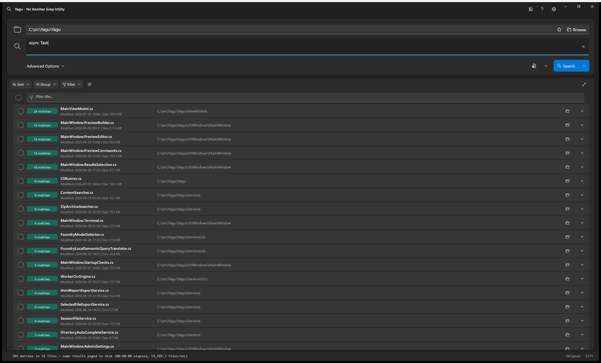

**Semantic search (local, on-device AI)** — describe what you want in plain English; a small model running locally through Microsoft Foundry Local translates it into concrete Yagu options and runs the search. No query ever leaves your PC.

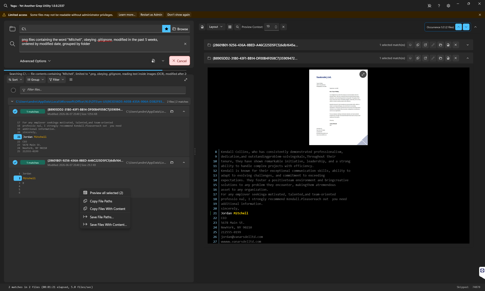

**Advanced Options** — a tabbed drawer for refining any search: search mode, include/exclude path filters, size and date ranges, and more — with a one-click **Generate CLI command**.

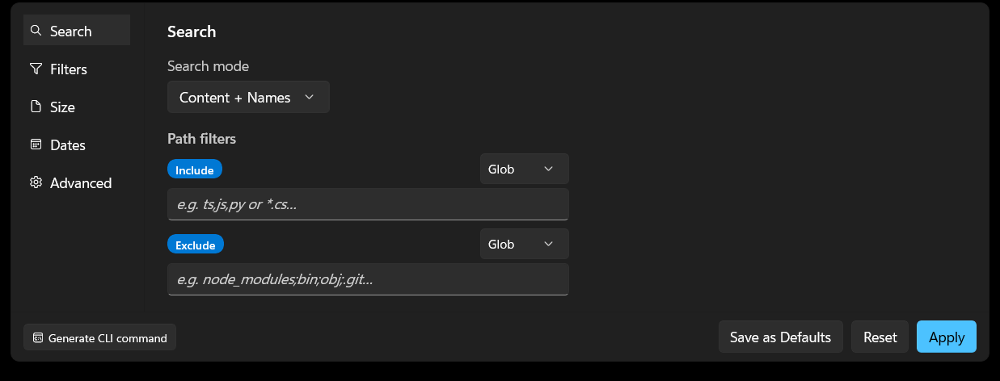

**Filtering options** — the Filters tab narrows what gets searched: obey `.gitignore`, skip file extensions, and toggle whether to search binaries, archives, online-only cloud files, hidden files, and image text (OCR).

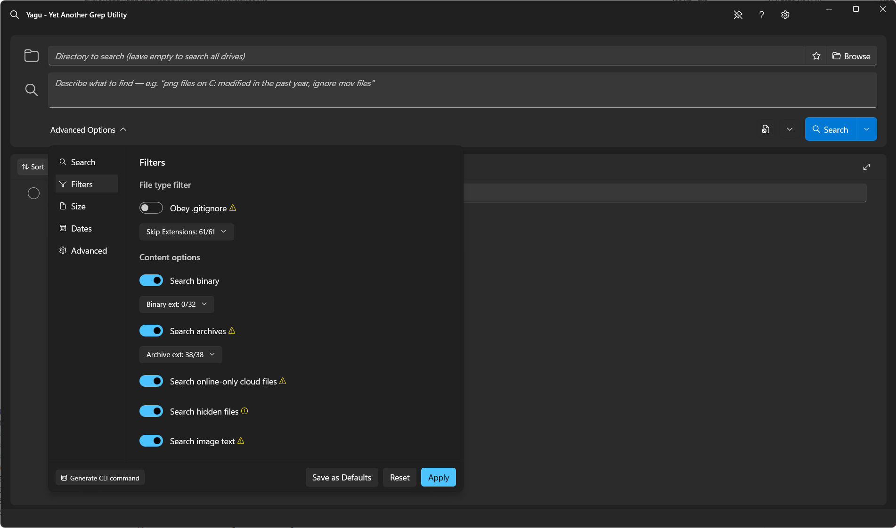

**Match navigation** — step through every occurrence in the context preview, with highlighted matches, line numbers, and an occurrence counter.

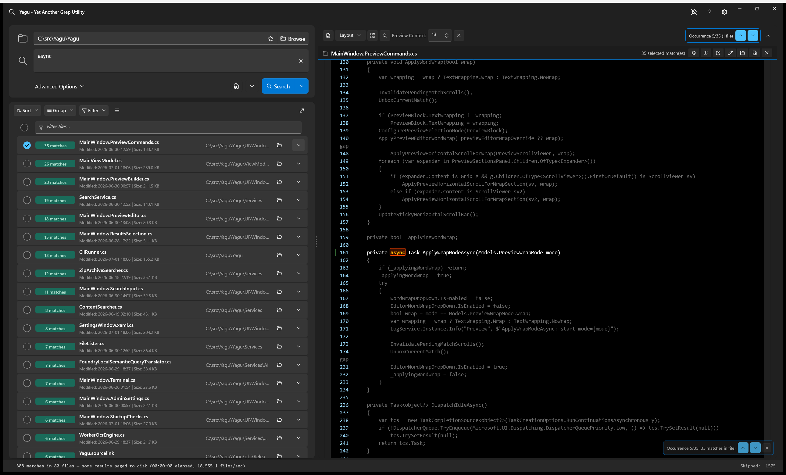

**Add individual lines to preview** — pull just the matched lines you care about into the preview instead of loading the entire file. This is a performance technique: for very large files, Yagu renders only the lines you select rather than the whole document.

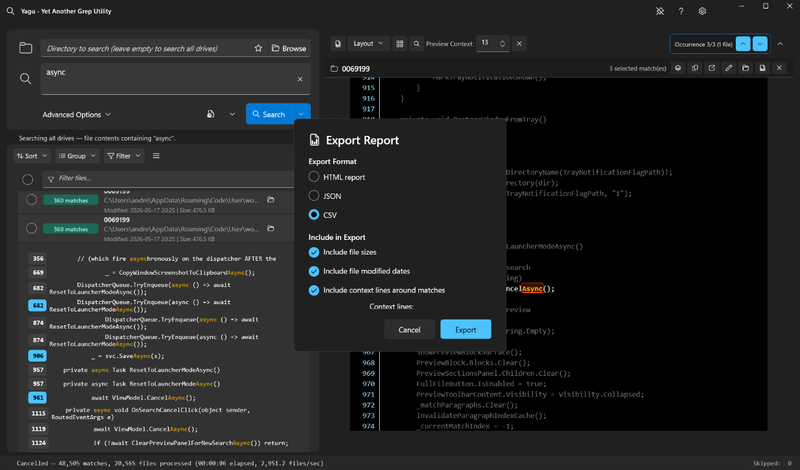

**Built-in editor** — open a matched file in-app with syntax highlighting, line numbers, find/replace, save, and `.yagubak` backups.

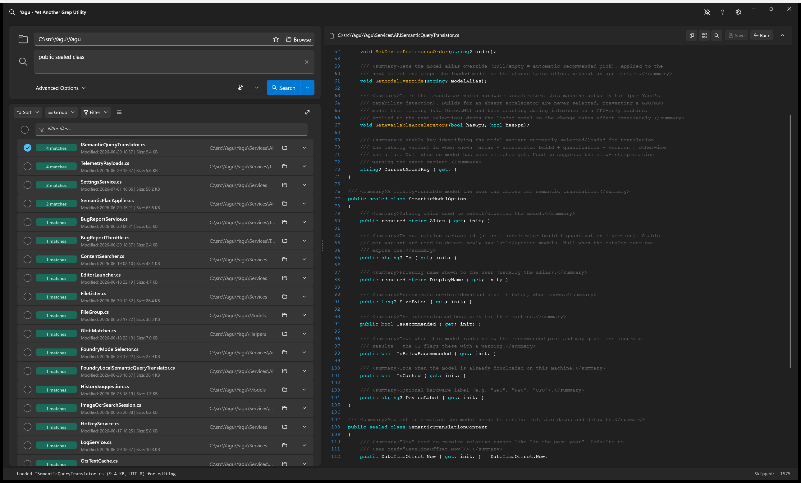

**Multi-file preview** — review several selected files together in one scrollable panel, collapsing the section drawers you don't need.

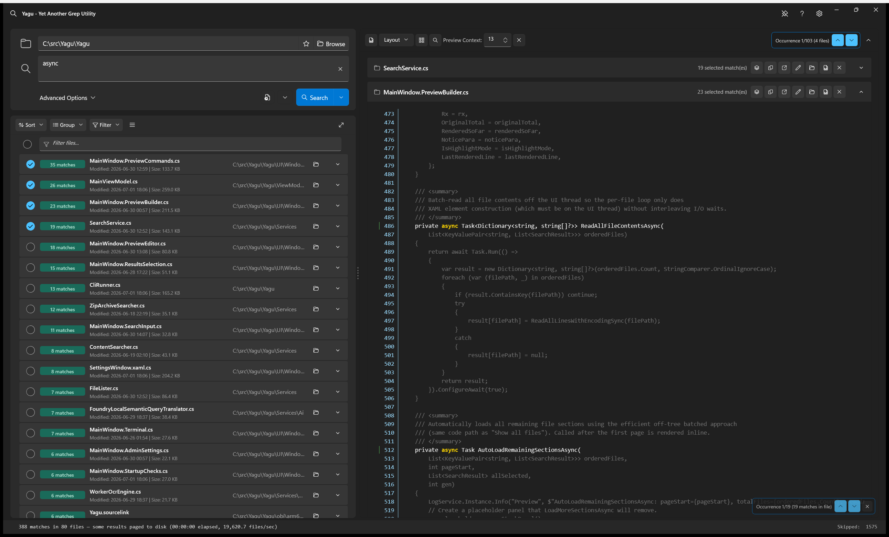

**AI settings** — enable on-device semantic search, pick the local model, and set the GPU → NPU → CPU accelerator order.

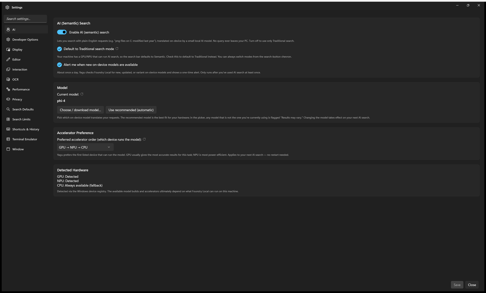

**OCR settings** — turn on image-text search, choose the OCR engine (PaddleSharp or Tesseract), and tune recognition quality.

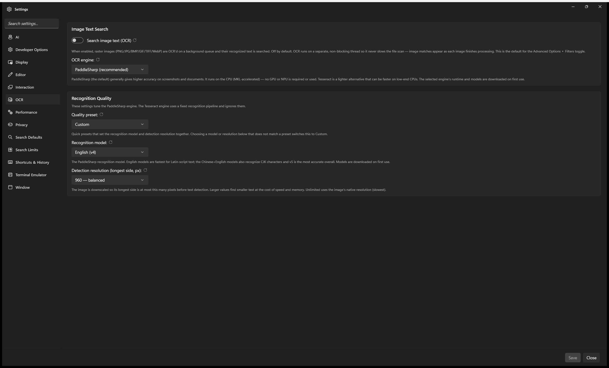

**Image-text (OCR) preview** — open a matched image to see it alongside the recognized text, with your query highlighted and line-numbered.

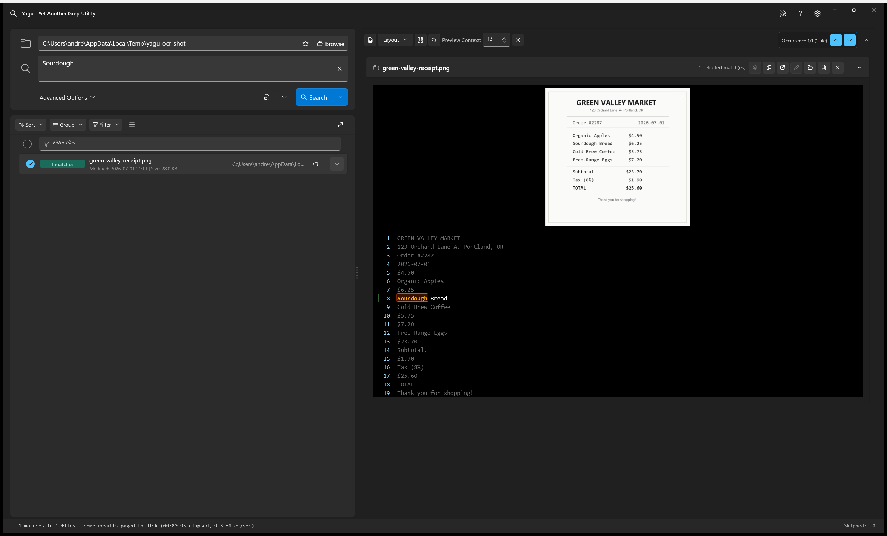

## Download Installer

To install Yagu without building from source, download the installer that matches your PC and run it. Yagu ships as a self-contained Native AOT build, so no separate .NET runtime is required; every installer also bundles the Windows App Runtime payloads the desktop app needs.

**Which one do I need?** Pick by CPU architecture — most people want **x64**. The separate **x64 · OCR bundled** edition is only for offline/air-gapped machines that need image-text (OCR) search without a first-run download.

| Installer | What it's for | Image-text (OCR) search |
| --- | --- | --- |
| [**x64** — YaguSetup-1.0.0.2296-x64.exe](https://github.com/andrewtheart/yagu-search/raw/main/installer/YaguSetup-1.0.0.2296-x64.exe) (~89 MB) | Most modern PCs: 64-bit Intel/AMD Windows. Start here if unsure. | Works. Defaults to the PaddleOCR engine; the OCR runtime and English models download once on first use. |
| [**x64 · OCR bundled** — YaguSetup-1.0.0.2299-x64-ocr.exe](https://github.com/andrewtheart/yagu-search/raw/main/installer/YaguSetup-1.0.0.2299-x64-ocr.exe) (~267 MB) | Same as x64, but for machines that must run OCR fully **offline** — air-gapped PCs, or to skip the first-run download. | Bundled in the installer: the PaddleOCR engine and English models are installed up front, so no download is needed. |
| [**Arm64** — YaguSetup-1.0.0.2298-arm64.exe](https://github.com/andrewtheart/yagu-search/raw/main/installer/YaguSetup-1.0.0.2298-arm64.exe) (~88 MB) | Windows on ARM: Snapdragon-based laptops, Surface Pro X, Windows Dev Kit. | Works. Defaults to PaddleOCR; the OCR runtime and models download once on first use. |
| [**x86** — YaguSetup-1.0.0.2297-x86.exe](https://github.com/andrewtheart/yagu-search/raw/main/installer/YaguSetup-1.0.0.2297-x86.exe) (~70 MB) | 32-bit Windows. | Works. Defaults to the Tesseract engine (PaddleOCR's runtime is x64-only); language data downloads once on first use. |

> There is no Arm64 or x86 "OCR bundled" edition: the bundled PaddleOCR runtime is win-x64 only, so it can only be packaged offline for x64. On Arm64 and x86, image-text search still works — it downloads what it needs on first use.

> **Note: Yagu is currently unsigned and is not supported on machines with Smart App Control enabled.**
>
> Yagu is an open-source project without a code-signing certificate. We applied for free open-source signing through SignPath, but it is not accepting new applications at the moment due to high volume (see [OSSign — Code Signing for Open Source](https://ossign.org/#apply)). Because Windows **Smart App Control** only allows programs that are signed by a recognized publisher, Yagu cannot run on PCs where Smart App Control is turned on. The installer detects this and stops with a message; to install Yagu, turn Smart App Control off (Windows Security → App & browser control → Smart App Control), or use a machine where it is not enabled. We will sign future releases once free open-source signing becomes available.


## Current Project Status

Use [Yagu.sln](Yagu.sln) for current development.

This README is the entry point for new contributors.

## Important Features

- Fast recursive text search across a directory and all subdirectories, with streaming results while the scan is still running.
- Literal, exact-match, and .NET regex search, with optional case-sensitive matching.
- Search modes for content plus file names, content only, file names only, or file-name-gated content search.
- Semantic search (local, on-device AI): describe a search in plain English and a small instruct model running locally through Microsoft Foundry Local translates it into concrete Yagu options — directory, include/exclude filters, dates, sizes, search mode, and result sorting/grouping — with no query ever leaving the machine.
- Advanced include/exclude filters with glob/path or regex modes, `.gitignore` support, skip-extension lists, optional binary-file inclusion, size/date filters, and maximum search depth.
- ZIP-format archive search for ZIP, DOCX, XLSX, JAR, NUPKG, and other configured archive-like containers, including nesting and entry-size safeguards.
- voidtools Everything support for file discovery through the in-process SDK or `es.exe`, with automatic fallback to built-in .NET enumeration.
- Optional Rust native scanner for fast per-file matching, with managed C# fallback when the DLL is unavailable or a file needs the managed path.
- Configurable result cap, hard result ceiling, per-file match cap, content-search parallelism, SDK buffer size, content file-size ceiling, and native/MMF concurrency limits.
- Memory-pressure mode that pages result payloads to a configurable temp-file drive instead of exhausting RAM.
- Low temp-drive disk-space monitor that terminates active searches when the configured temp drive is too full, with a configurable warning threshold.
- HDD-aware parallelism guard that can warn and reduce scanning to one worker on rotational drives.
- Grouped result list with no-sort arrival order plus sorting/grouping by folder, date, extension, file size, match count, modified date, or file name.
- Result filtering by file name/path, match text, and date range without rerunning the search.
- Selectable file groups and match lines with right-click actions for preview, open, copy, export, and Explorer navigation.
- Context preview with match highlighting, line numbers, match navigation, optional word wrap, lazy loading, and lightweight syntax coloring for common source files.
- Multi-file preview layouts for reviewing selected files or checked match lines together.
- Highlighted full-file previews for selected result groups, checked match lines, or entire files, with configurable full-file preview limits.
- Built-in editor with find/replace, save, `.yagubak` backups, large-file chunk loading, and double-click navigation from highlighted matches.
- External editor integration with configurable commands such as `code -g {file}:{line}`.
- Export selected match lines, selected file paths, selected files with content, or styled HTML preview reports; CLI export supports HTML, JSON, and CSV.
- GUI command generation that builds reproducible `Yagu.exe --cli` commands from the current search state, with an option to omit settings already saved in `%APPDATA%\Yagu\settings.json`.
- Embedded xterm.js terminal with configurable working directory, context menu actions, clear/reset support, and a "Send command to terminal" path from generated CLI commands.
- CLI mode for scripted search/export, startup arguments such as `--dir` and `--query`, and local `.yagu.json` settings discovery with CLI flags taking precedence.
- Explorer context menu registration for "Search with Yagu" and single-instance forwarding when Yagu is already running.
- Compact launcher, traditional window, stay-open, always-on-top, close-to-tray, system tray, and taskbar-progress behavior.
- Recent directory and search-query history, directory autocomplete, drag-and-drop folders, and optional global `Ctrl+Shift+letter` hotkey.
- Admin elevation banner with a "Restart as Admin" action, access-denied/skipped-file breakdowns, and optional admin-protected path skipping.
- Searchable Settings window with persisted settings, reset/use-default actions, theme/display controls, developer diagnostics, rotating logs, and crash logging.

## Semantic Search (Local AI)

Yagu can translate a natural-language request (e.g. *"word documents with 'Andrew' in them, modified this year"*) into concrete search options and run it. The translation happens **entirely on-device** — the query is never sent over the network.

- **On-device model via Microsoft Foundry Local.** [`FoundryLocalSemanticQueryTranslator`](Yagu/Services/Ai/FoundryLocalSemanticQueryTranslator.cs) hosts a small instruct model in-process through the `Microsoft.AI.Foundry.Local` SDK. The model and its hardware execution providers are downloaded once on first use and cached; there is no HTTP server and no network egress of the user's query.
- **Hardware-aware model selection.** [`FoundryModelSelector`](Yagu/Services/Ai/FoundryModelSelector.cs) ranks the hardware-compatible catalog models and auto-picks a small instruct model (e.g. `phi-4-mini`), preferring the less-quantized **GPU** build for accuracy and falling back to **NPU** then **CPU**. A specific model can be forced by family alias or exact variant id.
- **Strict JSON search plan.** The model is driven by an embedded system prompt ([`SemanticSearchSystemPrompt.prompt.md`](Yagu/Services/Ai/Prompts/SemanticSearchSystemPrompt.prompt.md)) that constrains it to emit a single JSON object describing the search. [`SemanticPlanJsonExtractor`](Yagu/Services/Ai/SemanticPlanJsonExtractor.cs) extracts and repairs that JSON (small local models are chatty and occasionally emit malformed output), and [`SemanticPlanApplier`](Yagu/Services/Ai/SemanticPlanApplier.cs) normalizes it — rooting drive shorthands, resolving relative dates against "today", expanding name-excludes to globs, clamping sizes, and parsing the search mode — into a `ResolvedSearchPlan` that is applied to the search inputs.
- **Archive-aware.** Office Open XML and OpenDocument files (`.docx`/`.xlsx`/`.pptx`/`.odt`…) are ZIP containers, so when a plan targets those formats Yagu automatically enables **Search archives** so their inner text is searched.
- **Available in the GUI and CLI.** In the GUI, switch the Search button's chevron to **Semantic**; from the CLI, use `--semantic-pattern "<text>"` (add `--explain` for a dry-run that prints the interpreted plan). The query is translated to a plan, the plan fills in the Advanced Options, and the normal search runs. See [HELP.md](HELP.md) for step-by-step usage and example prompts.

## Prerequisites

Yagu is Windows-only.

### Running The Installed App

For someone who only wants to install and run Yagu:

- Windows 10 version 1809 / build 17763 or newer.
- No separate .NET runtime. Yagu is published as a self-contained Native AOT app, so the matching .NET 10 runtime is bundled inside the installer for each architecture (x64, x86, arm64).
- Windows App Runtime 1.8. The installer packages the required runtime MSIX payloads and installs them when needed.
- voidtools Everything is optional but strongly recommended for fastest file discovery. If Everything is not available, Yagu falls back to built-in recursive .NET file enumeration.

The installed app does not require the .NET SDK, Rust, Visual Studio, Build Tools, Inno Setup, or PowerShell just to run. The native `yagu_core.dll` fast path is shipped with normal builds; if that DLL is missing or incompatible, Yagu falls back to the managed scanner.

### Building And Developing

For contributors building, testing, or packaging Yagu from this repository:

- Windows 10 version 1809 / build 17763 or newer.
- .NET 10 SDK. The repo pins SDK `10.0.107` with `rollForward: latestFeature` in [global.json](global.json).
- Visual Studio 2022 (17.8 or newer) or the standalone Build Tools, with:
  - The **Desktop development with C++** workload. Native AOT publishing invokes the MSVC compiler and linker, so this is required for normal builds, not just for the installer. Installing this workload also pulls in the Windows SDK.
  - The Windows SDK and WinUI / Windows App SDK components, because the main app is an unpackaged WinUI 3 application.
  - The test project avoids WinUI dependencies and can run on a normal Windows .NET SDK installation.
- C++ build tools for the target CPU architecture you build or publish. The host-architecture tools come with the C++ workload, but cross-architecture targets need their own components:
  - **arm64:** the **MSVC v143 - VS 2022 C++ ARM64/ARM64EC build tools (Latest)** individual component (Visual Studio Installer → *Individual components*, under the Desktop development with C++ workload). This is required to compile and link both the Native AOT app and the Rust `yagu_core.dll` for `win-arm64`; building the arm64 target or installer without it fails at the link step.
  - **x86:** the 32-bit C++ build tools, which the Desktop development with C++ workload includes by default.
  - The matching Rust target (`aarch64-pc-windows-msvc` for arm64, `i686-pc-windows-msvc` for x86) is added automatically by the build via `rustup target add`, so only the C++ side needs manual installation.
- PowerShell for helper scripts such as install, publish, profiling, cleanup, and Windows App Runtime prerequisite staging.
- Rust stable toolchain if you want to build and test the native `yagu_core.dll` fast path. The app still builds and runs without Rust if you pass `-p:BuildRustCore=false`; it will use the managed scanner.
- Inno Setup 6 only when building the installer EXE with [build-installer.ps1](build-installer.ps1).
- voidtools Everything is optional for development and testing of the Everything-backed discovery path; otherwise Yagu uses recursive .NET file enumeration.

## Quick Start

```powershell
git clone <repo-url>
cd Yagu

dotnet restore Yagu.sln
dotnet build Yagu.sln -c Release
dotnet run -c Release --project Yagu -- --dir "D:\projects\myapp"
```

If Rust is not installed or you want to iterate on managed code only:

```powershell
dotnet build Yagu.sln -c Release -p:BuildRustCore=false
dotnet run -c Release --project Yagu -p:BuildRustCore=false -- --dir "D:\projects\myapp"
```

The C# app loader tolerates a missing `yagu_core.dll`; native search is an optimization, not a hard runtime requirement.

## Common Commands

### Restore

```powershell
dotnet restore Yagu.sln
```

### Build

```powershell
dotnet build Yagu.sln -c Debug
dotnet build Yagu.sln -c Release
```

### Build Without Rust

```powershell
dotnet build Yagu.sln -c Release -p:BuildRustCore=false
```

### Run The App

```powershell
dotnet run -c Release --project Yagu
dotnet run -c Release --project Yagu -- --dir "D:\projects\myapp"
dotnet run -c Release --project Yagu -- --dir="D:\projects\myapp"
dotnet run -c Release --project Yagu -- --window-mode traditional
```

`--window-mode` accepts the same four modes exposed in Settings: `minimize-to-tray`, `stay-open`, `always-on-top`, and `traditional`. Numeric values `0` through `3` are also accepted. `--windowing-mode` is available as an alias.

`--max-depth <n>` limits how many levels of subdirectories are searched below the root directory. `0` (the default) means unlimited. For example, `--max-depth 2` searches the root and up to two levels of child folders.

### Run .NET Tests

```powershell
dotnet test Yagu.Tests/Yagu.Tests.csproj
dotnet test Yagu.Tests/Yagu.Tests.csproj -c Release
```

### Run Focused .NET Tests

```powershell
dotnet test Yagu.Tests/Yagu.Tests.csproj -c Release --filter ContentSearcherTests
dotnet test Yagu.Tests/Yagu.Tests.csproj -c Release --filter SearchServiceTests
dotnet test Yagu.Tests/Yagu.Tests.csproj -c Release --filter NativeParityTests
```

### Run UI Automation Tests

Most tests run without extra setup, but the match-navigation UI regression test is opt-in because it launches Yagu, drives the desktop UI through UI Automation, and captures screenshots. It requires Windows in an interactive desktop session, a Debug build of the app, and `YAGU_RUN_UI_REGRESSION=1`. Without that variable, the test exits early with a skipped message.

```powershell
dotnet build Yagu/Yagu.csproj -c Debug
$env:YAGU_RUN_UI_REGRESSION = '1'
dotnet test Yagu.Tests/Yagu.Tests.csproj -c Release --filter MatchNavRegressionTests
```

### Run Coverage

```powershell
dotnet test Yagu.Tests/Yagu.Tests.csproj -c Release --settings Yagu.Tests/coverage.runsettings --collect:"XPlat Code Coverage"
```

Coverage output is written under `TestResults/`.

### Run Rust Tests

```powershell
cargo test --manifest-path yagu-core/Cargo.toml
cargo test --manifest-path yagu-core/Cargo.toml --release
```

### Run Benchmarks

```powershell
dotnet run -c Release --project Yagu.Benchmarks
```

For a short BenchmarkDotNet smoke run similar to CI:

```powershell
dotnet run -c Release --project Yagu.Benchmarks -- --filter "*LiteralSearch*" --job short --launchCount 1 --warmupCount 1 --iterationCount 1
```

### Register Explorer Context Menu

The script writes per-user registry entries under `HKCU`, so it does not require machine-wide installation.

```powershell
.\scripts\register-context-menu.ps1 -ExePath 'C:\Tools\Yagu\Yagu.exe'
```

Uninstall the context menu entry:

```powershell
.\scripts\register-context-menu.ps1 -Uninstall
```

The registered command launches `Yagu.exe --dir "%V"` for folder and folder-background right-clicks.

### Build Installer (EXE)

The installer is built with [Inno Setup 6](https://jrsoftware.org/isdl.php) (free). Install it first:

```powershell
winget install JRSoftware.InnoSetup
```

Then build the per-architecture installers from the repo root:

```powershell
.\build-installer.ps1
```

This publishes Yagu as a self-contained Native AOT build for each architecture (x64, x86, arm64), stages each output, and compiles one installer EXE per architecture at `installer\output\YaguSetup-<version>-<arch>.exe`, copying the latest versioned installer for each architecture to `installer\YaguSetup-<version>-<arch>.exe`. Build a single architecture with `-Architecture x64` (or `x86` / `arm64`). Building the x86 and arm64 installers from an x64 machine requires the corresponding C++ build tools and Rust targets (the build adds the Rust target automatically). For arm64 specifically, install the **MSVC v143 - VS 2022 C++ ARM64/ARM64EC build tools** component (see [Building And Developing](#building-and-developing)); without it the Native AOT link step for `win-arm64` fails.

Running `dotnet publish -r win-<arch>` for the Yagu project also builds that architecture's installer after publish completes. A bare `dotnet publish` (no `-r`) builds all three installers (x64, x86, arm64), the same as running `.\build-installer.ps1`. To publish without building any installer, pass `-p:BuildInstallerOnPublish=false`.

Because Yagu is self-contained, the installer needs no .NET runtime on the target machine. At install time the setup program installs the bundled Windows App Runtime payloads after copying files.

#### Build Only The Installer

If the published app output already exists and you only want to compile the installer EXEs, run the installer script with `-SkipBuild` from the repo root:

```powershell
.\build-installer.ps1 -SkipBuild
```

This skips the `dotnet publish` step, reuses the existing files under `Yagu\bin\Release\<target-framework>\win-<arch>\publish`, refreshes the installer staging directory, stages the Windows App Runtime prerequisite payloads, and runs Inno Setup. The output is written to `installer\output\YaguSetup-<version>-<arch>.exe` and copied to `installer\YaguSetup-<version>-<arch>.exe`.

To specify a custom Inno Setup path:

```powershell
.\build-installer.ps1 -InnoSetupPath "C:\Path\To\ISCC.exe"
```

The installer creates a Start Menu shortcut, optional desktop icon, optional Explorer context menu, and a full uninstaller.

## Repository Layout

| Path | Purpose |
| --- | --- |
| [Yagu.sln](Yagu.sln) | Current solution for the app, tests, and benchmarks. |
| [Yagu](Yagu/) | Main WinUI 3 application: XAML UI, view model, services, models, and native wrappers. |
| [Yagu/Yagu.csproj](Yagu/Yagu.csproj) | App project, package references, WinUI settings, and Rust build integration. |
| [Yagu/UI/Windows/MainWindow](Yagu/UI/Windows/MainWindow/) | Main search window XAML and partial code-behind files. |
| [Yagu/UI/Windows/Settings](Yagu/UI/Windows/Settings/) | Settings window XAML and code-behind. |
| [Yagu/UI/Windows/Help](Yagu/UI/Windows/Help/) | Help window XAML and code-behind. |
| [Yagu/ViewModels/MainViewModel.cs](Yagu/ViewModels/MainViewModel.cs) | MVVM search state, settings binding, result grouping, commands, memory-pressure handling. |
| [Yagu/Models](Yagu/Models/) | Search options, results, grouped result collection, progress summaries, and file groups. |
| [Yagu/Services](Yagu/Services/) | File discovery, content scanning, settings, logging, editor launch, hotkeys, result export, disk-backed result store. |
| [Yagu/Native](Yagu/Native/) | P/Invoke wrappers for `yagu_core.dll` and the Everything SDK. |
| [yagu-core](yagu-core/) | Rust native search engine built as `yagu_core.dll`. |
| [Yagu.Tests](Yagu.Tests/) | xUnit tests for the engine-facing C# code and helpers. |
| [Yagu.Benchmarks](Yagu.Benchmarks/) | BenchmarkDotNet benchmark harness. |
| [scripts/register-context-menu.ps1](scripts/register-context-menu.ps1) | Explorer context menu registration script. |
| [.github/workflows/ci.yml](.github/workflows/ci.yml) | Windows CI: Rust build/test, .NET restore/build/test, benchmark smoke test. |
| [PLANS](PLANS/) | Design notes, performance reports, and future work. |

## Architecture

At a high level, Yagu is a WinUI shell around a streaming producer/consumer search pipeline.

```text
WinUI MainWindow
    |
    v
MainViewModel
    |
    v
SearchService
    |-----------------------------|
    v                             v
FileLister                    ContentSearcher
    |                             |
    v                             v
Everything SDK / es.exe /      Rust yagu_core.dll
.NET fallback                  or managed C# scanner
    |                             |
    |------------- channels -------|
                  |
                  v
        SearchResultCollection
                  |
                  v
          grouped WinUI result UI
```

### Main Components

| Component | Responsibility |
| --- | --- |
| `MainWindow` | Owns WinUI controls, dialogs, preview panel, full-file editor, clipboard/export UI, Everything install/start prompts, and global hotkey window hook. |
| `MainViewModel` | Converts UI state into `SearchOptions`, starts/cancels searches, persists settings, receives `SearchEvent` updates, groups/sorts/filters results, and handles memory-pressure eviction. |
| `SearchService` | Orchestrates the search pipeline, validates regexes, discovers files, runs parallel content workers, streams progress/matches, enforces caps, and emits fallback/memory-pressure events. |
| `FileLister` | Discovers candidate files with Everything SDK, `es.exe`, or recursive managed enumeration. Pushes some filters into Everything when possible. |
| `ContentSearcher` | Searches one file, choosing Rust native search when available and managed stream/MMF search otherwise. Applies binary, extension, size, encoding, and cancellation policies. |
| `NativeSearcher` | C# P/Invoke wrapper over `yagu_core.dll`, including ABI checks, native sessions, streaming callbacks, and native status mapping. |
| `ResultStore` | Disk-backed temp store for match payloads evicted during memory pressure. |
| `SearchResultCollection` | WinUI-free grouped result model used by the UI and large-result performance tests. |
| `SettingsService` | Loads and saves `%APPDATA%\Yagu\settings.json`. |
| `LogService` | Writes `%APPDATA%\Yagu\yagu.log` and rotates large logs. |

## Search Pipeline

1. The user chooses a directory, enters a query, and clicks Search or presses Enter.
2. `MainViewModel` validates the input and builds a `SearchOptions` object from the current UI/settings state.
3. `SearchService` validates regex syntax up front so the UI can show a clear error.
4. `FileLister` streams file paths from the best available backend.
5. File paths flow through bounded channels so discovery cannot outrun scanning indefinitely.
6. Search workers scan files concurrently with a safe configurable degree of parallelism.
7. Each matching line is emitted as a `SearchResult`; high-volume filename hits can be batched.
8. Progress, skip counts, fallback reasons, memory-pressure events, and completion summaries flow back as `SearchEvent` records.
9. `MainViewModel` adds results to grouped collections on the UI thread and loads file metadata in the background.
10. The preview panel hydrates evicted result payloads from `ResultStore` when needed.

## File Discovery Backends

Yagu tries file discovery backends in this order when the setting is `Auto`:

1. Everything SDK: in-process API, fastest path when Everything is installed and its database is loaded.
2. `es.exe`: voidtools Everything command-line client.
3. Managed .NET enumeration: slower fallback with cycle protection for recursive directory walking.

The backend can also be forced in Settings:

- Auto: SDK -> `es.exe` -> .NET.
- Everything SDK only.
- `es.exe` only.
- .NET enumeration only.

The Everything SDK path can pre-filter by extension, maximum size, and simple excluded path segments before those files enter the content-search pipeline. Complex globs are still checked by Yagu after discovery.

If Everything is not installed or not running, the UI can prompt to start it or install it. Searches still work without Everything; they just use the managed recursive enumerator.

## Content Search Engine

Yagu has two content-search implementations:

- Native fast path: [yagu-core](yagu-core/) builds `yagu_core.dll`, and [Yagu/Native/NativeSearcher.cs](Yagu/Native/NativeSearcher.cs) calls it through P/Invoke.
- Managed fallback: [Yagu/Services/ContentSearcher.cs](Yagu/Services/ContentSearcher.cs) reads files with buffered streams or memory-mapped files and uses compiled .NET regex/literal matching.

The native path is optional. If the DLL is missing, has the wrong architecture, or fails the ABI check, Yagu logs the condition and uses the managed scanner.

The Rust crate exposes a C ABI and supports:

- UTF-16 Windows paths from C# and UTF-8 search patterns.
- Literal and regex matching.
- Case-sensitive and case-insensitive options.
- Context-before/context-after capture.
- Binary-file detection (skipped by default, opt-in via Search binary toggle).
- Max file size and max result limits.
- Cancellation polling.
- Streaming callbacks so matches do not need to be buffered as one giant native result.
- Native sessions that compile the matcher once and reuse it across many files.

By default, the Rust crate uses the in-tree scanner in [yagu-core/src/scan.rs](yagu-core/src/scan.rs). Experimental ripgrep-library spike code exists behind the `grep_crates` Cargo feature and is off by default.

## Performance

Yagu's search hot path has been **profiled and fine-tuned to be competitive with [ripgrep](https://github.com/BurntSushi/ripgrep)** — the current benchmark for fast command-line search. In many workloads it **exceeds ripgrep's throughput**, and in the remaining cases it **matches** it. The gains come from the native Rust scanner ([yagu-core/src/scan.rs](yagu-core/src/scan.rs)), which compiles the matcher once per search and reuses it across files, streams matches back without buffering, and skips work early (binary detection, size caps, extension/`.gitignore` filters) before touching file contents.

This is measured, not assumed. The [`Yagu.Benchmarks`](Yagu.Benchmarks/) project (BenchmarkDotNet) tracks literal and regex search throughput against recorded baselines in [`Yagu.Benchmarks/results/perf-baselines.jsonl`](Yagu.Benchmarks/results/perf-baselines.jsonl), and the native binary can be built with a symbol-rich profiling profile (`-p:RustProfile=profiling`) for deeper flame-graph analysis. Real-world results still depend on hardware, storage (SSD vs. HDD), corpus shape, and pattern complexity — but Yagu is engineered to keep pace with the fastest searchers available.

### Scaling To Large Files And Thousands Of Results

Yagu is fine-tuned and deliberately designed to **load very large files and thousands of file results and matches at once** while staying responsive — the window does not freeze while realizing a huge result set or rendering a long document. That scale is made possible by several performance optimizations working together:

- **Virtualized result groups.** Each `FileGroup` realizes only the first `PageSize = 200` matches as live UI items and loads the rest on demand through incremental "Show more" pages, so a single file with tens of thousands of hits never materializes them all at once ([FileGroup.cs](Yagu/Models/FileGroup.cs)).
- **Single-notification batch collections.** The result and group lists use `BatchObservableCollection`, which raises one `Reset` notification per batch instead of one `CollectionChanged` event per item, avoiding a per-item layout pass on high-cardinality searches ([BatchObservableCollection.cs](Yagu/Models/BatchObservableCollection.cs)).
- **Bounded-channel result batching.** Content and filename matches are coalesced into 256-item batches and handed to the UI thread through bounded channels with back-pressure, so a fast native scanner cannot flood the dispatcher ([SearchService.cs](Yagu/Services/SearchService.cs)).
- **Disk-backed result eviction under memory pressure.** When the working set approaches the process memory cap (auto-sized between **512 MB and 768 MB**, recovery triggered at 90%), match payloads are evicted to `ResultStore` temp files and kept only as compact varint-encoded stubs (sized below the Large Object Heap threshold), then rehydrated on demand when a group is expanded or a result is previewed ([ResultStore.cs](Yagu/Services/ResultStore.cs), [FileGroup.cs](Yagu/Models/FileGroup.cs)). A background `LowDiskSpaceMonitor` guards the temp drive during large runs ([LowDiskSpaceMonitor.cs](Yagu/Services/LowDiskSpaceMonitor.cs)).
- **Off-UI-thread metadata.** File size and timestamps are loaded on background threads and cached, so populating thousands of rows never blocks the UI on file-system I/O ([FileMetadataCache.cs](Yagu/Services/FileMetadataCache.cs)).
- **Large-file preview windowing.** The preview renders file sections incrementally (50 per page, "Show more" for the rest), folds extremely long physical lines into 4 KB paragraph chunks to avoid DirectWrite layout failures, and bounds a single "Show all" reveal to 20,000 characters — so even a minified multi-hundred-KB single-line file previews without hanging ([MainWindow.PreviewBuilder.cs](Yagu/UI/Windows/MainWindow/MainWindow.PreviewBuilder.cs)). You can also **add just the matched lines you care about** to the preview instead of loading the whole file (see *Add individual lines to preview* near the top of this README).
- **Zero-copy native streaming.** The Rust scanner compiles the matcher once per search, streams matches back without buffering whole files, borrows line bytes instead of allocating per match, and early-skips binary, oversized, and ignored files before ever reading their contents ([yagu-core/src/scan.rs](yagu-core/src/scan.rs)).
- **Throttled progress and auto-scroll.** Statistics and auto-scroll update on fixed 100 ms / 500 ms timers rather than per file or per match (see [UI Update Throttling](#ui-update-throttling) below).

### UI Update Throttling

Search statistics (files scanned, files skipped, matches found, files/second) are **not** updated per-file. A dedicated `PeriodicTimer` in `SearchService` emits a `SearchEvent.Progress` snapshot every **100 ms**. The view model handles each snapshot by setting approximately six properties that cascade into roughly ten `PropertyChanged` notifications per tick. At 10 Hz this is lightweight and does not compete with the search pipeline for dispatcher time.

The `ProgressBar` binds to `TotalFiles` and `FilesScanned` with compiled `x:Bind` (no reflection). The auto-scroll timer that keeps the result list pinned to the bottom fires at **500 ms**, well below the threshold for perceptible UI stutter.

### Result Batching

Content and filename matches are batched before delivery to the UI thread:

| Match type | Batch size | Delivery mechanism |
| --- | --- | --- |
| Content matches | 256 | `SearchEvent.MatchBatch` via bounded channel |
| Filename matches | 256 | `SearchEvent.MatchBatch` via bounded channel |

Each result added to a `FileGroup` can trigger up to three `CollectionChanged` events (group collection, `VisibleResults` sub-collection, and top-level `VisibleGroups`). In a worst-case batch where every result belongs to a different new file, one batch may produce up to ~768 `CollectionChanged` notifications in a single dispatcher tick. WinUI handles incremental `Add` without a full layout pass, but very high-cardinality searches can still cause brief dispatcher stalls at batch boundaries.

### FileGroup Metadata

File size and last-modified metadata are loaded off the UI thread via `Task.Run`. Only the four property-change notifications (`FileSize`, `LastModified`, `FormattedSize`, `FormattedDate`) dispatch back to the UI. Because these bind to collapsed expander headers, the layout cost is minimal until the user expands a group.

### Memory Pressure

When the process working set exceeds the configured memory limit, `SearchService` switches to memory-pressure mode. Result payloads are evicted to disk-backed `ResultStore` temp files under `%TEMP%`, and only lightweight metadata stays in memory. The preview panel rehydrates payloads on demand when the user selects a result.

## Settings, Logs, And Temp Files

| Data | Location |
| --- | --- |
| User settings | `%APPDATA%\Yagu\settings.json` |
| App log | `%APPDATA%\Yagu\yagu.log` |
| Rotated app log | `%APPDATA%\Yagu\yagu.log.old` |
| Crash log | `yagu-crash.log` next to the running executable when possible |
| Memory-pressure result temp files | `%TEMP%\yagu-results-*.tmp` |

Settings include recent directories, search history, search defaults, file limits, skip extensions, backend selection, parallelism, memory limits, editor command, preview mode, word wrap, global hotkey, and log verbosity.

In CLI mode, Yagu looks for `.yagu.json` in the current working directory first. If it is not present there, Yagu checks the running process launch directory next, then falls back to `%APPDATA%\Yagu\settings.json`. CLI flags override any file-based settings.

The app schedules best-effort cleanup for orphaned Yagu result temp files on startup.

## Test Setup

The .NET test project intentionally compiles selected source files from [Yagu](Yagu/) directly instead of referencing the WinUI app project. This keeps the test assembly free of Windows App SDK UI runtime requirements and makes engine/helper behavior easier to test.

Areas covered by [Yagu.Tests](Yagu.Tests/) include:

- `ContentSearcher` literal, regex, binary, size, encoding, and skip behavior.
- `SearchService` progress, batching, limits, fallback events, and memory pressure behavior.
- `FileLister` fallback enumeration and cycle-protection behavior.
- `NativeSearcher` outcome mapping and native/managed parity.
- Settings persistence and migration.
- Result grouping, sorting, filtering, selection, and large-result UI model behavior.
- Editor launcher command parsing.
- Hotkey registration helpers.
- Export formatting for selected files and selected content.
- Syntax highlighting, glob matching, line truncation, and other helpers.

Run Rust tests when changing [yagu-core](yagu-core/). Run .NET tests when changing [Yagu/Services](Yagu/Services/), [Yagu/Models](Yagu/Models/), [Yagu/Helpers](Yagu/Helpers/), [Yagu/Native](Yagu/Native/), or settings behavior. Run both when changing the native ABI or native search semantics.

## CI

The GitHub Actions workflow in [.github/workflows/ci.yml](.github/workflows/ci.yml) runs on Windows and performs:

1. Checkout.
2. Setup .NET 10 SDK.
3. Setup Rust stable.
4. Cache Cargo registry/git/target directories.
5. Build `yagu-core` in release mode.
6. Test `yagu-core` in release mode.
7. Restore [Yagu.sln](Yagu.sln).
8. Build [Yagu.sln](Yagu.sln) in release mode.
9. Run [Yagu.Tests](Yagu.Tests/).
10. Upload test result artifacts.
11. Run a short BenchmarkDotNet smoke benchmark.

## Development Notes

- The app build attempts `cargo build --release --quiet` for [yagu-core](yagu-core/) before C# compilation unless `BuildRustCore=false` is set.
- After changing Rust FFI exports or ABI-sensitive code, rebuild [yagu-core](yagu-core/) before running .NET native parity tests.
- The native DLL must match the process architecture.
- Avoid broad formatting churn in [yagu-core](yagu-core/) unless that is the goal of the change.
- The managed scanner remains important because it is the fallback path and handles cases the native engine may reject.
- Keep UI-free behavior in services/models where possible so tests can cover it without WinUI.
- Use the memory and result caps during broad scans; unchecked searches over an entire drive can produce very large result sets.

## Troubleshooting

### `cargo` is not installed

Build without the native fast path:

```powershell
dotnet build Yagu.sln -c Release -p:BuildRustCore=false
```

Install Rust from https://rustup.rs/ when you want to build and test [yagu-core](yagu-core/).

### Everything is missing or not running

Yagu can still search with managed enumeration. For best file-discovery speed, install voidtools Everything and make sure the Everything process/database is running. The app also checks this on startup and can prompt to start or install it.

### Search sees access-denied errors

Some folders require elevation. Use the in-app "Restart as Admin" action from the warning banner, or search a directory that your user account can read.

### Tests need native behavior

Build the Rust DLL first:

```powershell
cargo build --manifest-path yagu-core/Cargo.toml --release
dotnet test Yagu.Tests/Yagu.Tests.csproj -c Release --filter NativeParityTests
```

### The result set is huge

Use include globs, exclude globs, skip extensions, max file size, and max result settings. If memory pressure is detected, Yagu pages result payloads to disk and continues in memory-saving mode.
